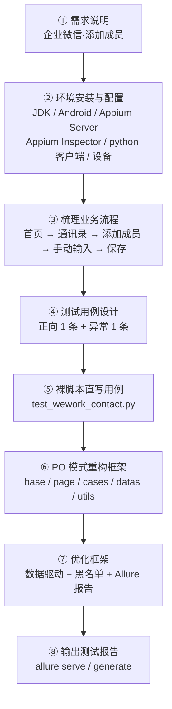
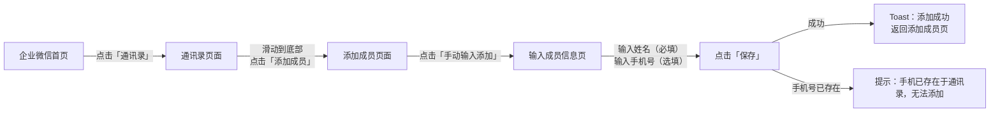
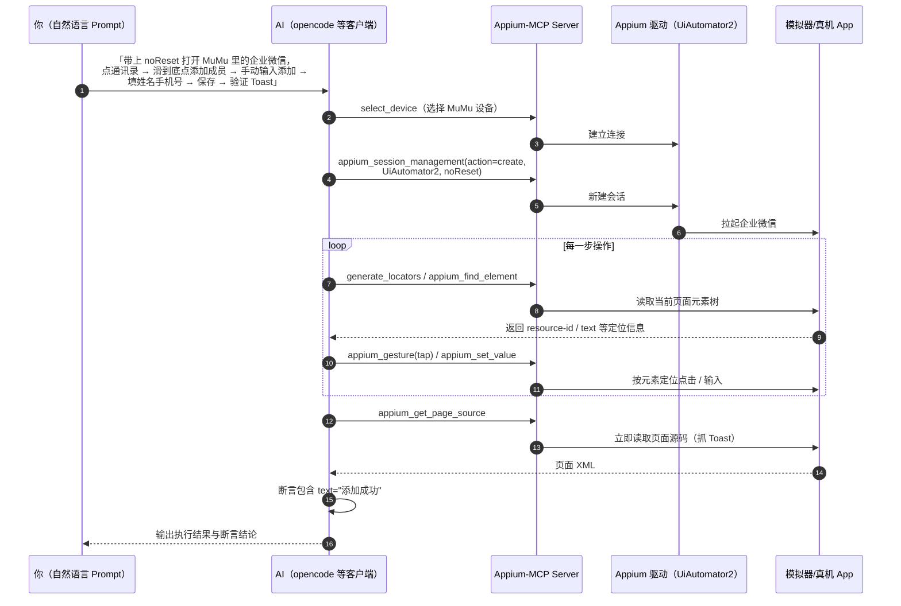

---
tags:
  - 课程笔记
  - APP自动化测试
  - Appium
  - PageObject
  - 实战
  - AI
  - MCP
course: APP自动化测试
chapter: Ch28-企业微信App自动化测试实战与AI辅助测试
created: 2026-09-22
status: draft
---

# Ch28 - 企业微信 App 自动化测试实战与 AI 辅助测试

## 课程来源
- 学习日期：

> 本章是 APP 自动化课程 **L5 的实战收口章**：被测应用从雪球换成 **企业微信**（添加成员功能），把 Ch26/Ch27 的 PO 框架在同一套骨架上再走一遍「需求 → 用例设计 → 裸脚本 → PO 重构 → 数据驱动 → 黑名单 → Allure 报告」的完整链路；后半部分是全新增的 **AI + Appium-MCP**——让 AI 直接操作 App，而不是写代码。
>
> 配套项目代码与总结：[[../../03-Projects/06_app_auto_test-main/项目总结|企业微信 App 自动化框架 项目总结]]

---

## 一、实战需求与用例设计

### 知识点 1：需求说明 + 测试需求清单

【课程原话/定义】

**被测应用**：企业微信——腾讯微信团队打造的企业通讯与办公工具，具有与微信一致的沟通体验、丰富的 OA 应用、和连接微信生态的能力；可帮助企业连接内部、连接生态伙伴、连接消费者。

前提条件：

1. 手机端安装好企业微信 App。
2. 企业微信注册用户（有企业/组织，能进通讯录）。

**测试需求**：

1. 企业微信 App 添加成员功能自动化测试。
2. 完成 App 自动化测试框架搭建。
3. 在自动化测试框架中编写自动化测试用例。
4. 优化测试框架。
5. 输出测试报告。

**实战思路**（重新绘制）：



【为什么？】

1. **为什么先用「裸脚本」而不是直接上框架**：裸脚本能在 10 分钟内验证「环境通、元素找得到、流程走得通」；如果一上来就分层，一旦失败你分不清是环境问题还是封装问题。裸脚本是**探路**，PO 是**沉淀**（Ch19 雪球 → Ch27 雪球 PO 化，走的就是同一条路）。
2. **为什么测试需求里「框架、用例、优化、报告」各占一条**：企业交付物不是「一个能跑的脚本」，而是**可回归、可维护、可量化**的一套东西。框架 = 可维护，用例 = 覆盖，优化 = 稳定与数据分离，报告 = 证据与结果沟通。面试时能把这四件说清，比背 PO 定义值钱。
3. **为什么选企业微信做实战**：它是真实国民级 App（腾讯系加固、Activity 命名规范、页面层级深、有 Toast 和弹窗），比雪球更接近企业真实被测对象——尤其是「滑动后才有添加成员按钮」和「保存后 Toast 断言」这两个坑，只有真 App 才会遇到。

【必须掌握】

- 被测应用信息：`appPackage = com.tencent.wework`，`appActivity = .launch.LaunchSplashActivity`
- 「添加成员」的完整业务路径（5 步）
- 交付物四件套：框架 + 用例 + 优化 + 报告

【企业场景】

你在企业里接到「给 XX App 做 UI 自动化」的需求时，第一步不是写代码，而是像本章这样把**被测 App、被测功能、前提条件、交付物**写清。尤其「前提条件」——企业里最常见的返工就是环境不对：设备上装的 App 版本不对、测试账号没有权限、被测功能被后台开关关掉了，脚本写得再好也跑不通。

【面试考察】

面试官：「给你一个 App 让你做 UI 自动化，你的第一步做什么？」

参考回答框架：先明确被测范围（哪个 App、哪个功能模块）与环境前提（App 版本、设备/模拟器、账号权限、是否有后台开关）；再梳理业务流程拿到页面跳转路径；然后设计用例（正向 + 异常）；先用裸脚本打通链路验证环境；最后才做 PO 分层 + 数据驱动 + 报告。**先探路再沉淀**，不要一上来就搭框架。

【易错点】

| 误区 | 纠正 |
|------|------|
| 拿到需求直接写 PO 框架代码 | 先用裸脚本验证环境与元素定位，再重构；否则环境问题会被误判成封装问题 |
| 忽略「前提条件」 | 企业微信必须是**已注册企业用户且登录状态**（`noReset=True` 保留登录态正是为此） |
| 只交脚本不交报告 | 交付物是「框架 + 用例 + 优化 + 报告」，报告是给团队看结果与证据的 |

【我的理解】

> （本章为什么先把「裸脚本」写出来，之后才用 PO 重构？如果反过来——先搭好 PO 框架再往里填用例，第一次跑失败了你需要多排查哪些东西？对照 Ch19（裸脚本雪球）与 Ch27（PO 化雪球），这条「先探路再沉淀」的路径在企业里通常怎么用？）

---

### 知识点 2：测试用例设计（正向 + 异常）

【课程原话/定义】

| 测试模块 | 用例标题 | 前置条件 | 用例步骤 | 预期结果 |
|----------|----------|----------|----------|----------|
| 成员模块 | 添加成员-成功 | 登录成功 | 1. 点击通讯录<br>2. 点击添加成员按钮<br>3. 点击手动输入添加按钮<br>4. 输入姓名、手机号，点击保存按钮 | 1. 进入通讯录页面<br>2. 进入添加成员页面<br>3. 进入输入成员信息页面<br>4. 成功添加成员，并给出【添加成功】的提示信息 |
| 成员模块 | 添加成员-手机号重复，添加失败 | 登录成功 | 1. 点击通讯录<br>2. 点击添加成员按钮<br>3. 点击手动输入添加按钮<br>4. 输入**已经存在的手机号**，点击保存 | 1. 进入通讯录页面<br>2. 进入添加成员页面<br>3. 进入输入成员信息页面<br>4. 提示【手机已存在于通讯录，无法添加】，添加成员失败 |

**业务流程图**（重新绘制）：



【为什么？】

1. **为什么只设计 2 条用例就够（成功 + 手机号重复）**：这是用例设计里最省的**等价类 + 边界**组合——1 条走通主流程（正向），1 条覆盖最典型的业务异常（唯一性冲突）。自动化用例的价值是**回归**，不是穷举；先把「主链路 + 最高频异常」自动化，其余异常用例由功能测试覆盖（Ch08 用例设计方法论）。
2. **为什么「手机号重复」选它做异常用例**：加了成员 → 再添加同一手机号 → 企业微信后台有唯一性校验，返回明确提示文案。**这种「服务端有确定返回、客户端有确定文案」的异常最容易做自动化断言**；相反，网络异常、权限异常这类返回不确定的场景，自动化性价比低。
3. **为什么用例的「预期结果」必须写清每一屏的页面变化**：自动化断言就是照着预期结果写的——「进入通讯录页面」「进入添加成员页面」在自动化里对应**页面对象链式跳转**，「添加到通讯录的提示信息」对应**Toast 文本断言**。用例写不清，断言就写不出。

【必须掌握】

- 用例 5 要素：模块 / 标题 / 前置条件 / 步骤 / 预期结果
- 正向（添加成功，Toast=添加成功）+ 异常（手机号重复）两类各 1 条
- 预期结果 → 自动化断言的映射关系（页面跳转 → 链式调用；Toast → 文本断言）

【企业场景】

你在企业里接需求时，用例表格是**和产品/开发对齐过的**：这行的「预期结果」是产品确认过的文案，「手机号重复」这个异常是开发确认过的校验。你把这张表贴进测试计划，评审过了再写自动化——这样后面断言失败时，你能立刻分辨是**产品改文案了**还是**真 bug**。企业里最常见的自动化「假失败」就是文案变了但断言没跟着改。

【面试考察】

面试官：「UI 自动化的用例你怎么设计？是不是把所有功能用例都自动化？」

参考回答框架：不是。先按优先级筛——**主流程（冒烟）+ 高频回归 + 曾出过 bug 的路径**优先自动化；用例设计沿用功能测试方法论（等价类/边界值/场景法），但选那些**返回确定、可断言**的场景。本章就以「添加成员成功」+「手机号重复」两条覆盖正向与典型异常，其余靠手工覆盖。全量自动化维护成本远高于收益。

【易错点】

| 误区 | 纠正 |
|------|------|
| 把功能用例全量搬进自动化 | 自动化做「主流程 + 高频回归 + 稳定可断言」的用例，不是全量搬运 |
| 预期结果只写「添加成功」 | 要写清**每一屏的页面变化 + 提示文案**，否则断言无从下手（文案是断言的依据） |
| 异常用例选「网络异常」这类不确定场景 | 优先选服务端有确定返回的异常（如手机号重复），断言才稳定 |
| 用例步骤漏写「滑动」 | 企业微信的「添加成员」按钮在列表底部，**必须先滑动**才可见（对应 `swipe_find`），漏写会导致元素找不到 |

【我的理解】

> （本章只设计了 2 条用例就把「添加成员」做完了，为什么说这 2 条是「最省的组合」而不是「覆盖不足」？如果你要再加 3 条自动化用例，你会加哪三条，依据什么筛？——提示：从「返回确定 + 可断言 + 高频回归」三个角度筛。）

---

### 知识点 3：裸脚本直写版用例（对照写法）

【课程原话/定义】

`test_wework_contact.py`：类里直接写 capability + 元素定位 + 操作，**不分层**：

```python
class TestWeworkContact:

    def setup_class(self):
        faker = Faker("zh_CN")
        self.name = faker.name()
        self.phonenum = faker.phone_number()

    def setup_method(self):
        # Capability 设置定义为字典
        caps = {}
        caps["platformName"] = "Android"                      # 平台
        caps["appium:automationName"] = "uiautomator2"        # appium 驱动
        caps["appium:deviceName"] = "emulator-5554"            # adb devices 里的设备名
        caps["appium:appPackage"] = "com.tencent.wework"       # 包名
        caps["appium:appActivity"] = ".launch.LaunchSplashActivity"  # 启动页
        caps["appium:noReset"] = True                          # 不清空缓存
        caps["appium:forceAppLaunch"] = True                   # 强制 app 重启
        options = AppiumOptions().load_capabilities(caps)
        self.driver = webdriver.Remote("http://127.0.0.1:4723", options=options)
        self.driver.implicitly_wait(10)                        # 全局隐式等待

    def teardown_method(self):
        self.driver.quit()

    def test_add_contact(self):
        # 点击通讯录按钮
        self.driver.find_element(AppiumBy.XPATH, "//*[@text='通讯录']").click()
        # 滑动点击添加成员按钮
        self.swipe_find("添加成员").click()
        # 点击手动输入添加按钮
        self.driver.find_element(AppiumBy.XPATH, "//*[@text='手动输入添加']").click()
        # 定位姓名输入框
        self.driver.find_element(
            AppiumBy.XPATH,
            "//*[contains(@text, '姓名')]/../*[@text='必填']"
        ).send_keys(self.name)
        # 定位手机号输入框
        self.driver.find_element(
            AppiumBy.XPATH, "//*[@text='手机']/..//*[@text='选填']"
        ).send_keys(self.phonenum)
        # 滑动屏幕
        self.swipe_find("保存")
        # 点击保存按钮
        self.driver.find_element(AppiumBy.XPATH, "//*[@text='保存']").click()
        # 获取 toast 文本
        tips = self.driver.find_element(
            AppiumBy.XPATH, "//*[@class='android.widget.Toast']").text
        assert tips == "添加成功"
```

类里还自带两个「万能方法」：`swipe_window()`（按屏幕尺寸算滑动坐标：x 取中间、y 从 80% 滑到 20%）和 `swipe_find(text, max_num=5)`（滑动查找：找到返回元素，滑 5 次还找不到抛 `NoSuchElementException`）。

【为什么？】

1. **两个输入框的定位为什么用 `..` 轴**：企业微信「手动输入添加」页的输入框**本身没有 resource-id、text 也不稳定**，但每个字段上方有一行说明文字（「姓名 - 必填」「手机 - 选填」）。所以定位思路是「先找到说明文字，再回父节点、往下找同级的输入框」——`//*[contains(@text,'姓名')]/../*[@text='必填']`。这正是 Ch20 XPath 高级定位（轴定位）在真机上的落地：**没有 id 时，用「相邻/父子关系 + 文字」组合出唯一路径**。
2. **为什么必须先 `swipe_find("添加成员")`**：通讯录页的「添加成员」按钮在列表底部，一屏看不到；`swipe_find` 把「找元素 → 找不到就滑一屏 → 再找」封成一个循环，比写死 `swipe` 坐标稳（不同分辨率手机屏幕高度不一样）。
3. **`setup_class` 与 `setup_method` 分工**：Faker 造数据放 `setup_class`（整个类只造一次，用例共享）；建 driver 放 `setup_method`（每条用例一个干净会话，用例之间不串状态）——对应 Ch12 的 fixture 级别选择。
4. **为什么裸脚本里 `assert` 直接写在用例里**：裸脚本的目标是「跑通」，不必守 PO 原则；等到重构时把「动作」和「断言」分开——**断言留在用例层，动作下沉到页面层**（这正是 Ch27 六大原则里「不要在方法内加断言」的由来）。

【必须掌握】

- capability 七件套（platformName / automationName / deviceName / appPackage / appActivity / noReset / forceAppLaunch）+ `webdriver.Remote`
- Faker 造数据：`Faker("zh_CN").name()` / `.phone_number()`，`setup_class` 造一次
- `swipe_window` 坐标算法（x = width/2，y 从 0.8h 到 0.2h）+ `swipe_find` 滑动查找 + 最终抛 `NoSuchElementException`
- Toast 断言：`//*[@class='android.widget.Toast']` 取 `.text` 比 `== "添加成功"`

【企业场景】

你在企业里第一次接手一个新 App，最快的上手方式就是**先写这样一个裸脚本**：它既是环境自检（设备、Appium Server、包名 Activity 对不对），也是元素定位的探路（哪些控件有 resource-id、哪些只能靠文字）。跑通之后你才有资格谈分层——因为这时候你已经知道页面之间怎么跳、哪些定位方式靠谱。

【面试考察】

面试官：「你说说你的自动化用例是怎么写的，能描述一下代码结构吗？」

参考回答框架：从裸脚本讲起——用例类里 setup 建 driver（capability 设平台/驱动/包名/Activity/noReset）、显式 `implicitly_wait` 兜底，用例体按业务步骤逐步定位点击输入，最后断言 Toast 文本；滑动场景用 `swipe_find`（滑动查找）；但这样的写法元素表达式散落在用例里，维护性差，所以下一步就是重构成 PO。

【易错点】

| 误区 | 纠正 |
|------|------|
| `noReset=True` 理解成「清缓存」 | 它表示**不重置应用状态/数据**（保留登录态）；「清缓存/重装」是 `fullReset=True`（Ch11） |
| `forceAppLaunch` 与 `noReset` 混为一谈 | `forceAppLaunch=True` 表示**会话建立时强制拉起 App**（即便已在运行）；`noReset` 管的是数据是否重置，两回事 |
| 滑动用写死坐标 | 用 `swipe_find`（尺寸比例算坐标 + 找元素循环），换分辨率不崩 |
| 隐式等待时长前后不一致 | 本课脚本 `setup_method` 设 **10s**，而 `swipe_find` 里恢复成 **15s**（第 3 个参数写死 15）——这是个**真实的源码不一致**，两处数字要对齐，否则「滑动查找后」全局等待被悄悄改掉 |
| 一个用例滑到底才断言 | Toast 是**短时控件**（约 2s 消失），保存后要**立即**取 `page_source`/`Toast` 文本，中间不要插其他等待 |

【我的理解】

> （`//*[contains(@text, '姓名')]/../*[@text='必填']` 这条 XPath 里，`/..` 和后面的 `/*` 分别起什么作用？为什么这条表达式在「输入框自己没有 id」时能定位到？如果页面里有两个字段上方都写着「必填」，这条表达式会出什么问题、你会怎么改？）

【扩展知识】

> `swipe_find` 里的「临时把隐式等待调成 1s、找到后再恢复」是一个**性能与稳定的权衡**：滑动查找会反复触发 `find_element`，如果每次都要等满 10s 隐式等待，一轮滑动查找就是一分钟。企业里更规范的做法是用 `WebDriverWait(..., timeout=1)` 包一层短超时轮询，而不是全局改 `implicitly_wait`——因为改全局是「隐式状态副作用」，容易像上面那样把恢复值写错。

---

## 二、PO 模式重构：框架结构与目录

### 知识点 4：四层结构与目录

【课程原话/定义】

**框架结构**：

| 分层 | 作用 | 示例 |
|------|------|------|
| BasePage | 封装**和业务无关**的公共方法（操作） | 查找元素、滑动行为 |
| 业务 App | 和**具体 App 相关**的操作 | 初始化 App、回到首页 |
| 业务 Page | 具体的业务页面 | ContactPage（通讯录页）、MainPage（首页） |
| 测试用例层 | 测试步骤、相关的页面以及断言 | 添加成员用例、查找成员用例 |

**目录结构**：

```
.
├── __init__.py
├── base                  # 基础层：与业务无关的封装
│   ├── __init__.py
│   ├── app.py            # WeworkApp：App 启动/关闭（业务 App 层）
│   └── base_page.py      # BasePage：find/等待/滑动/Toast/返回
├── cases                 # 用例层
│   ├── __init__.py
│   └── test_xxx.py
├── log
│   └── test.log
├── datas                 # 测试数据
│   └── xxx.yml
├── page                  # 页面对象层
│   ├── __init__.py
│   ├── main_page.py
│   ├── address_list_page.py
│   ├── add_member_page.py
│   ├── menual_input_page.py
│   └── xxx_page.py
├── conftest.py
└── utils                 # 工具层
    ├── __init__.py
    ├── log_util.py
    └── utils.py
```

【为什么？】

1. **为什么「BasePage」和「业务 App」要分成两层**：BasePage 里的 `find_ele/swipe_window` 对**任何 App 都通用**（换 App 不改）；`WeworkApp.start()` 里的 `com.tencent.wework` 只对**企业微信**有效（换 App 只改这一处）。把「通用能力」和「应用配置」分开，框架才可复用——这是 PO 分层的第一刀。
2. **为什么页面类要「一页一类」**：企业微信添加成员要经过 4 个页面（首页 / 通讯录 / 添加成员 / 手动输入），每一页有自己的元素和操作。一页一类 → 某页 UI 变了只改那一页的类，其余零改动。
3. **为什么 `cases/` 里只有测试步骤和断言，没有定位器**：用例层的可读性目标是「像业务步骤」——`goto_address_list_page().goto_add_member_page()...`；定位器下沉到 `page/`，数据下沉到 `datas/`，工具下沉到 `utils/`。**用例层越薄，框架越值钱**。
4. **和 Ch27 的关系**：Ch27 讲的是「五层结构（基础层 / 公共业务层 / 页面层 / 用例层 / 公共方法层）」，本章讲「四层（BasePage / 业务 App / 业务 Page / 用例层）+ utils 工具目录」——**同一套框架，两种切分口径**：Ch27 把「工具（日志/数据读取）」单独算一层，本章把 utils 视为目录级工具、把「业务 App」看成继承 BasePage 的一层。看代码时只要抓到「通用 → 应用 → 页面 → 用例」这条纵轴就不会迷路。

【必须掌握】

- 四层职责边界：BasePage（通用操作）/ 业务 App（应用配置）/ 业务 Page（业务页面）/ 用例层（步骤 + 断言）
- 目录五件套：`base`/`page`/`cases`/`datas`/`utils`（+ `log`/`conftest.py`）
- 换被测 App 时**只改哪里**：`base/app.py` 里的 capability 两行（appPackage/appActivity）

【企业场景】

你在企业里维护的框架，代码评审时评审人第一眼看的就是**分层有没有串**：`cases/` 里出现 `find_element` 或 `AppiumBy` 就是不合格（说明定位器漏上去了）；`page/` 里出现 `assert` 也不合格（断言应该在用例层）；`base/base_page.py` 里出现 `com.tencent.wework` 同样不合格（业务信息漏到通用层）。这三条是 UI 自动化代码评审最常见的红线。

【面试考察】

面试官：「你的 App 自动化框架分几层？每层职责是什么？换一个被测 App 要改哪些代码？」

参考回答框架：分四层——BasePage 封装与业务无关的通用操作（定位/等待/滑动/Toast）；业务 App 层管应用级操作（capability 启动、回首页）；页面对象层一页一类，封装该页元素与业务方法（`goto_xxx` 返回下一页对象 / `get_xxx` 返回断言数据）；用例层只写步骤与断言。换 App 只改业务 App 层 capability 两行，各页面类与用例按业务调整，base 层零改动。

【易错点】

| 误区 | 纠正 |
|------|------|
| 通用方法和应用配置混在一个类 | `find_ele/swipe` 进 `BasePage`，`com.tencent.wework` 只出现在 `WeworkApp.start()` |
| 用例目录里写定位表达式 | `cases/` 只调页面方法 + `assert`，定位器属于 `page/` |
| 页面类里加断言 | 页面方法只「做动作 / 取数据」，断言统一在用例层（PO 六大原则第 4 条） |
| `datas/`、`utils/` 与 `page/` 混放 | 数据、工具、页面三类资产分目录，`conftest.py` 负责把项目根加进 `sys.path` |
| 目录名拼写 `menual_input_page.py` | 源码即 `menual`（manual 的拼写错误）。**跟项目保持一致**别乱改文件名（改了所有 import 都要跟着改）；但自己新建项目时应写成 `manual_input_page.py` |

【我的理解】

> （为什么说「BasePage 里出现 `com.tencent.wework` 就是分层串了」？请用「换一个被测 App 需要改哪些文件」这个问题，去验证你认为的分层边界是否成立——你能做到只改 1 个文件里的 2 行吗？）

---

## 三、填充框架（四件事）

### 知识点 5：app 启动封装（WeworkApp）

【课程原话/定义】

```python
class WeworkApp:

    def start(self):
        # Capability 设置定义为字典
        caps = {}
        caps["platformName"] = "Android"
        caps["appium:automationName"] = "uiautomator2"
        caps["appium:deviceName"] = "emulator-5554"
        caps["appium:appPackage"] = "com.tencent.wework"
        caps["appium:appActivity"] = ".launch.LaunchSplashActivity"
        caps["appium:noReset"] = True
        caps["appium:forceAppLaunch"] = True
        options = AppiumOptions().load_capabilities(caps)
        self.driver = webdriver.Remote("http://127.0.0.1:4723", options=options)
        self.driver.implicitly_wait(10)
        return self

    def stop(self):
        self.driver.quit()
```

【为什么？】

1. **为什么把启动从用例里搬出来**：所有用例都要启动 App，写在一处 → 换设备只改 `deviceName` 一行，换 App 只改 `appPackage/appActivity` 两行。
2. **`start()` 为什么 `return self`**：让「启动 → 进首页」写成一行 `app.start().goto_main()`（Ch27 同款设计），返回 self 才能继续点出 `goto_main()`。
3. **`stop()` 里 `quit()` 而不是 `close()`**：`quit()` 关闭会话、释放设备（不释放会占着设备，下条用例报 session already exists）；这是 Ch12 应用控制四动词里的「关会话」。

【必须掌握】

- `WeworkApp.start()` 返回 self、`stop()` 调 `quit()`
- capability 里企业微信的两行：包名 `com.tencent.wework` + 启动页 `.launch.LaunchSplashActivity`
- 全局隐式等待在启动时统一设一次（10s）

【企业场景】

你在企业里通常会把这层再往前推一步：capability 里「设备名、平台版本、Server 地址」全部从**配置文件/环境变量**读（`caps["appium:deviceName"] = os.getenv("DEVICE_NAME", "emulator-5554")`），这样同一份代码能在本地模拟器、CI 上的设备农场之间切换，不用改代码只改环境变量。

【面试考察】

面试官：「capability 你都配了哪些？`noReset` 和 `forceAppLaunch` 分别解决什么问题？」

参考回答框架：平台（platformName=Android）、驱动（automationName=uiautomator2）、设备（deviceName）、被测应用（appPackage/appActivity）、状态控制（noReset=true 保留登录态、加速执行；forceAppLaunch=true 保证会话建立时 App 被拉起）。CI 上跑回归用 noReset 提速，需要从零验证注册/首启流程时才用 fullReset。

【易错点】

| 误区 | 纠正 |
|------|------|
| capability 里漏 `appium:` 前缀 | Appium 2.x 非 W3C 标准参数都要 `appium:` 前缀（Ch11） |
| 忘了 `quit()` | 忘关会话 → 设备被占用 → 下条用例 `session already exists` |
| 每个用例各自写一份 capability | 抽到 `WeworkApp.start()`，一处定义处处复用 |
| `deviceName` 写死成别人机器的名字 | 用 `adb devices` 里真实名称，或从配置/环境变量读 |

【我的理解】

> （`start()` 返回 `self` 与 `goto_main()` 返回 `MainPage`，两个返回值分别支撑了哪种链式写法？如果 `stop()` 里写成 `self.driver.close()` 而不是 `quit()`，跑第二条用例时可能报什么错？）

---

### 知识点 6：BasePage 封装（通用操作全部下沉）

【课程原话/定义】

`base/base_page.py`——把裸脚本里散落的操作全部收敛成方法：

| 方法 | 作用 | 关键实现 |
|------|------|----------|
| `find_ele(by, value)` | 查找单个元素 | `driver.find_element` + 日志 |
| `find_eles(by, value)` | 查找多个元素 | `driver.find_elements` |
| `find_and_click(by, value)` | 查找并点击 | `find_ele(...).click()` |
| `find_and_sendkeys(by, value, text)` | 查找并输入 | `find_ele(...).send_keys(text)` |
| `set_implicitly_wait(time=1)` | 设置隐式等待 | 默认 1s（滑动查找时提速用） |
| `wait_ele_located(by, value, timeout=10)` | 显式等待元素可定位 | `WebDriverWait + expected_conditions` |
| `wait_ele_click(by, value, timeout=10)` | 显式等待元素可点击 | `element_to_be_clickable` |
| `wait_for_text(text, timeout=5)` | 等待某文本出现 | `lambda x: x.find_element(XPATH, //*[@text=...])`，返回 True/False |
| `swipe_window()` | 滑动一屏 | `get_window_size()` 算坐标，`swipe(x1,y1,x2,y2,2000)` |
| `swipe_find(text, max_num=5)` | 滑动查找元素 | 找不到就滑，滑 5 次仍无 → 抛 `NoSuchElementException` |
| `get_toast_text()` | 取 Toast 文本 | `//*[@class='android.widget.Toast']`.text |
| `go_back(num=5)` | 连续返回 | 循环调 `driver.back()` |

```python
class BasePage:

    def __init__(self, driver: WebDriver=None):
        self.driver = driver

    def find_and_click(self, by, value):
        logger.info(f"查找元素 {by},{value} 并点击")
        self.find_ele(by, value).click()

    def wait_ele_click(self, by, value, timeout=10):
        logger.info(f"显式等待 {by} {value} 出现，等待时间为 {timeout}")
        ele = WebDriverWait(self.driver, timeout).until(
            expected_conditions.element_to_be_clickable((by, value))
        )
        return ele

    def swipe_window(self):
        size = self.driver.get_window_size()
        width = size.get("width")
        height = size.get('height')
        start_x = width / 2
        start_y = height * 0.8
        end_x = start_x
        end_y = height * 0.2
        self.driver.swipe(start_x, start_y, end_x, end_y, 2000)

    def swipe_find(self, text, max_num=5):
        self.set_implicitly_wait()          # 1s，提速
        for num in range(max_num):
            try:
                ele = self.find_ele(AppiumBy.XPATH, f"//*[@text='{text}']")
                self.set_implicitly_wait(15)  # 恢复
                return ele
            except Exception:
                logger.info(f"没有找到元素，开始滑动，第{num + 1}次")
                self.swipe_window()
        self.set_implicitly_wait(15)
        raise NoSuchElementException(f"滑动之后，未找到 {text} 元素")

    def get_toast_text(self):
        return self.find_ele(AppiumBy.XPATH, "//*[@class='android.widget.Toast']").text
```

【为什么？】

1. **为什么要封装 `find_and_click` 这种「一步到位的组合方法」**：一是减少用例/页面层的重复代码，二是**日志天然收敛**——所有查找动作都经过 `find_ele`，日志里就有完整的操作轨迹；三是最重要的一点：后面 Ch25/Ch27 的**黑名单装饰器 black_wrapper 只要挂在 `find_ele`/`find_eles` 上，所有点击输入都自动获得弹窗容错能力**。封装的真正价值在「有统一入口可以做横切处理」。
2. **`swipe_find` 的两个返回点**：找到 → 恢复等待并 `return ele`；滑满 5 次还没找到 → 恢复等待并**抛异常**。绝不静默返回 None——否则用例会在「元素是 None」的地方报一个毫无信息量的 `AttributeError: 'NoneType'`，排查成本翻倍。
3. **`wait_for_text` 返回 True/False 而不抛异常**：它的语义是「判断文本是否出现」，用于**断言前的条件判断**（如等待页面出现某文案）。返回布尔值让调用方自己决定要不要失败，这是接口设计上的取舍——`wait_ele_click` 抛异常（拿不到元素就无法继续），`wait_for_text` 返回布尔（是否出现本身就是结论）。
4. **`go_back(num=5)` 为什么默认返回 5 次**：企业微信从「手动输入页」回到首页要经过多层页面（输入页 → 添加成员页 → 通讯录页 → 首页），用例结尾想「一键回首页」时就靠它。默认值大一点更省事，但要注意 `driver.back()` 在首页按了会**退出 App**（Android 行为），所以这类方法更适合放在 teardown 前的收尾。

【必须掌握】

- 定位类：`find_ele` / `find_eles` / `find_and_click` / `find_and_sendkeys`
- 等待类：`set_implicitly_wait` / `wait_ele_located` / `wait_ele_click` / `wait_for_text`（隐式 vs 显式，Ch14/Ch22）
- 滑动类：`swipe_window` / `swipe_find`
- 取值与导航：`get_toast_text` / `go_back`
- **所有方法都打日志**：失败时日志能还原「操作到哪一步断了」

【企业场景】

你在企业里做代码评审，BasePage 是整个框架最该被逐行看的地方，因为**所有用例都走它**。三条评审要点：① 每个方法只做一件事（`find_and_click` 不要顺手加断言）；② 异常不能吞（`except: pass` 是重罪，要么抛要么按业务降级）；③ 有没有统一的日志/留证入口（后面挂黑名单装饰器要用）。

【面试考察】

面试官：「你的 BasePage 里封装了哪些方法？为什么要封装 `find_and_click` 而不是每次直接 `find_element().click()`？」

参考回答框架：封装定位（find_ele/find_eles/find_and_click/find_and_sendkeys）、等待（隐式 + 显式 wait_ele_click/wait_for_text）、滑动（swipe_window/swipe_find）、取值（get_toast_text）、导航（go_back）。封装的意义不只是少写代码，更重要的是**统一入口**：日志统一、异常留证统一、黑名单容错装饰器可以一次性挂上，所有调用点自动受益。

【易错点】

| 误区 | 纠正 |
|------|------|
| `swipe_find` 找不到时返回 None | 必须抛 `NoSuchElementException`，否则错误被推迟成难懂的 `AttributeError` |
| 滑动查找临时改隐式等待后忘记恢复 | 必须在**每个出口**（找到 / 异常）恢复，否则污染后续用例 |
| 本课源码恢复值 15 与启动时设置 10 不一致 | 真实源码 bug，两处数字必须对齐（统一成同一个常量最稳） |
| 每个方法里各自 try/except 吞异常 | 容错统一交给装饰器（Ch25/Ch27），BasePage 保持「干净职责」 |
| 滑动写死坐标 | 用 `get_window_size()` 按比例算（0.8h → 0.2h） |

【我的理解】

> （为什么「黑名单容错装饰器只挂在 `find_ele`/`find_eles` 上」就能让整个框架的点击、输入、滑动都获得弹窗容错能力？这说明 BasePage 封装带来的真正收益是什么——省代码，还是「统一横切入口」？）

【扩展知识】

> 本课源码里 `wait_ele_located` 用的是 `expected_conditions.invisibility_of_element_located(...)`——**放这里是错的**：`invisibility_of_element_located` 等的是「元素**不可见**」，而方法名 `wait_ele_located`（等待元素可定位）语义上应该用 `visibility_of_element_located`。写等待方法时一定要核对 `expected_conditions` 的语义方向（Ch22 显式等待高级里列全了 EC 家族），这类「名字与语义相反」的错误不会报错，只会让等待神秘超时。

---

### 知识点 7：把元素定位表达式封成私有属性

【课程原话/定义】

```python
class MainPage(WeworkApp):

    # 通讯录按钮
    __CONTACT_BTN = AppiumBy.XPATH, "//*[@text='通讯录']"

    def goto_address_list(self):
        # 点击通讯录按钮
        # 解包传参
        self.find_and_click(*self.__CONTACT_BTN)
        return AddressListPage(self.driver)
```

把元素定位表达式也拆分出来定义为**私有属性**，满足 PO 六大原则中「不要暴露页面内部的元素给外部」的要求。

【为什么？】

1. **定义成「元组」是为了配合 `*` 解包**：`__CONTACT_BTN = (AppiumBy.XPATH, "//*[@text='通讯录']")` 把「定位方式 + 定位表达式」打包成一个值；调用时 `find_and_click(*self.__CONTACT_BTN)` 用 `*` 解包成两个参数——这正好对上 `find_and_click(by, value)` 的签名。不打包就要写两遍参数，定位器散落在方法体里。
2. **为什么用双下划线前缀**：`__CONTACT_BTN` 触发名字改写（name mangling），外部拿到 `MainPage` 对象后**没法直接访问定位器**——外部只知道「有 `goto_address_list()` 这个方法」，不知道里面怎么定位。定位器漂移（比如文案从「通讯录」变成「通讯录/客户」）只改类顶部一行。
3. **为什么跳转方法要 `return AddressListPage(self.driver)`**：返回下一页对象，用例才能链式写下去（`goto_address_list().goto_add_member_page()...`）。这是 PO 六大原则里「方法应该返回其他 PageObject」的落地。

【必须掌握】

- `__XXX = AppiumBy.XX, "表达式"`（类属性元组）+ `*self.__XXX` 解包
- 双下划线 = 私有（不暴露给外部），满足 PO 属性原则
- 跳转方法 `return 下一个页面对象(self.driver)`

【企业场景】

你在企业里看一个页面类写得好不好，就看类顶部：**定位器是不是集中在最上面、命名是不是有意义**（`__CONTACT_BTN` 而不是 `__XPATH1`）。企业里 UI 改动频繁，评审和排错时大家第一个动作就是「翻页面类顶部的常量列表」，一眼定位到要改的那行——所以「定位器集中」不是审美，是**排错效率**。

【面试考察】

面试官：「PO 模式里元素定位表达式放在哪？为什么不放在方法里？」

参考回答框架：定义为页面类的私有类属性（`__CONTACT_BTN = AppiumBy.XPATH, "..."`），用 `*` 解包传给封装方法。这样定位器集中在类顶部、一目了然，且不暴露给外部（满足 PO「不暴露页面内部元素」原则）；UI 变更只改一行，用例与外部调用零改动。

【易错点】

| 误区 | 纠正 |
|------|------|
| 元组忘了逗号 / 忘记 `*` 解包 | `__X = AppiumBy.XPATH, "..."` 是元组；调用必须 `*self.__X`，否则传参错位 |
| 定位器写在方法体内 | 集中在类顶部，便于统一维护与评审 |
| 用了双下划线还想在子类访问 | 名字改写会让 `self.__CONTACT_BTN` 在子类里访问不到（子类会被改写成 `_子类名__CONTACT_BTN`）；跨类复用请用单下划线 `_CONTACT_BTN` |
| 跳转方法忘记 `return` | 链式调用会断在 `None` 上（下一段 `AttributeError`） |

【我的理解】

> （`__CONTACT_BTN = AppiumBy.XPATH, "//*[@text='通讯录']"` 里为什么可以不加括号？`self.find_and_click(*self.__CONTACT_BTN)` 的 `*` 具体做了什么？如果写成 `self.find_and_click(self.__CONTACT_BTN)` 会报什么错？）

---

### 知识点 8：日志封装（log_util.py）

【课程原话/定义】

`utils/log_util.py`：

```python
import logging
import os
from logging.handlers import RotatingFileHandler

logger = logging.getLogger(__name__)
root_path = os.path.dirname(os.path.abspath(__file__))
log_dir_path = os.sep.join([root_path, '..', f'/logs'])
if not os.path.isdir(log_dir_path):
    os.mkdir(log_dir_path)

file_log_handler = RotatingFileHandler(
    os.sep.join([log_dir_path, 'log.txt']),
    maxBytes=1024 * 1024, backupCount=10, encoding="utf-8")
date_string = '%Y-%m-%d %H:%M:%S'
formatter = logging.Formatter(
    '[%(asctime)s] [%(levelname)s] [%(filename)s]/[line: %(lineno)d]/[%(funcName)s] %(message)s ',
    date_string)

stream_handler = logging.StreamHandler()
file_log_handler.setFormatter(formatter)
stream_handler.setFormatter(formatter)

logger.addHandler(stream_handler)
logger.addHandler(file_log_handler)
logger.setLevel(level=logging.INFO)
```

【为什么？】

1. **两个 handler = 控制台 + 文件**：`StreamHandler` 让你实时看到执行到哪一步；`RotatingFileHandler` 落盘留证。**自动化脚本必须有文件日志**——CI 上跑完你只能拿到日志文件，没有日志的失败报告等于没有信息（Ch24 关键数据记录）。
2. **`maxBytes=1MB / backupCount=10`**：超过 1MB 自动轮转，最多留 10 个备份。UI 自动化日志量很大（每个元素查找都打一条），不轮转会**把磁盘写满**——这是企业 CI 上真实踩过的坑。
3. **为什么用 `logging.getLogger(__name__)` 而不是 `logging` 根对象**：拿到的是「本模块」的 logger，业务代码 `from ...utils.log_util import logger` 全局共用一个已配置好的 logger，避免各处 `basicConfig()` 互相覆盖（Ch05 日志模块）。
4. **格式里为什么带 `%(funcName)s` 和 `%(lineno)d`**：失败时日志能直接指出「是哪个文件哪一行的哪个方法」出的问题，配合截图/page_source 构成完整现场。

【必须掌握】

- `getLogger(__name__)` + `addHandler`（文件 + 控制台）+ `setLevel(INFO)`
- `RotatingFileHandler` 的 `maxBytes` / `backupCount` / `encoding="utf-8"`
- 日志格式五要素：时间 / 级别 / 文件 / 行号 / 方法名
- 其他模块 `from frame.utils.log_util import logger` 直接用

【企业场景】

你在企业里跑 CI 时，测试失败的第一手资料就是日志文件（Allure 报告里的附件 + 归档的 log.txt）。所以日志要满足两条：**能定位到具体操作步骤**（所以每个 find/click 都打日志、带参数）、**不会无限增长**（所以必须轮转）。这两条一满足，「用例昨晚失败了你去看下为什么」这种问题才有解。

【面试考察】

面试官：「自动化框架里日志怎么做？为什么要用 RotatingFileHandler？」

参考回答框架：用 logging 模块，`getLogger(__name__)` 建全局 logger，挂两个 handler——StreamHandler 输出控制台便于实时观察、RotatingFileHandler 落盘留证并自动轮转（maxBytes 1MB、backupCount 10、utf-8 编码）；格式包含时间/级别/文件/行号/方法名。轮转是为了防止 UI 自动化这种高频日志把磁盘写满，同时保留历史日志便于回溯。

【易错点】

| 误区 | 纠正 |
|------|------|
| 源码 `os.sep.join([root_path, '..', f'/logs'])` | `f'/logs'` 是笔误（无占位符 + 硬编码 `/` 与 `os.sep` 冲突），正确写 `'logs'`；日志目录名本课是 `logs`，而目录结构图里画的是 `log`，**以代码为准** |
| 用 `print` 代替日志 | 无级别、无落盘、无线程安全；CI 上拿不到 |
| 不加轮转参数 | 日志无限增长会把磁盘写满 |
| 忘记 `encoding="utf-8"` | Windows 下中文日志乱码/报编码错 |

【我的理解】

> （为什么 BasePage 的每个方法里都要 `logger.info(f"查找元素 {by},{value}")` 这种「带参数」的日志？只打一句「开始操作」够不够？回想一次你自己 debug 的经历——一条好日志应该包含哪些信息才能让你不看屏幕就还原现场？）

---

## 四、优化框架（数据驱动 + 黑名单 + 报告）

### 知识点 9：数据驱动（yaml + Utils + conftest 路径 + 中文乱码）

【课程原话/定义】

**① 测试数据 `datas/members_info.yaml`**：

```yaml
member_info:
  - - 陈俊
    - "15691203895"
  - - 胡桂芳
    - "14590228232"
  - - 陈玉
    - "13984932909"
```

**② `conftest.py` 把项目根加进环境变量，并修复中文乱码**：

```python
import os
import sys
from frame.utils.log_util import logger

root_path = os.path.dirname(os.path.dirname(os.path.abspath(__file__)))
logger.info(f"当前项目路径为 {root_path}")
sys.path.append(root_path)

# 解决用例中文乱码的问题
def pytest_collection_modifyitems(session, config, items) -> None:
    for item in items:
        item.name = item.name.encode('utf-8').decode('unicode-escape')
        item._nodeid = item.nodeid.encode('utf-8').decode('unicode-escape')
```

**③ `utils/utils.py` 提供路径与读数据**：

```python
class Utils:

    @classmethod
    def get_file_path(cls, path_name):
        path = os.sep.join([root_path, path_name])
        logger.info(f"文件路径为 {path}")
        return path

    @classmethod
    def get_yaml_data(cls, yaml_path):
        with open(yaml_path, encoding="utf-8") as f:
            datas = yaml.safe_load(f)
        return datas
```

**④ 用例里读数据 + 参数化**：

```python
def get_member_datas():
    yaml_path = Utils.get_file_path('datas/members_info.yaml')
    yaml_datas = Utils.get_yaml_data(yaml_path)
    datas = yaml_datas.get("member_info")
    logger.info(f"获取到的成员数据为 ===> {datas}")
    return datas

class TestContactByParams:

    def setup_method(self):
        self.app = WeworkApp()
        self.main = self.app.start().goto_main()

    def teardown_method(self):
        self.app.stop()

    @pytest.mark.parametrize("name, phonenum", get_member_datas())
    def test_add_member(self, name, phonenum):
        toast_tips = self.main.goto_address_list_page().\
            goto_add_member_page().goto_menual_input_page().\
            quick_input_member(name, phonenum).get_toast_tips()
        assert "添加成功" == toast_tips
```

【为什么？】

1. **为什么数据要抽到 yaml**：加一个测试账号只加 yaml 三行，**代码零改动**。业务用例的价值在逻辑，数据是「变量」——逻辑与数据分离（Ch26 数据驱动的落地）。
2. **为什么需要 `conftest.py` 里 `sys.path.append(root_path)`**：Python 只在**运行目录**和 `sys.path` 里找包；`cases/` 里的用例要 `from frame.page.xxx import XxxPage`，不加路径就会 `ModuleNotFoundError`。conftest.py 是 pytest 启动时**最先加载**的文件，最适合放这种「全局前置」。
3. **`pytest_collection_modifyitems` 为什么能修中文乱码**：pytest 收集用例后生成 `item.name`/`item.nodeid`，Windows 下中文会被转义成 `\u4e2d\u6587` 之类的字面量。这个钩子把「按 utf-8 编码再按 unicode-escape 解码」跑一遍，等于把 `\u4e2d` 还原成「中」。**这是在「收集完成」这个时机做统一加工**——pytest 钩子机制的典型用法。
4. **为什么 yaml 里是「列表的列表」**：`member_info` 是一个列表，每个元素是 `[姓名, 手机号]`；`parametrize("name, phonenum", datas)` 会把每个子列表解包成两个参数——**数据结构直接决定参数化写法**。

【必须掌握】

- yaml 数据 → `Utils.get_file_path` + `Utils.get_yaml_data`（`yaml.safe_load`）→ `@pytest.mark.parametrize` 注入
- conftest.py 的两个职责：项目根进 `sys.path`、中文乱码钩子
- `pytest_collection_modifyitems(session, config, items)` 钩子签名与作用时机
- 用例里 `setup_method` 启动 App + `teardown_method` 关 App，测试体只写一条业务链 + 一个断言

【企业场景】

你在企业里做 UI 自动化，账号数据一定是外置的（yaml/csv/数据库/用例平台），原因有三：① 测试账号会变（过期、被踢、权限调整）；② 不同环境用不同账号（测试/预发）；③ 数据驱动能用同一段代码跑**多条数据 = 多条用例**，回归覆盖率上去了维护成本没上去。加数据不改代码，是数据驱动的核心收益。

【面试考察】

面试官：「pytest 怎么做数据驱动？你的自动化框架里项目路径问题怎么解决？pytest 中文用例名乱码怎么处理？」

参考回答框架：数据放 yaml/CSV，用 `Utils.get_file_path` 拼绝对路径（基于 conftest 里算出的 `root_path`）+ `Utils.get_yaml_data` 读取，再用 `@pytest.mark.parametrize("name, phonenum", datas)` 注入，数据结构决定参数化字段；项目路径在 `conftest.py` 里 `sys.path.append(root_path)` 解决（conftest 最早加载，全局生效）；中文乱码用 `pytest_collection_modifyitems` 钩子对 `item.name` / `item._nodeid` 做 `encode('utf-8').decode('unicode-escape')` 还原。

【易错点】

| 误区 | 纠正 |
|------|------|
| 相对路径读 yaml | 依赖运行目录，换个目录跑就找不到 → 用 `conftest` 的 root_path 拼绝对路径 |
| yaml 结构写成字典而不是列表的列表 | 列表的列表才能被 parametrize 解包成两个参数 |
| `yaml.load` 而非 `yaml.safe_load` | `load` 可执行任意 Python 对象（安全隐患），数据文件一律 `safe_load` |
| 忽略 `encoding="utf-8"` | 中文 yaml 在 Windows 下必崩 |
| 把 `sys.path.append` 写在测试文件里 | 每个文件都要写且顺序不保证 → 放 `conftest.py`，全局只写一次 |

【我的理解】

> （`@pytest.mark.parametrize("name, phonenum", get_member_datas())` 为什么能一次生成 3 条用例？yaml 里的「列表的列表」结构如果改成「字典的列表」（如 `- name: 陈俊, phonenum: "156..."`），parametrize 那一行该怎么改？两种写法各有什么好处？）

---

### 知识点 10：黑名单处理（截图 + page_source + 装饰器重试）

【课程原话/定义】

**① 先补两个「留证」工具方法（`utils/utils.py`）**：

```python
@classmethod
def get_current_time(cls):
    return time.strftime("%Y-%m-%d-%H-%M-%S")

@classmethod
def save_source_datas(cls, source_type):
    """source_type: images（图片） / pagesource（页面源码）"""
    if source_type == "images":
        end = ".png"; _path = "images"
    elif source_type == "pagesource":
        end = "_page_source.xml"; _path = "page_source"
    else:
        return None
    source_name = Utils.get_current_time() + end
    source_dir_path = os.sep.join([root_path, _path])
    if not os.path.isdir(source_dir_path):
        os.mkdir(source_dir_path)
    return os.sep.join([source_dir_path, source_name])
```

`BasePage` 里对应加两个方法：

```python
def screenshot(self):
    file_path = Utils.save_source_datas("images")
    self.driver.save_screenshot(file_path)
    return file_path

def save_page_source(self):
    file_path = Utils.save_source_datas("pagesource")
    with open(file_path, "w", encoding="u8") as f:
        f.write(self.driver.page_source)
    return file_path
```

**② 黑名单装饰器（`base/error_handle.py`）**：

```python
# 弹窗黑名单
black_list = [
    (AppiumBy.XPATH, "//*[@text='确定']"),
    (AppiumBy.XPATH, "//*[@text='取消']")
]

def black_wrapper(fun):
    def run(*args, **kwargs):
        basepage = args[0]          # 第一个参数是 self，可调用 BasePage 的方法
        try:
            logger.info(f"开始查找元素：{args[2]}")
            result = fun(*args, **kwargs)
            return result
        except Exception as e:
            logger.warning("未找到元素，处理异常")
            # ① 截图 + 页面源码，附件进 Allure
            image_path = basepage.screenshot()
            allure.attach.file(image_path, name="查找元素异常截图",
                               attachment_type=allure.attachment_type.PNG)
            pagesource_path = basepage.save_page_source()
            allure.attach.file(pagesource_path, name="page_source",
                               attachment_type=allure.attachment_type.TEXT)
            # ② 遍历黑名单，点掉弹窗后重试
            for b in black_list:
                basepage.set_implicitly_wait()
                eles = basepage.driver.find_elements(*b)
                if len(eles) > 0:
                    basepage.driver.find_elements(*b)[0].click()
                    basepage.set_implicitly_wait(15)
                    return fun(*args, **kwargs)     # 重试原方法
            logger.error(f"遍历黑名单，仍未找到元素，异常信息为 ====> {e}")
            raise e
    return run
```

**③ 挂到 BasePage 的查找方法上**：

```python
class BasePage:
    @black_wrapper
    def find_ele(self, by, value): ...

    @black_wrapper
    def find_eles(self, by, value): ...
```

【为什么？】

1. **为什么「只挂 find 方法」就够**：所有操作（click / send_keys / swipe_find / get_toast）最终都要先「找到元素」——它们内部都调 `find_ele`。**在唯一入口做横切**，整个框架自动获得容错能力。这是知识点 6「统一入口」的回报，也是装饰器（Ch01 闭包与装饰器）在框架里的真实用途。
2. **为什么异常时先截图 + 存 page_source**：元素找不到只是表象，**真因在页面长什么样**——是不是被一个没预料到的弹窗盖住了？page_source 里能直接看到弹窗节点。截图给人看，page_source 给自己搜（`grep 确定`）。这两件收藏进 Allure，失败现场就永久保留了（Ch24）。
3. **`basepage = args[0]` 为什么行得通**：装饰器包的是实例方法，调用时 Python 会把 self 作为第一个位置参数传进来，所以 `args[0]` 就是 `self`（BasePage 实例），进而能调 `self.screenshot()` / `self.driver`。这是理解「装饰器应用于实例方法」的关键一步。
4. **为什么遍历黑名单后还要「重试一次」**：弹窗挡住了目标元素 → 点掉弹窗 → 元素就可见了 → 所以把原方法再跑一遍。点掉后仍失败说明不是弹窗问题，直接 `raise e` 抛原始异常——**保留原始异常信息**（不要抛自定义异常把堆栈吃掉），排查时才看得到根因。

【必须掌握】

- 装饰器三件事：`args[0]` 拿 self → 异常时留证（截图 + page_source 进 Allure）→ 遍历黑名单点弹窗后重试
- 黑名单只挂 `find_ele` / `find_eles`（统一入口）
- 留证文件命名：时间戳 + `.png` / `_page_source.xml`，分别落 `images/`、`page_source/` 目录
- 重试仍失败要 `raise e` 抛原始异常

【企业场景】

你在企业里跑夜间回归最怕两件事：① 用例失败但**没人知道为什么**（没有截图/源码）；② 偶发弹窗（权限提示、后台通知）让一堆用例集体挂掉。黑名单装饰器同时解决这两件事——所以它几乎是所有 UI 自动化框架的标配。企业里还会把黑名单做成**可配置**（放 yaml/配置中心），因为弹窗文案会随版本变化，不能写死在代码里。

【面试考察】

面试官：「你的框架怎么处理意外弹窗？为什么要用装饰器而不是在每个方法里 try/except？」

参考回答框架：用装饰器 `black_wrapper` 统一挂在 BasePage 的 `find_ele`/`find_eles` 上（所有操作的必经入口）：异常时先截图 + 保存 page_source 附加到 Allure 留证，再遍历黑名单弹窗（"确定"/"取消"）点掉弹窗重试原方法，仍失败则抛原始异常。用装饰器的好处是容错逻辑与业务逻辑解耦、只写一次全框架生效；如果在每个方法里 try/except，代码重复且容易漏。

【易错点】

| 误区 | 纠正 |
|------|------|
| 黑名单挂在每个业务方法上 | 挂在 `find_ele`/`find_eles` 这个统一入口，一次生效 |
| 装饰器里忘记 `args[0]` 是 self | 实例方法被装饰时第一个位置参数是 self；不能直接用 `self` 这个名字 |
| 重试后抛自定义异常 | `raise e` 保留原始异常与堆栈，排查才有根因 |
| 弹窗文案写死在代码里 | 文案会随版本变，企业里放配置文件；本课写死是简化 |
| 忘记 `set_implicitly_wait(1)` 再查弹窗 | 查弹窗要快（默认等待会让「没有弹窗」的情况白等 10s），查完恢复 |

【我的理解】

> （为什么「黑名单只挂在 find_ele/find_eles 上」就能让整个框架具备弹窗容错？请从「调用链」角度解释：一次 `find_and_click` 依次经过了哪些方法？装饰器在这条链的哪一环生效？如果只挂在 `find_and_click` 上会漏掉什么？）

---

### 知识点 11：Allure 报告

【课程原话/定义】

**页面方法加步骤描述**：

```python
class MainPage(WeworkApp):
    @allure.step("点击通讯录按钮")
    def goto_address_list_page(self): ...

class AddressListPage(WeworkApp):
    @allure.step("点击添加成员按钮")
    def goto_add_member_page(self): ...

class AddMemberPage(WeworkApp):
    @allure.step("点击手动输入添加按钮")
    def goto_menual_input_page(self): ...

class MenualInputPage(WeworkApp):
    @allure.step("快捷输入成员信息")
    def quick_input_member(self, name, phonenum): ...
```

**用例加业务描述**：

```python
@allure.feature("企业微信联系人操作")
class TestContact:

    @allure.story("添加成员")
    @allure.title("添加成员冒烟用例")
    def test_add_member(self): ...
```

**生成报告**：

```bash
pytest --alluredir=./results --clean-alluredir
allure serve ./results
allure generate --clean report/html report -o report/html
```

【为什么？】

1. **`@allure.step` 加在「页面方法」上而不是用例里**：PO 的分层让步骤描述天然落在页面方法上——业务方法名就是业务步骤名。加了 `@allure.step` 后，报告里自动展开「点击通讯录按钮 → 点击添加成员按钮 → 点击手动输入添加按钮 → 快捷输入成员信息」**可折叠的操作链**，失败时一眼看出卡在哪一步。这是 PO 分层「白送」的报告收益。
2. **`feature/story/title` 三级语义**：`feature`（大模块，如「企业微信联系人操作」）→ `story`（用户故事，如「添加成员」）→ `title`（用例标题）。报告里按这三层组织，**给非技术同事看的是「功能覆盖」而不是「test_xxx.py::test_1」**。
3. **`--alluredir` 只产结果数据、`allure serve` 才渲染**：pytest 插件把结果写成 json/xml 到 `results/`；`allure serve` 起本地服务即刻预览，`allure generate` 生成静态 HTML 用于归档/CI 附件。**CI 上必须用 generate**（不能开交互式 serve）。
4. **为什么断言和 Toast 截图都要挂在报告里**：报告的意义是「让不在场的人判断是真 bug 还是环境问题」。步骤链 + 断言 + 失败截图 + page_source 四件齐了，值班同学不用问你就知道怎么回事。

【必须掌握】

- `@allure.step`（页面方法）/ `@allure.feature` + `@allure.story` + `@allure.title`（用例）
- 三条命令：`pytest --alluredir=./results --clean-alluredir` → `allure serve ./results`（本地看）→ `allure generate --clean <结果目录> -o <输出目录>`（归档/CI）
- 失败留证进报告：`allure.attach.file(..., attachment_type=PNG/TEXT)`（黑名单装饰器里已经挂了）

【企业场景】

你在企业里交付自动化，最终交给团队的不是代码而是**报告**：每晚回归完，测试报告（按 feature/story 组织的用例通过率 + 失败截图）直接贴到群里。所以标题要写业务语义、步骤要能展开、失败要有截图——报告写得好，自动化才算「落地」；只在自己电脑上跑得通，那叫自娱自乐。

【面试考察】

面试官：「你的自动化测试报告怎么做的？失败用例怎么定位？」

参考回答框架：用 Allure——页面方法加 `@allure.step` 让报告展开成业务操作链，用例加 `feature/story/title` 做三级归类；pytest 用 `--alluredir` 产出结果数据，`allure serve` 本地预览、`allure generate` 生成静态报告归档或挂 CI。失败定位靠装饰器自动附加的截图 + page_source，配合日志的「文件/行号/方法名」，不看屏幕也能还原现场。

【易错点】

| 误区 | 纠正 |
|------|------|
| 源码 `allure generate --clean report/html report -o report/html` | 参数混乱（结果目录与输出目录混在一起）。正确：`allure generate --clean ./results -o ./report/html` |
| 忘了 `--clean-alluredir` | 不清结果目录会把上一轮的结果混进来，通过率算错 |
| `@allure.step` 加在用例体里 | 加在**页面方法**上，报告里才是业务步骤链 |
| CI 上用 `allure serve` | serve 是交互式本地服务，CI 用 `generate` 出静态 HTML |
| 报告没有截图/源码 | 报告失去「让不在场的人判断」的价值（靠装饰器自动附加） |

【我的理解】

> （为什么 `@allure.step` 加在「页面方法」上、报告就自动展开成业务步骤链？如果框架没有 PO 分层、所有步骤都写在用例里，要做到同样的报告效果你需要写多少装饰器？这说明了分层与报告的什么关系？）

---

## 五、AI + Appium-MCP 自动化

### 知识点 12：什么是 Appium-MCP，它和 Appium 的关系

【课程原话/定义】

- **MCP = Model Context Protocol（模型上下文协议）**。
- **Appium-MCP**：基于 Appium 官方驱动（UiAutomator2 / XCUITest）的 **MCP 服务端**。
- 按原生元素定位点击（resource-id / text），**不依赖手写坐标**。
- 本质：让 AI 从「写代码」→「**直接操作 App**」。

**Appium-MCP 可以做什么**：自动打开 App / 自动点击按钮（按元素定位，无需手写坐标）/ 自动输入数据 / 自动滑动页面 / 自动断言结果（可捕获 Toast 文本）。**不需要写 Appium 代码。**

**架构对比**：

| 方式 | 描述 |
|------|------|
| Appium | 人写代码执行 |
| Appium-MCP | AI 自动执行 |

【为什么？】

1. **MCP 是什么、解决什么问题**：LLM 本身只能「输出文本」，它没法直接碰你的手机。MCP 是 Anthropic 提出的开放协议，把「外部能力」封装成**工具（tools）**暴露给模型——模型通过调用工具来作用于真实世界。Appium-MCP 就是把 Appium 的能力（建会话、找元素、点击、输入、取页面源码）封装成一组工具，模型调用工具即可驱动真机。
2. **为什么「按元素定位点击」是关键区别**：让 AI 直接「点屏幕坐标 (540, 1600)」是最脆的做法（分辨率、状态栏高度一变就错）。Appium-MCP 让模型先**读元素树**（`generate_locators` / `appium_find_element`），拿到 resource-id/text 后再点击——和人类测试工程师的操作方式一致，稳定性来自 Appium 官方驱动，而不是模型猜坐标。
3. **和 Appium 脚本的关系是「同源不同层」**：底层都是 UiAutomator2/XCUITest，只是「谁来编排步骤」不同——Appium 是**人**写好步骤固化成代码；Appium-MCP 是**模型**根据自然语言即时编排步骤。所以二者不是替代关系，而是**两种使用时机**（见知识点 16）。
4. **为什么断言也能做**：Toast 这类瞬时控件在 Appium 里靠 `page_source` 抓取（Ch23），MCP 里同样是「点击保存后立刻 `appium_get_page_source`，断言包含 `text="添加成功"`」——**自动化断言的本质没变，变的只是执行者**。

【必须掌握】

- MCP = Model Context Protocol；Appium-MCP = Appium 官方驱动的 MCP 服务端
- 能力五件套：打开 App / 点击 / 输入 / 滑动 / 断言（含 Toast）
- 稳定性来源：按元素定位（resource-id / text），不是坐标
- 与 Appium 的关系：同源（UiAutomator2/XCUITest）不同编排者（人写代码 vs AI 即时编排）

【企业场景】

你在企业里第一次接触 MCP 会是两个场景：① 研发/测试把 Appium-MCP 挂到 AI 编程助手（opencode / Claude Code 之类）里，用自然语言驱动真机跑一遍新页面；② 团队在评估「AI 能不能替代一部分 UI 自动化维护工作」。你的价值不在于「会不会用 AI」，而在于**判断哪些环节适合交给 AI**（探索、一次性验证），哪些必须留下人工编写的脚本（核心回归、需要长期稳定的断言）。

【面试考察】

面试官：「你了解 MCP 吗？Appium-MCP 和 Appium 脚本有什么区别？AI 能替代 UI 自动化吗？」

参考回答框架：MCP 是模型上下文协议，把外部能力以工具形式暴露给 LLM 调用；Appium-MCP 是基于 Appium 官方驱动的 MCP 服务端，把「建会话/找元素/点击/输入/滑动/取源码」封装成工具，让模型能直接操作 App，且**按元素定位而非坐标**，稳定性有保障。与 Appium 脚本同源不同编排者：脚本是人写死的、可评审可版本化、适合稳定回归；MCP 是模型按自然语言即时编排、适合探索与快速验证。结论不是替代，而是分工：核心流程用 Appium，探索测试交给 AI。

【易错点】

| 误区 | 纠正 |
|------|------|
| 把 MCP 当成「一个新的自动化框架」 | 它是**协议层**（能力暴露方式），真正的驱动还是 Appium（UiAutomator2/XCUITest） |
| 以为 AI 会「看屏幕猜坐标点击」 | 规范用法是**先读元素树再按元素定位点击**，坐标点击只作兜底（且易偏） |
| 认为 AI 自动化不用装 Appium 环境 | Appium-MCP 依赖 Appium 驱动与设备环境，环境该配的还得配 |
| 相信「效率提升 10x」 | 是课程/厂商的宣传口径：探索阶段收益明显，稳定回归仍要靠脚本 |

【我的理解】

> （MCP 把 Appium 的能力「封装成工具给模型调用」——这里的「工具」和你在 Pytest 里写的 `find_ele` 方法，在抽象层次上有什么相似之处？为什么「让模型调用工具」比「让模型直接输出坐标」稳定得多？）

【扩展知识】

> MCP 生态里同类的还有 Chrome DevTools MCP（Web 端调试/自动化）、Playwright MCP（浏览器自动化）、数据库/文件系统 MCP 等——模式完全一样：**把某个专业工具的能力包成 tools 给模型**。学一个 Appium-MCP，其他 MCP 的用法与坑（安装源、启动方式、工具命名）都能迁移。

---

### 知识点 13：AI 自动化执行流程

【课程原话/定义】

课程给了一张「AI 自动化执行流程」图（uml diagram）。结合实战操作要点（知识点 15）还原如下：



【为什么？】

1. **流程的本质仍然是「建会话 → 操作 → 断言」**：和你手写的 Appium 脚本一致，只是每一步由模型根据自然语言 + 当前元素树即时决定。**理解这条流程 = 理解 AI 自动化没有魔法**：它把「写代码」换成了「调工具」，把「编译期确定的步骤」换成了「运行期推理的步骤」。
2. **为什么每步都要先读元素树再操作**：App 是动态的（弹窗、加载中、列表滚动），模型必须**先看再动**——这就是 `generate_locators` / `appium_find_element` 存在的意义。它替代的是人工的「打开 Appium Inspector 看元素」这一步。
3. **为什么 Toast 断言要「点完保存立刻」取 page_source**：Toast 约 2s 消失（Ch23），中间任何多余等待都会错过。这一步和手写脚本完全一样，是 UI 自动化的硬约束，AI 也不例外。
4. **为什么设备选择（select_device）要单独一步**：多设备/多模拟器并存时必须先确定目标；企业里设备农场有多台设备，选错设备 = 全部白跑。

【必须掌握】

- 流程五步：选设备 → 建会话（UiAutomator2 + noReset）→ 读元素树 → 按元素操作 → 取源码断言
- 工具名：`select_device` / `appium_session_management` / `generate_locators` / `appium_find_element` / `appium_gesture(tap)` / `appium_set_value` / `appium_get_page_source`
- 与手写脚本的对应关系（建会话 ↔ `webdriver.Remote`；读元素树 ↔ Inspector/`page_source`；点击 ↔ `click()`；断言 ↔ `assert`）

【企业场景】

你在企业里评估 AI 自动化方案时，要能画出这条流程并指出**风险点**：AI 每一步都在「推理」，推理可能出错（点错元素、漏步骤）；而手写脚本的步骤是确定性的。所以企业落地方式通常是「AI 跑一遍 → 人工确认步骤正确 → 把 AI 的探索结果沉淀成脚本」，**AI 负责发现路径，脚本负责守住路径**。

【面试考察】

面试官：「AI 驱动 App 自动化的流程是怎样的？哪一步最容易出问题？」

参考回答框架：先选设备、建会话（UiAutomator2、noReset），然后循环「读元素树（generate_locators/find_element）→ 按元素定位操作（tap/set_value）」，最后取 page_source 做断言（如 Toast 文本）。最容易出问题的是「读元素树后到操作之间页面发生变化」（如弹窗、加载）导致点错或点空，以及瞬时 Toast 的抓取时机。所以要用元素定位而非坐标，并在断言前立即取源码。

【易错点】

| 误区 | 纠正 |
|------|------|
| 让 AI「一步到位」跑完整条长流程 | 步骤越多、推理链越长，出错概率越高；建议按页面/阶段拆成小 Prompt |
| 只用自然语言描述「点那个按钮」 | 描述要给**可见文案**（如「点击通讯录按钮」），模型的定位依据就是文本/resource-id |
| 用纯坐标操作 | 坐标易偏（分辨率/状态栏），优先 resource-id / text 元素定位 |
| Toast 断言前插入等待 | Toast 约 2s 消失，保存后立刻取 page_source |

【我的理解】

> （这条流程里「读元素树 → 操作」为什么要交替循环，而不是「一次性把整个页面的元素都读出来，然后规划好所有动作」？请从「App 页面是动态的」这个角度解释，并举一个你操作企业微信时会遇到的动态场景。）

---

### 知识点 14：为什么不用 npx + 两种安装方式 + 客户端配置

【课程原话/定义】

**为什么不用 npx（三个原因，层层递进）**：

1. **国内源同步滞后**：默认 npm 用 npmmirror 镜像，部分新版本未同步，安装报 `ETARGET`：

   ```
   npm error code ETARGET
   npm error notarget No matching version found for mcp-proxy@^6.7.13
   ```

   （官方源 `registry.npmjs.org` 上 `mcp-proxy@6.7.13` 已存在，只是镜像没同步。）

2. **npm 11 的 npx 去重 bug**：即使切了官方源，`npx` / `npm exec` 解析 Appium 依赖树时仍可能崩溃：

   ```
   TypeError: Invalid Version:
     at ... @npmcli/arborist ... Node.canDedupe
   ```

3. **Windows 下 opencode 起不来 npx**：opencode 是**无 shell 直接 spawn** 命令，`npx` / `.cmd` 这类包装文件会报 `ENOENT`。

   **结论：不要用 npx。用 npm 装好包，客户端配置里 command 写成 `node` + 绝对路径。**

**安装方式一（推荐）：全局安装**

```bash
npm i -g appium-mcp@latest --registry=https://registry.npmjs.org/
# 查看全局安装路径
npm root -g
```

`-g` 全局安装读的是**用户级/全局 `.npmrc`**（常指向国内源），不会读项目 `.npmrc`，所以命令里必须带 `--registry` 指定官方源（或把用户级 registry 改成官方源）。

**客户端配置（OpenCode）**：

```json
{
  "$schema": "https://opencode.ai/config.json",
  "mcp": {
    "appium-mcp": {
      "type": "local",
      "enabled": true,
      "command": [
        "node",
        "E:/node/node_global/node_modules/appium-mcp/dist/index.js"
      ]
    }
  }
}
```

- `command` 里的路径 = `npm root -g` 的结果，替换为**你机器上的实际路径**。
- **不能写 `"appium-mcp"` 或 `"npx"`**：opencode 直接 spawn（无 shell），它们是 `.cmd` 包装，会报 `ENOENT`；必须 `node.exe` + 绝对路径。
- 改完**退出并重启 opencode**；能通过 `appium_session_management(action=create)` 连上模拟器即配置成功。

**安装方式二（备选）：国内源 + 项目内本地固定版本**

```
.mcp/appium-mcp/package.json：
{
  "name": "appium-mcp-pinned",
  "private": true,
  "dependencies": { "appium-mcp": "1.92.14" },
  "overrides":    { "mcp-proxy": "6.7.12" }
}
```

```bash
cd .mcp/appium-mcp
npm install
```

镜像下必须用 `overrides` 把 `mcp-proxy` 锁到 `6.7.12`（镜像尚未同步 6.7.13）；官方源则无需 `overrides`。客户端的 `command` 指向本地的 `node_modules/appium-mcp/dist/index.js`（绝对路径），写法同上。

【为什么？】

1. **`npx` 看起来最省事，为什么反而不能用**：`npx` 的语义是「临时下载/解析并运行一个包」，每次执行都要解析依赖树并可能联网取版本——把「运行时的不确定性」引入到一个**必须绝对可靠的启动路径**上。三个坑（镜像没同步、npm 11 解析 bug、Windows 无 shell spawn）都是这种不确定性的表现。**在 MCP 这种「客户端启动服务端」的场景里，启动命令要么确定、要么失败**，所以要用「装好 + 绝对路径」。
2. **为什么 `-g` 还要显式带 `--registry`**：npm 的配置有层级——项目级 `.npmrc` > 用户级 `.npmrc` > 全局。`-g` 安装安装的是全局包，读取的配置**不包含项目级**，所以项目里配了官方源也救不了它，必须在命令里显式指定，或改用户级配置。
3. **为什么备选方案要 `overrides` 锁 `mcp-proxy`**：`appium-mcp` 依赖 `mcp-proxy@^6.7.13`（`^` 允许 6.x 内升级），但镜像只同步到 6.7.12 → 解析失败。`overrides` 强制把传递依赖钉到可用版本，**用版本可用的代价换装得上**。这是国内镜像环境下通用的救火手段。
4. **为什么必须 `node` + 绝对路径，不能写包名**：`opencode` 这类客户端用 `spawn`（不经过 shell）启动子进程；Windows 上的 `npx` / `appium-mcp` 都是 `.cmd` 批处理包装（shell 才能执行），直接 spawn 会 `ENOENT`。写 `node` + `.js` 绝对路径则是「一个真实存在的可执行文件 + 一个真实存在的脚本」，任何平台都能直接执行。

【必须掌握】

- 三个不能用 npx 的原因（镜像滞后 ETARGET / npm 11 解析 bug / Windows 无 shell spawn ENOENT）
- 方式一：`npm i -g appium-mcp@latest --registry=https://registry.npmjs.org/` + `npm root -g` + `node` + 绝对路径
- 方式二：项目内 `.mcp/appium-mcp/package.json` 固定版本 + `overrides` 锁 `mcp-proxy`
- 客户端配置成功后**必须重启**客户端；验证标志 = `appium_session_management(action=create)` 能建会话

【企业场景】

你在企业里给团队配这套东西时，方式一（全局安装 + 官方源）适合**你自己的开发机**；方式二（项目内固定版本）适合**写进仓库、团队共享、CI 复用**——因为版本被钉死在项目里，同事 clone 下来 `npm install` 就是同一个版本，不会出现「你那儿能跑我这儿报 ETARGET」。**国内镜像环境下的依赖管理，本质就是「显式锁版本」这件事。**

【面试考察】

面试官：「你在 Windows 上配 MCP 服务端时踩过什么坑？」（这类「踩坑题」比概念题更能证明你真做过）

参考回答框架：三条都出在启动方式上——① 国内 npm 镜像没同步新版本，报 ETARGET，解决是显式 `--registry=https://registry.npmjs.org/`（`-g` 安装不读项目级 `.npmrc`）；② npm 11 的 npx 解析依赖树有 bug（`@npmcli/arborist` 的 `canDedupe` 报 Invalid Version），解决是不用 npx、直接本地安装；③ Windows 下 AI 客户端无 shell spawn 命令，`npx`/`.cmd` 报 ENOENT，解决是 `command` 写成 `node` + `.js` 绝对路径。核心结论：启动路径要确定，不用 npx。

【易错点】

| 误区 | 纠正 |
|------|------|
| 客户端 command 写 `"npx"` 或 `"appium-mcp"` | 无 shell spawn 会 ENOENT → 必须 `node` + 绝对路径 `.js` |
| 以为项目里配了官方源就够了 | `-g` 全局安装不读项目级 `.npmrc`，命令里要显式 `--registry` |
| 镜像装最新版报 ETARGET 就放弃 | 用方式二 + `overrides` 把 `mcp-proxy` 锁到镜像已同步的版本 |
| 改完配置不重启客户端 | MCP 服务端在客户端启动时拉起，必须退出重启 |
| 路径直接抄课程里的 `E:/node/node_global/...` | 那是课程机器的路径，必须换成你机器 `npm root -g` 的结果 |

【我的理解】

> （`npx` 的三个坑（镜像滞后 / npm 11 依赖解析 bug / 无 shell spawn）为什么都可以用「先装好 + 用 node 跑绝对路径」这一个方案解决？请你用一句话说清 `npx` 与「装好后直接 node 执行」在「确定性」上的差别。企业里往 CI 上配 MCP 时，你会选方式一还是方式二，为什么？）

【扩展知识】

> 方式二这种「项目内固定版本 + `overrides` 钉传递依赖」的做法，在 Python 世界里对应的是 `requirements.txt` 的精确版本锁定（`mcp-proxy==6.7.12`）或 `uv.lock` / `poetry.lock` 的锁文件机制。**跨语言的共同原则：可复现的构建 = 所有依赖版本都被显式固定**。国内镜像环境尤其需要，因为镜像同步滞后是常态。

---

### 知识点 15：Appium-MCP 实战（Prompt 与操作要点）

【课程原话/定义】

**示例 Prompt**：

```
请完成以下测试步骤

1. 请带上 noRest 参数打开 mumu 模拟器中的企业微信 app
2. 点击通讯录按钮
3. 滑动到页面底部点击添加成员按钮
4. 点击手动输入添加成员按钮
5. 输入姓名和手机号，点击保存按钮
6. 验证弹出 toast
```

**实战操作要点**：

- **建立会话**：`select_device` 选择 MuMu → `appium_session_management` `action=create`（UiAutomator2、`noReset`）
- **读取界面**：`generate_locators` / `appium_find_element`
- **点击 / 输入**：按元素定位后 `appium_gesture(tap)`、`appium_set_value`
- **校验 Toast**：点击保存后**立即** `appium_get_page_source`，断言包含 `text="添加成功"`
- **优先元素定位**（resource-id / text），避免纯坐标点击的偏差

【为什么？】

1. **Prompt 为什么写成「编号步骤」而不是「帮我测一下添加成员」**：模型执行是**逐步推理**的，编号步骤 = 明确的执行序列，每一步都有可验证的完成标志（点击后到达哪个页面）。越模糊的指令，模型越容易自由发挥——AI 自动化的 Prompt 和写测试用例一样，**步骤要可验证**。
2. **Prompt 里的参数为什么直说「noReset」**：模型不知道你的业务约定（要不要保留登录态）。把关键会话参数写进 Prompt，等价于你在用例里写 capability——**这是「用自然语言表达配置」**。
3. **为什么「滑动到页面底部点击添加成员」要写清「滑动」**：企业微信的添加成员按钮在列表底部，不写「滑动」，模型可能直接找元素 → 找不到 → 开始试错（乱滑/乱点）。**这就是用例里「步骤 4 漏写滑动」的同一个坑，在 AI 场景下换个形式又出现一次**：需求描述不清，执行者就会试错。
4. **为什么要「优先元素定位」**：元素定位（resource-id/text）是「语义级」的——只要按钮还在、文案没变就点得中；坐标点击是「像素级」的——分辨率、状态栏、字体缩放一变就偏。**语义定位换来的稳定性，是 UI 自动化的第一原则**（Ch13/Ch18）。

【必须掌握】

- 一段可用的 Prompt 结构：编号步骤 + 关键参数（noReset）+ 可见文案（通讯录/添加成员/手动输入添加/保存）+ 断言目标（Toast）
- 工具调用顺序：`select_device` → `appium_session_management` → `generate_locators`/`appium_find_element` → `appium_gesture`/`appium_set_value` → `appium_get_page_source`
- Toast 断言写法：取 page_source → 断言包含 `text="添加成功"`

【企业场景】

你在企业里用 AI 跑 UI 自动化，最实用的做法是「**AI 做一次性的脏活**」：① 新版本发版，快速验证「添加成员」这条主流程还能不能走通（探索）；② 新页面还没写脚本，先用 AI 快速摸清元素定位表达式（拿到 resource-id 后抄进页面类）；③ 排查线上问题，用 AI 在测试设备上复现操作路径。**AI 是「探针」，脚本是「护栏」**。

【面试考察】

面试官：「你用 AI 做过 App 自动化吗？怎么让它按你的预期执行？」

参考回答框架：用 Appium-MCP 挂到 AI 客户端上，Prompt 写成编号步骤（含关键会话参数如 noReset、可见文案、断言目标），执行时工具链是「选设备 → 建会话 → 读元素树 → 按元素定位点击输入 → 取 page_source 断言 Toast」。关键约束是：步骤要可验证、必须按元素定位而非坐标、Toast 这类瞬时元素要立刻取源码。我用它做探索验证，稳定的核心回归仍然沉淀成 Appium 脚本。

【易错点】

| 误区 | 纠正 |
|------|------|
| 课程 Prompt 里写的 `noRest` | 笔误，正确参数名是 **`noReset`**（保留应用状态/登录态）；照抄会连不上或参数被忽略 |
| Prompt 太笼统（「测试添加成员功能」） | 写编号步骤 + 可见文案 + 断言目标，减少模型试错 |
| 用坐标描述「点右边那个按钮」 | 给可见文案或元素名（resource-id/text） |
| 断言前加等待/截图间隔 | Toast 约 2s 消失，保存后立即取 page_source |
| AI 建了会话不关 | 会话不释放会占设备；确认结束后显式结束会话（对应 `driver.quit()`） |

【我的理解】

> （课程 Prompt 里「滑动到页面底部点击添加成员按钮」这一句，为什么不能省？请对照你在知识点 3 裸脚本里 `swipe_find("添加成员")` 那一行——同一个「按钮在屏幕外」的问题，在人写脚本和 AI 执行两种方式下分别表现成什么？这说明「需求描述的精确度」在两种方式下的要求是一样的还是不同的？）

---

### 知识点 16：AI 的定位、优势、与 Appium 的结合方式、风险

【课程原话/定义】

**优势总结**：

- 不需要写 Appium 代码
- 不需要手写元素定位表达式（MCP 直接读取元素树）
- 不需要维护脚本
- 按元素定位点击，接近真实用户行为、更稳定
- 与 Appium 生态同源，复用 UiAutomator2 / XCUITest
- 测试效率提升 10x

**和 Appium 如何结合？** 推荐方案：

- **核心流程：Appium（稳定）**
- **探索测试：AI（高效）**

**风险与注意事项**：

| AI 自动化的风险 | 解决方案 |
|-----------------|----------|
| 误操作（误删数据） | 限制执行范围 |
| 权限问题 | 使用测试环境 |
| 不稳定 | 加操作白名单 |
| 纯坐标点击容易产生偏差 | 优先使用元素定位（resource-id / text） |

**总结**：Appium 环境搭建 → App 自动化测试用例编写 → PO 设计模式搭建 App 自动化测试框架 → AI 辅助 App 自动化测试。

【为什么？】

1. **为什么风险表里「误操作」排第一**：手写脚本的动作是**你逐行确认过**的；AI 的动作是**模型推理出来的**——同样的自然语言，它可能点进「删除成员」而不是「添加成员」。在真实企业账号上，这就是数据事故。所以第一条对策是「限制执行范围」（只给测试组织、只给必要权限）。
2. **为什么「不稳定」的对策是「加操作白名单」而不是「多试几次」**：AI 的不稳定来自推理自由度，重试只是在赌运气；**白名单把自由度收窄**（只允许点击这些元素/只允许这些动作），才是工程解。这和黑名单装饰器的思路同源——只不过黑名单是「屏蔽已知干扰」，白名单是「限定允许动作」，**白名单比黑名单更安全**（默认拒绝）。
3. **为什么结论是「核心流程 Appium + 探索测试 AI」**：稳定性来自**确定性**——核心回归必须每次执行步骤完全一致（可评审、可版本化、失败可复现），这是脚本的强项；而「快速摸清新页面、验证一次、找定位表达式」这类**一次性的**工作，AI 的即时编排最快。用错地方就是灾难：拿 AI 跑每日回归 → 每晚结果不稳定；拿脚本探索新页面 → 每次改定位器都要重写代码。
4. **「效率提升 10x」怎么理解**：它是**厂商/课程的宣传口径**，指的是「无需写代码即可完成探索型验证」这个环节的体感收益。企业里更靠谱的表述是：**AI 让「首次路径探索」的时间大幅下降，但长期维护成本取决于你的框架设计**。面试时主动说明这一点，比背诵 10x 更可信。

【必须掌握】

- 结合方式一句话：核心流程（回归）用 Appium 脚本保证稳定，探索测试（摸路径/一次性验证）用 AI 提效
- 四条风险与四类对策的对应关系（误操作→限制范围；权限→测试环境；不稳定→白名单；坐标→元素定位）
- 能解释「白名单比黑名单更安全」

【企业场景】

你在企业里推动 AI 自动化落地，最容易被问到的问题就是「AI 会不会误删线上数据」。标准回答是三件套：① **只在测试环境/测试组织跑**（`noReset` 保留的登录态也必须是测试账号）；② **限定执行范围**（只开放被测功能所在页面的操作）；③ **操作白名单**（只允许这些元素/动作）。再加一条工程实践：AI 跑完的结论要**人工确认后才允许进回归集**。

【面试考察】

面试官：「你觉得 AI 自动化能替代手工写脚本吗？企业里你会怎么用？」

参考回答框架：不能替代，是分工——AI 适合探索测试（快速摸清页面路径、一次性验证主流程、拿元素定位表达式），因为它无需写代码、按自然语言即时编排；但核心回归必须用 Appium 脚本，因为回归要求步骤确定性、可评审、可版本化、失败可复现。风险上要控制三点：只在测试环境跑、限定执行范围、加操作白名单（比黑名单更安全），并且优先元素定位而非坐标点击。所谓 10x 是探索环节的体感收益，不能等同于长期维护成本下降。

【易错点】

| 误区 | 纠正 |
|------|------|
| 在生产账号/线上环境上跑 AI 自动化 | AI 的动作是推理出来的，误操作会造成真实数据事故 → 只在测试环境 + 测试账号 |
| 用 AI 跑每日核心回归 | 步骤不确定性 → 结果不稳定 → 只在探索/一次性验证时用 AI |
| 只有黑名单没有白名单 | 黑名单是「屏蔽已知干扰」，白名单是「默认拒绝」；AI 场景更适合白名单 |
| 把 10x 当作可写进简历的量化成果 | 写简历要写「用 AI 完成 X 场景探索，人工写脚本时间从 A 降到 B」这类可核实的表述 |

【我的理解】

> （「核心流程用 Appium、探索测试用 AI」——请举出你工作/学习中 3 个具体场景，分别判断该用哪个，并说明判断依据（关键词：一次性 vs 每日回归 / 需要可复现 vs 需要快速上手 / 结论要不要长期维护）。如果 AI 探索出来一条新路径，你会怎么把它「沉淀」成脚本？）

---

## 今日课程总结

| 模块 | 核心内容 | 面试权重 |
|------|----------|----------|
| 需求与用例设计 | 企业微信·添加成员；正向 + 手机号重复 2 条；预期结果→断言的映射 | ★★★★ |
| 裸脚本直写 | capability 七件套、Faker 造数据、swipe_find、Toast 断言 | ★★★★★ |
| PO 框架分层 | BasePage / 业务 App / 业务 Page / 用例层 + 目录五件套 | ★★★★★ |
| 填充框架四件事 | app 启动、BasePage 封装、定位器私有化、日志封装 | ★★★★★ |
| 优化三件套 | 数据驱动（yaml+conftest 钩子）、黑名单装饰器、Allure 报告 | ★★★★★ |
| AI + Appium-MCP | MCP 概念、执行流程、npx 三坑与两种安装、Prompt 与要点、AI 的定位与风险 | ★★★★ |

---

## 今天没搞懂的问题
-
-
-

## 关联笔记

- [[Ch27-基于PO模式的测试框架优化实战]]（同一套 PO 框架的雪球版；本章是企业微信版 + 四层/五层切分口径对照）
- [[Ch26-自动化测试架构优化]]（四层结构、数据驱动、Allure 报告的通用讲法）
- [[Ch25-app弹窗异常处理]]（黑名单 + 装饰器原理，本章是其企业微信落地）
- [[Ch24-自动化关键数据记录]]（日志 / 截图 / page_source 三件套）
- [[Ch23-特殊控件Toast]]（Toast 定位与「2s 消失」的抓取时机）
- [[Ch22-显式等待高级使用]]（`expected_conditions` 语义，含 `visibility_` vs `invisibility_` 的坑）
- [[Ch20-XPath高级定位技巧]]（`..` 父轴 / contains 组合定位，本章两个输入框定位的依据）
- [[Ch11-Capability配置参数解析]]（noReset / forceAppLaunch / appium: 前缀）
- [[Ch17-滑动交互方法]]（swipe 坐标与滑动查找）
- [[Ch08-Appium环境安装与使用]]（JDK / Android / Appium Server / Inspector 环境前提）
- [[Pytest/README|Pytest]]（parametrize、conftest、钩子）
- [[../../03-Projects/06_app_auto_test-main/项目总结|企业微信 App 自动化框架 项目总结]]（配套项目代码索引）
