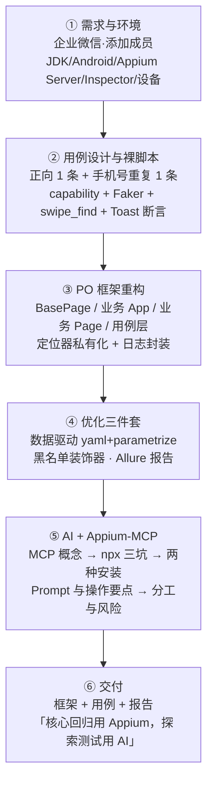

# 实战项目：企业微信用户端 App 自动化测试实战 — 直播观看思路

> **一句话定位**：这是 APP 自动化板块的 **L5 实战收口**——把 Ch24（失败留证）、Ch25（弹窗容错）、Ch26（架构优化）、Ch27（PO 框架）全部落到一个**真实国民级 App（企业微信·添加成员）**上，最后接上 **AI + Appium-MCP**（让 AI 直接操作 App）。
>
> 配套：[[Ch28-企业微信App自动化测试实战与AI辅助测试|Ch28 课程笔记]] · [[../../03-Projects/06_app_auto_test-main/App自动化实战-完整技术文档|App 自动化实战-完整技术文档]] · [[../../03-Projects/06_app_auto_test-main/项目总结|项目总结]]

---

## 一条主线（进化链）

```
裸脚本直写用例（能跑）
   → PO 重构分层（可维护：UI 变了只改一个类）
      → 优化三件套（数据驱动 + 黑名单容错 + Allure 报告 = 可回归）
         → AI + Appium-MCP（换执行者：从「人写代码」到「AI 直接操作 App」）
```



---

## 分阶段观看

### 阶段 ①：需求与环境（第 1–8 页）

**直播会讲什么**：企业微信是什么、要测什么（添加成员）、测试需求四条（功能测试 / 框架 / 用例 / 优化 / 报告）、环境六件套（JDK / Android / Appium Server / Inspector / python 客户端 / 设备）、业务流程与用例设计表。

**带着这些问题看**：
- 为什么「测试需求」里「框架、用例、优化、报告」各占一条？企业交付物到底是什么？
- 「添加成员」这条业务路径要经过几个页面？每个页面的跳转动作分别是什么？
- 用例设计表里的「预期结果」写得那么细，是为了什么？（提示：断言从哪里来）
- 为什么异常用例选「手机号重复」，而不是「网络异常」？

**易踩的坑**：
- 环境没通就开始写代码 → 失败分不清是环境问题还是代码问题。**先做「环境自检三连」**：`adb devices` / `appium` / `dumpsys activity top`（拿包名 Activity）。
- 忽略「前提条件」：企业微信必须已登录（`noReset=True` 保登录态），登录态失效脚本会卡在登录页。
- `deviceName` 抄别人的 → 用自己 `adb devices` 的输出。

---

### 阶段 ②：用例设计与裸脚本（第 9–10 页）

**直播会讲什么**：`test_wework_contact.py`——capability 七件套、Faker 造数据、`swipe_window` / `swipe_find` 滑动查找、姓名/手机号输入框的 XPath、保存后 Toast 断言。

**带着这些问题看**：
- 为什么这节课先写「裸脚本」，不直接上 PO 框架？（提示：探路 vs 沉淀）
- `swipe_find("添加成员")` 为什么不能换成直接 `find_element`？按钮在哪？
- 两个输入框为什么用 `//*[contains(@text,'姓名')]/../*[@text='必填']` 这种「绕一圈」的定位？（提示：输入框没有 resource-id，只能用邻接文字 + 父轴）
- `setup_class` 放 Faker、`setup_method` 建 driver——为什么这样分配？
- Toast 断言为什么必须紧跟在点击保存之后？

**易踩的坑**：
- **照抄源码的隐式等待不一致**：启动设 10s，`swipe_find` 里恢复成 15s——两处数字要对齐（统一常量）。
- `noReset=True` 被理解成「清缓存」（实际是**不重置数据/保留登录态**）。
- 把 `forceAppLaunch=True` 当成 `noReset` 的同义词（前者管会话建立时拉起 App，后者管数据是否重置）。
- 滑动用写死坐标 → 换分辨率就崩，用 `get_window_size()` 按比例算。
- Toast 取晚了（2s 消失），断言直接失败。

---

### 阶段 ③：PO 框架重构（第 11–27 页）← 本课重点

**直播会讲什么**：框架分层表（BasePage / 业务 App / 业务 Page / 用例层）+ 目录结构（base·page·cases·datas·utils）→ 搭空架子 → 填充四件事：**app 启动 / BasePage 封装 / 定位器私有化 / 日志封装** → 优化：数据驱动（yaml + conftest 路径 + 中文乱码钩子）→ 黑名单装饰器 → Allure 报告。

**带着这些问题看**：
- `BasePage` 和「业务 App」为什么要分两层？（提示：换 App 时哪层要改）
- `find_and_click` 里的 `click()` 是「多写了一个方法」，还是「给框架留了一个统一入口」？（提示：黑名单装饰器要挂在哪里）
- 为什么定位器要写成 `__CONTACT_BTN = AppiumBy.XPATH, "..."` 这个「元组」？`*` 解包在做什么？
- `swipe_find` 找不到元素时为什么抛异常而不是返回 `None`？
- 跳转方法 `goto_xxx()` 为什么必须 `return` 下一个页面对象？
- 数据驱动里，`conftest.py` 为什么要 `sys.path.append(root_path)`？中文乱码钩子为什么能修乱码？
- 黑名单装饰器为什么只挂在 `find_ele` / `find_eles` 上，就能让整个框架的点击、输入都获得弹窗容错？
- `@allure.step` 为什么加在**页面方法**上，报告就自然变成「业务步骤链」？

**易踩的坑**：
- **PO 六原则里最容易被忽略的两条**：「方法内不加断言」「方法返回 PageObject 或断言数据」。
- 源码笔误 `wait_ele_located` 用了 `invisibility_of_element_located`（等的是「不可见」，语义相反）→ 这类错误不报错，只让等待神秘超时。
- 源码笔误 `os.sep.join([root_path, '..', f'/logs'])`（`f'/logs'` 无占位符 + 硬编码 `/`）。
- Allure 命令参数混乱：正确写法是 `allure generate --clean ./results -o ./report/html`。
- 源码笔误 `//*[@text=['取消']`（多一个 `[`）。
- 把「数据驱动」理解成「多写几条用例」——它的本质是**逻辑与数据分离**（加数据不改代码）。
- 只做 PO 不做黑名单/报告 → 框架「能跑但不落地」（失败没现场、结果没法给团队看）。

---

### 阶段 ④：AI + Appium-MCP（第 28–43 页）← 全新内容

**直播会讲什么**：MCP 是什么、Appium-MCP 能做什么、架构对比（人写代码 vs AI 执行）、AI 执行流程；然后是最工程化的部分——**为什么不用 npx（三个坑）**、两种安装方式 + 客户端配置、实战 Prompt 与操作要点、优势总结、**和 Appium 如何结合**、风险与注意事项。

**带着这些问题看**：
- MCP 解决的是什么问题？（提示：LLM 只能输出文本，怎么操作真机）
- 为什么强调「按元素定位点击」而不是给坐标？坐标点击在什么情况下会偏？
- npx 的三个坑（镜像 ETARGET / npm 11 解析 bug / Windows 无 shell spawn ENOENT）为什么都能用同一个方案解决？它们的共同点是什么？
- `-g` 全局安装为什么还要显式带 `--registry`？（提示：npm 配置层级里没有「项目级」）
- 方式二里 `overrides` 把 `mcp-proxy` 锁到旧版，是在解决什么问题？（提示：镜像同步滞后）
- 客户端 `command` 为什么不能写 `"npx"` 或 `"appium-mcp"`？
- 为什么结论是「核心流程用 Appium、探索测试用 AI」，而不是「AI 替代脚本」？
- 「加操作白名单」为什么比黑名单更安全？

**易踩的坑**：
- **照抄 Prompt 里的 `noRest`**（正确是 `noReset`）。
- Prompt 写得太笼统（「测试添加成员功能」）→ 模型自由发挥、乱试；要给**编号步骤 + 可见文案 + 断言目标**。
- 以为 AI 会「看屏幕猜坐标点击」→ 规范用法是先读元素树（`generate_locators` / `appium_find_element`）再按元素定位操作。
- 以为 AI 自动化不用配 Appium 环境（底层还是 UiAutomator2/XCUITest）。
- 在**测试环境/测试账号**之外的地方跑 AI 自动化 → 误操作会动真实数据。
- 把「效率提升 10x」当成长期维护成本的下降（它只是探索环节的体感收益）。
- 改完配置不重启客户端 → MCP 服务端根本没拉起。

---

### 阶段 ⑤：总结（第 44–45 页）

**直播会讲什么**：四句话收口——Appium 环境搭建 / App 自动化测试用例编写 / PO 设计模式搭建框架 / AI 辅助 App 自动化。

**带着这个问题看**：这四件事里，哪一件是你简历上「能写、能被追问、能扛住 3 层深挖」的？（答案通常是 PO 框架 + 报告，因为它可量化、可展示）

---

## 课后动手清单

- [ ] **环境自检三连**跑通：`adb devices` / `appium` / `adb shell dumpsys activity top | grep ACTIVITY`（拿到企业微信包名 + Activity）
- [ ] 写**裸脚本** `test_contact.py`：先不加 swipe 跑一次看它怎么失败，再加 `swipe_find("添加成员")` 跑通（亲身踩「按钮在屏幕外」）
- [ ] **PO 重构**：四层落地，用例层**不许出现** `find_element` / `AppiumBy`，所有定位器改私有元组 + `*` 解包
- [ ] **数据驱动**：数据抽到 `datas/data.yaml`，`parametrize` 跑 3 组（加数据不加代码）
- [ ] **黑名单装饰器**：故意写错一个定位器文案，确认 Allure 报告里真有截图 + `page_source`
- [ ] **Allure 报告**：`--alluredir` → `allure serve` → `allure generate --clean ./results -o ./report/html`（记住正确参数顺序）
- [ ] **改掉源码三处「不报错但行为不对」**：重复点击「添加成员」、`find_eles` 漏挂装饰器（`swipe_find` 直接调 driver 绕过了容错）、隐式等待 10 vs 15
- [ ] **配 Appium-MCP**：方式一装 + `command` 写 `node` + 绝对路径 + 重启客户端，用 `appium_session_management(action=create)` 验证；卡 ETARGET 就切方式二 + `overrides`
- [ ] **用 Prompt 跑一遍**添加成员（把 `noRest` 改成 `noReset`），跑完回答：它真做 Toast 断言了吗？它拿到的定位表达式和你手写的一致吗？
- [ ] **口述四问**：PO 六原则 / 黑名单为什么只挂 find 方法 / 隐式 vs 显式等待 / 换 App 要改哪两行
- [ ] 把本课沉淀成**简历条目**：一句 STAR + 一条量化（如「用 PO 框架覆盖企业微信添加成员主流程，用例维护成本降低 X」）

---

## 关联笔记

- [[Ch28-企业微信App自动化测试实战与AI辅助测试]]（本实战的课程笔记，16 个知识点）
- [[Ch27-基于PO模式的测试框架优化实战]]（同一套 PO 框架的雪球版；两章对照着看「哪层可复用」）
- [[Ch26-自动化测试架构优化]]（四层结构 + 数据驱动 + 报告）
- [[Ch25-app弹窗异常处理]]（黑名单 + 装饰器原理）
- [[Ch24-自动化关键数据记录]]（日志 / 截图 / page_source）
- [[Ch23-特殊控件Toast]]（Toast 定位与 2s 抓取时机）
- [[Ch22-显式等待高级使用]]（`expected_conditions` 语义，含 `visibility_` vs `invisibility_`）
- [[Ch20-XPath高级定位技巧]]（父轴 `..` + contains 组合定位）
- [[Ch11-Capability配置参数解析]]（noReset / forceAppLaunch / `appium:` 前缀）
- [[Ch17-滑动交互方法]]（swipe 坐标与滑动查找）
- [[../../03-Projects/06_app_auto_test-main/App自动化实战-完整技术文档|App自动化实战-完整技术文档]]（项目源码级详解 + AI 部分）
- [[../../03-Projects/06_app_auto_test-main/项目总结|项目总结]]（课程视角速览）
