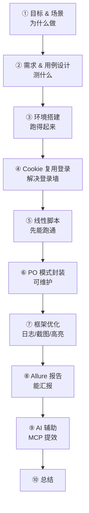

# 实战项目：企业微信 Web 自动化测试 — 直播观看思路

> 本文件是"带着思路看实战直播"的地图，不是知识点笔记。直播 = L5 usecase《企业微信 web 自动化测试实战》共 41 页。
> 每阶段给你三样东西：**直播会讲什么 / 带着这些问题看 / 易踩的坑**，最后是**课后动手清单**。

## 一、这个实战项目一句话定位

用 Selenium + Pytest 给企业微信管理后台的"添加成员"功能搭一套 **PO 模式** 的 Web 自动化测试框架，从"能跑的线性脚本"一路优化到"可维护、可观测、能出报告"的工程化框架。

> 直播主线是一条"进化链"：
> 线性脚本 → PO 封装 → 框架优化（日志/截图/高亮）→ Allure 报告 → AI 辅助。
> 记住这条链，每一页都在为下一步做铺垫。

## 二、直播整体脉络图

## 三、分阶段观看思路

### 阶段① 目标与适用场景（第 2~4 页）

**直播会讲什么**：课程目标 4 条 + "什么场景适合做 Web 自动化"。

**带着这些问题看**
- 课程目标为什么把"脚本编写 / 框架封装 / 框架优化"分成三个能力层次？它们对应代码演进的哪三步？
- "业务流程不频繁改动 / UI 元素不频繁改动 / 频繁回归 / 核心场景"——企业微信添加成员满足这四条里的哪几条？

【为什么？】 自动化最大的成本不是写脚本，而是**维护脚本**。所以"该不该自动化"的判断标准，本质是"变更频率低 + 执行频率高"。UI 天天改，脚本就天天修，得不偿失。

【易错点】 不是所有测试都适合自动化。面试常问"什么场景适合/不适合自动化"，背这四条 + 能举反例（探索性测试、一次性验证、频繁改版的页面）才算答到位。

---

### 阶段② 需求说明 + 设计测试用例（第 5~7 页）

**直播会讲什么**：企业微信是什么 → 需求拆解 → 两张用例表（正常添加 + 重复账号）。

**带着这些问题看**
- 需求里"输出测试报告"为什么单独列一条？它对应后面哪一页的 Allure？
- 用例表五列：测试模块 / 用例标题 / 前置条件 / 用例步骤 / 预期结果——哪一列在"自动化代码"里最难表达？为什么是"前置条件"（登录）和"预期结果"（断言）？

【为什么？】 用例是脚本的"施工图"。把用例步骤翻译成代码，就是后面线性脚本里那一长串 find_element + click；把"预期结果"翻译成代码，就是 assert。

【易错点】 正常用例 + 重复账号用例，一个断言"保存成功"，一个断言"账号已被占用"——**两条用例的差异只在预期结果，步骤几乎一样**。这正是后面 PO 模式"同样的行为不同结果建模为不同方法"的伏笔。

---

### 阶段③ 搭建环境（第 8 页）

**直播会讲什么**：Selenium 4.x 自动下载 driver，失败则手动配置。

**带着这些问题看**
- 为什么 Selenium 4.x 的 `webdriver.Chrome()` 不用传 chromedriver 路径了？3.x 和 4.x 的差别在哪？
- `SE_OFFLINE=true` 这个环境变量是干什么的？

【为什么？】 4.x 内置 **Selenium Manager**：自动检测 Chrome 版本 → 下载匹配的 chromedriver → 缓存 → 启动。所以"版本不匹配"这个高频坑在 4.x 里被抹掉了。`SE_OFFLINE` 是告诉它"别联网找了，我自己配好了"。

【易错点】 老教程里 `Service(executable_path=...)` 的写法在 4.x 里路径参数已经移到了 `Service` 里，直接 `webdriver.Chrome(executable_path=...)` 会报 TypeError。

---

### 阶段④ Cookie 复用登录（第 9 页）—— 本场第一个"工程化"动作

**直播会讲什么**：怎么绕过扫码登录——第一次人工扫码，把 cookie 存成 yaml，以后读 yaml 直接登。

**带着这些问题看**
- 为什么要"保存 cookie"而不是每次都扫码？扫码对自动化意味着什么？
- `add_cookie` 之前为什么要先 `driver.get(url)` 打开同域页面？

【为什么？】 自动化最怕"人工介入"——扫码需要人，人就进不了 CI、跑不了无人值守回归。Cookie 复用把"一次性的人工登录"变成"可复用的登录态"，是 UI 自动化登录的通用解法（企业微信、后台管理系统都这么干）。

【易错点】 **`add_cookie` 必须先在目标域打开一个页面**，否则会报 `invalid cookie domain`。很多新人直接 add_cookie 到空浏览器上，就是这个坑。

---

### 阶段⑤ 线性脚本：通讯录添加成员（第 10 页）—— 先跑通

**直播会讲什么**：从登录 → 进通讯录 → 添加成员 → 断言的完整线性脚本，用 Faker 造数据。

**带着这些问题看**
- 为什么测试数据要用 Faker 造随机数（`fake.uuid4()` 做账号）？如果写死"张三 13800138000"会怎样？
- 脚本里 `implicitly_wait(15)` 和一堆 `WebDriverWait(...).until(...)` 为什么混着用？各自解决什么问题？
- 最后为什么用 `assert tips.text == "保存成功"` 和 `assert mname in name_list` 两次断言？

【为什么？】 Faker 造随机账号是因为"账号唯一性"——重复账号会触发第二条用例的"已被占用"。随机数据让用例可重复跑（回归），不会第二次跑就失败。

【易错点】 15 秒隐式等待偏大。隐式等待是全局兜底，值大会拖慢每个找不到元素的用例，实战建议 3~5 秒，主力等待交给显式等待。

---

### 阶段⑥ PO 模式封装（第 11~19 页）—— 本场核心

**直播会讲什么**：线性脚本的三大痛点 → PO 建模原则 → 企业微信页面建模图 → 项目结构 → base/page/tests 代码。

**带着这些问题看**
- 线性脚本"无法适应 UI 频繁变化"具体体现在哪？如果一个定位器变了，你要改几个地方？
- PO 建模原则里"方法应该返回 PageObject 或返回用于断言的数据"——看 `goto_contact_page()` 返回 `ContactPage()`，`get_tips()` 返回字符串，这两类分别对应什么？
- "不要在方法内加断言"为什么是原则？断言应该放哪？

【为什么？】 PO 的核心是**把"页面怎么变"和"业务怎么测"解耦**：页面元素的定位、操作封装在 Page 类里，用例只关心业务步骤（登录 → 进通讯录 → 添加成员 → 校验）。UI 变了只改 Page 类一处，用例一行不动。

【易错点】 链式调用 `self.main.login().goto_contact_page().goto_add_member()` 能成立的前提是**每个方法都 return 下一个页面对象**（或 self）。这是 PO 最容易被忽略的细节——忘了 return 链就断了。

---

### 阶段⑦ 框架优化：BasePage 封装 + 日志 + 截图 + 高亮（第 21~26 页）

**直播会讲什么**：把重复代码下沉到 BasePage（find/find_click/find_send/wait_* 等），加 loguru 日志、异常截图 + 保存 PageSource、元素高亮。

**带着这些问题看**
- `find()` 方法里 try/except 包住定位，失败时返回 None 而不是抛异常——这样设计的好处和代价是什么？
- "错误截图始终执行，操作截图默认关闭"——为什么要区分两种截图？
- 元素高亮用 `execute_script` 改 border——为什么用 JS 而不是 Selenium 的某个 API？

【为什么？】 日志 + 截图 + PageSource 合起来叫"**可观测性**"：用例半夜在 CI 上挂了，你早上看 Allure 报告，能看到"定位哪个元素失败 → 当时的页面长什么样 → 页面源码"三件套，不用复现就能定位。这是测试框架从"玩具"到"能交付"的分水岭。

【易错点】 BasePage 构造函数里 `if driver is None: 自己 new 一个 Chrome`——这个"可注入 driver"的设计让多页面共享同一个浏览器会话（`ContactPage(self.driver)`），否则每 new 一个页面对象就开一个新浏览器。

---

### 阶段⑧ Allure 报告（第 27~30 页）

**直播会讲什么**：`@allure.step` 给每个页面方法加步骤、截图和 PageSource 作为附件挂进报告、用例加 feature/story/title，最后 `pytest --alluredir` + `allure serve`。

**带着这些问题看**
- `@allure.step` 加在"页面方法"上而不是"用例"上，为什么这样报告会更好看？
- 截图挂进报告靠的是 `allure.attach.file`——它是在 `screen_image()` 里顺手做的，这体现了什么设计思路？

【为什么？】 allure 报告的价值是**给非测试的人看**：feature/story 是"测哪个模块哪个场景"，step 是"每一步做了什么"，附件是"失败时的证据"。一个测试框架能不能在公司推得动，报告好不好看占一半。

---

### 阶段⑨ AI 辅助 Web 自动化测试（第 31~40 页）

**直播会讲什么**：MCP 是什么 → opencode + Playwright MCP → 自然语言执行用例 → AI 生成 PO 脚本 → 风险与对策。

**带着这些问题看**
- MCP 让 AI 从"写代码"变成"直接执行任务"，本质区别是什么？
- 最后的"风险 & 注意事项"为什么把"限制 MCP 权限 / 白名单 / 沙箱 / 审计日志"当成重点？

【为什么？】 传统 AI 辅助 = AI 生成代码 → 人跑。MCP 路线 = AI 直接操作浏览器 → 实时看到结果 → 再让 AI 把验证过的流程沉淀成脚本，即"先探索、后固化"。风险对策的核心是**让 AI 只能做白名单内的事**，防止它误删数据。

【扩展知识】 这是本模块的"了解"项（课程目标里是"了解 AI 辅助"）。投简历时知道 MCP + Playwright MCP 的概念、能说清"自然语言探索 → 脚本固化"的流程即可，不需要手写 opencode.json。

---

## 四、课后动手清单（看完直播再验证）

> 每一条都是"能动手就不只是看"的任务，做完才叫真会。

- [ ] 跑通环境：`uv sync` 后 `python -c "from selenium import webdriver; webdriver.Chrome().quit()"` 不报错
- [ ] 手写一遍线性脚本（不抄），跑通"添加成员"，体验 Faker 随机数据
- [ ] 自己把线性脚本拆成 MainPage / ContactPage / AddMemberPage + BasePage，验证链式调用能跑通
- [ ] 故意写错一个定位器，看日志 + 截图 + PageSource 三件套是否都生成
- [ ] 加 `@allure.feature/story/title/step`，`allure serve` 打开报告确认截图附件在
- [ ] 口述：为什么 `add_cookie` 前要先打开同域页面？为什么 PO 方法里不加断言？

## 五、关联笔记

- [[Ch15-PageObject设计模式]] — PO 建模原则的完整展开
- [[Ch19-Cookie复用自动化登录]] — Cookie 登录的完整知识点
- [[Ch16-异常自动截图]] — 报错截图的前置章节
- [[Ch04-自动化测试用例结构分析]] — 用例五列 ↔ 代码结构的映射
- [[Ch14-电子商务产品实战-litemall优惠券管理]] — 上一个实战项目，对比两个实战的异同
