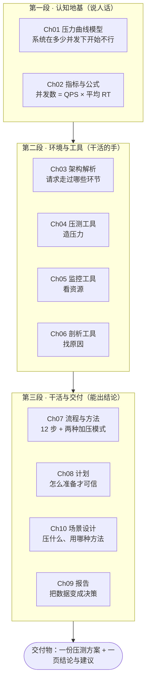

# L1 性能测试体系 · 10 章重点梳理（跟着学版）

> 用法：**一段一段来，每段读完合上书口述，答不上来才回看原文。** 不要先通读 10 章。
> 配套：[[性能测试学习地图-初学者重点]]（先放清单与两周行动）· [[README|课程 MOC]]

---

## 0. 10 章的关系（主线只有四句话）

> **一句话记住结构：Ch01/Ch02 是"语言"，Ch03-Ch06 是"工具"，Ch07-Ch10 是"干活的顺序"。**
> 工具记不住不影响面试；语言（曲线 + 公式）说不清，面试必挂。

### 今天的三段节奏（建议 90~120 分钟）

| 段         | 章节                        | 读完必做的口述题                                              | 时长     |
| --------- | ------------------------- | ----------------------------------------------------- | ------ |
| 第一段 认知地基  | Ch01 → Ch02               | Q1 曲线怎么读？Q2 弃忍区 TPS 为什么降？Q3 并发数怎么算？                   | 40 min |
| 第二段 环境与工具 | Ch03 → Ch04 → Ch05 → Ch06 | Q4 瓶颈怎么定位（工具链）？Q5 为什么都用 JMeter？Q6 top 看什么、jstack 干什么？ | 40 min |
| 第三段 干活与交付 | Ch07 → Ch10 → Ch08 → Ch09 | Q7 流程重点 4 步？Q8 并发模式 vs RPS？Q9 压测报告要有什么？               | 40 min |

---

## 第一段 · 认知地基

### Ch01 性能测试介绍与压力曲线模型 ⏱ 25 min

**这章要回答的一句话**：性能测试到底在测什么？系统在多少并发下开始不行？

**必须掌握（7 条）**
1. 定义：在**现实场景 / 不同负载条件**下衡量 RT、吞吐量、资源利用率、稳定性、可扩展性
2. 四个目的：发现瓶颈 / 评估系统能力 / 优化性能 / 检验可靠性
3. 应用场景 → 并发模型：大促峰值、热点突发、抢票、日常容量规划、新品参考竞品
4. 价值：**良好的容量规划能力 + 性能调优能力 = 为老板省钱**（降本增效）
5. 知识体系四大模块：理论 / 工具 / 流程与场景设计 / 调优（调优是资深级别）
6. ⭐️ **压力曲线模型**：三曲线（RT 蓝 / TPS 紫 / 资源利用率 绿）+ 三区域（Light Load 轻压力 / Heavy Load 重压力 / Buckle Zone 弃忍）+ 两拐点（最佳并发用户数 Optimum / 最大并发用户数 Maximum）
7. 拐点的工程意义：容量结论给"**日常区间 + 容量上限 + 扩容红线**"，不给单点数字

**核心金句（背下来）**：
- "均值看趋势，分位值定 SLA。"
- "三条曲线一起看：**产能（TPS）+ 成本（利用率）+ 体验（RT）**，单看 TPS 会把过载读成正常。"

**最容易懵的点**：弃忍区里 TPS 反而下降、资源仍满 → 机制是**排队变长 → 超时重试 + 线程上下文切换 + GC 抢占 → 资源被内耗在"管理拥堵"上**。

**面试会怎么问**：什么是性能测试？和功能测试区别？压力曲线怎么解读？最佳并发数和最大并发数有什么区别，压测压到哪个点？压测结果出来你怎么定容量？

**你的思考题（写下答案）**：为什么过了第二个拐点 TPS 反而下降？"资源都被占满了，为什么处理能力变弱了？"
> 你的答案：

**过关标准**：白板 2 分钟画出三曲线三区域，并说出两个拐点的工程含义。

---

### Ch02 性能测试概念与指标体系 ⏱ 20 min

**这章要回答的一句话**：那些数字各自指什么？怎么从业务量算出我该压多少？

**必须掌握（6 条）**
1. 并发 = **虚拟并发用户数**（同时在发请求），业务说的"同时在线人数"必须折算，不能直接当并发
2. 口径：RT（端到端响应时间）、吞吐量（统称）、TPS（业务事务/秒）、QPS（查询/接口/秒）
3. **TPS = QPS 的条件**：一个业务只对应一个请求连接时成立；一般 TPS 衡量业务流程、QPS 衡量接口查询
4. ⭐️ **并发数 = QPS × 平均 RT**（利特尔法则）→ 反推：RT 上升会让并发堆积，这是弃忍区形成的数学解释
5. 分位值：Mean（看趋势）/ P90·P95（大多数用户的体验）/ P99（最差 1%，投诉与抖动来源）
6. 加压方式一句话结论：单机高并发靠**多线程**，大规模靠**多进程 + 多机分布式**

**核心金句**：
- "并发数 = QPS × 平均 RT——**RT 一涨，并发需求成倍增加**，所以 RT 上升同时也是容量事件。"
- "线上 SLA 写 TP99，不写平均值。"

**最容易懵的点**：① 并发 ≠ 在线用户；② 单位（200ms = 0.2s）；③ 平均值掩盖长尾。

**面试会怎么问**：性能测试关注哪些指标？并发是什么意思？并发数怎么算？TPS 和 QPS 什么时候相等？看平均值还是分位值，为什么？

**你的思考题**：把"某电商日订单 10 万单，峰值时段（20:00-21:00）占全天 30%，下单接口平均 RT 200ms"推成：峰值 QPS = ? 瞬时并发 = ?
> 你的推导：
> （提示：先把 10 万 × 30% 落到 1 小时内，再换算每秒；最后用并发数公式）
> 卡住了 → 直接看本文末尾的 **附：容量推导五步法（含例题）**，那里用**另一组数字**完整演示了推理过程

**过关标准**：现场写出上面这道推导，每一步说得清"为什么这么算"。

---

## 第二段 · 环境与工具

### Ch03 经典技术架构解析 ⏱ 12 min（了解即可，别细抠）

**这章要回答的一句话**：一个请求走过了哪些环节？出问题该看哪一层？

**必须掌握（3 条）**
1. 架构演进：单机 → 分布式集群，**监控也从单机命令升级为多机监控系统**
2. 经典架构分层：Nginx（反向代理/负载均衡）→ 应用集群（微服务）→ DB 集群 / 缓存集群 / 消息队列 → K8s + Docker 部署 → Prometheus + Grafana + Alert 监控告警
3. 每层的"盯守指标"：Nginx（连接数/QPS/错误率/upstream RT）、应用（CPU/内存/线程池/GC）、DB（连接数/慢SQL/锁）、缓存（命中率/热 key）、MQ（堆积量）

**核心金句**：**"架构图上的每个方框，都是压测时要盯的一组指标。"**

**面试会怎么问**：你们系统什么架构？分布式架构下压测和单体有什么不一样？压测时你关注哪些节点？

**你的思考题**：对着 Ch03 的 Mermaid 图，给每一层写 1 个"最可能先饱和"的指标。
> 你的答案：

**过关标准**：能对着架构图说出一条"从入口到数据层"的排查顺序。

---

### Ch04 行业流行性能压测工具介绍 ⏱ 15 min

**这章要回答的一句话**：用什么工具造压力？为什么行业默认 JMeter？

**必须掌握（5 条）**
1. 压测工具三大功能：模拟用户行为、生成大量请求、测量 RT 与资源利用率（价值 = **让压力可复现、数据可比较**）
2. Apache AB：开源命令行、单 URL 基准测试、`-n` 请求数 / `-c` 并发数 / `-t` 超时
3. 五个工具一句话定位：**JMeter**（开源 Java、多协议、分布式、参数化、图形化 → 企业默认）、**nGrinder**（平台化 controller + agent，团队级大规模）、**Locust**（Python 写脚本，与自动化框架打通）、**LoadRunner**（商业，协议广、监控分析强、贵，金融/传统行业）、**AB**（快速基准）
4. ⭐️ 为什么选 JMeter（六大优点）：开源自由 / 跨平台 / 高可扩展（分布式）/ 多协议 / 灵活脚本（参数化）/ 强报告分析
5. 组织方式：按"**成本 → 覆盖面 → 规模 → 结果可用性**"讲，而不是罗列优点

**核心金句**：**"能用一条命令回答的问题，别上 JMeter；但业务链路压测，AB 不够用。"**

**面试会怎么问**：JMeter 和 LoadRunner 的区别？你们为什么用 JMeter？AB 和 JMeter 什么区别？

**你的思考题**：用一句话说明"为什么不做参数化的压测数据不可信"。
> 你的答案：（提示：缓存、风控、锁竞争）

**过关标准**：1 分钟讲完选型理由；知道工具细节要等 L2 的 JMeter 模块学。

---

### Ch05 行业流行性能监控工具介绍 ⏱ 20 min

**这章要回答的一句话**：压力造出来了，我怎么知道服务器撑不撑得住？哪类资源先满？

**必须掌握（6 条）**
1. 分工：**压测工具看业务指标（TPS/RT/错误率），监控工具看系统指标（CPU/内存/IO/网络），两侧按时间轴对齐才能定位瓶颈**
2. 工具分层：Linux 自带命令（快速排查）→ Nmon（单机持续采集）→ Collectd + InfluxDB + Grafana（采集/存储/可视化三层）→ Prometheus + Grafana（主流：标签模型 + PromQL + 内建告警 + Exporter 生态）
3. ⭐️ **vmstat 1** 三个关键字段：`r`（等 CPU 的运行队列，> 核数 = CPU 瓶颈）、`wa`（IO 等待高 = 磁盘瓶颈）、`si/so`（非 0 = 内存不足用 swap）
4. ⭐️ **top** 用来定"哪个进程"：按 CPU/内存排序；`top -H -p <pid>` 看线程级
5. Nmon：低开销、高采样率、可导出 → **压测全过程采集的标准工具**
6. 为什么监控要分层：采集要轻 / 存储要专（时序库）/ 可视化要灵活

**核心金句**：**"命令是急诊，监控平台是病历。"**（急诊先定方向，病历用来复盘与出报告）

**最容易懵的点**：`r` 不是进程总数；load average 高 ≠ CPU 使用率高（可能在等 IO）。

**面试会怎么问**：压测时怎么快速判断瓶颈在哪？vmstat 你关注哪些列？你用什么做性能监控？

**你的思考题**：8 核机器 `r=25、wa=2、si/so=0、id=5%`，你的判断是什么？下一步看什么？
> 你的答案：

**过关标准**：压测时能在 30 秒内说出"瓶颈方向是 CPU / IO / 内存"。

---

### Ch06 行业流行性能剖析工具介绍 ⏱ 20 min

**这章要回答的一句话**：知道哪个进程忙了，怎么再往下定位到"哪段代码 / 哪一跳调用"？

**必须掌握（6 条）**
1. 性能剖析四件事：指标收集 / 热点分析 / 优化建议 / 可视化报告（比监控更低一层：监控看资源，剖析看**方法、代码、调用链**）
2. JConsole：JDK 自带，看内存 / GC / 线程 / 类加载 → 判断"CPU 高是业务代码还是 GC 在抢"
3. VisualVM：多合一剖析（CPU 剖析找热点方法、内存剖析、Heap Dump）；⚠️ 插桩有性能开销，**正式压测轮次不要开**
4. ⭐️ **jstack**：线程堆栈 → 死锁、锁竞争、阻塞；经典组合 `top -H -p <pid>` 找高 CPU 线程 → 转十六进制 → 在 jstack 里搜 `nid` → 定位到代码行；多次采样取重复方法 = 找 CPU 热点
5. ⭐️ **火焰图**：横轴宽度 = 该调用占 CPU 时间比例（**越宽越热**），纵轴 = 调用栈深度；只对 CPU 型问题敏感
6. 链路追踪：**SkyWalking**（链路 + 服务拓扑 + 指标）、**Zipkin**（轻量、Trace/Span、上下文传播）→ 微服务下回答"**慢在哪一跳**"

**核心金句**：**"压测造问题，监控缩范围，剖析给结论。"**

**面试会怎么问**：线上 CPU 飙高你怎么排查？火焰图怎么读？微服务下怎么定位瓶颈？

**你的思考题**：写出你的下钻顺序（压测 → 监控 → 剖析）并各举一个工具。
> 你的答案：

**过关标准**：能说出"top -H + jstack"的完整步骤；知道火焰图看宽度不看颜色。

---

## 第三段 · 干活与交付

### Ch07 性能测试流程与方法 ⏱ 15 min

**这章要回答的一句话**：一次压测从哪开始到哪结束？加压方式怎么选？

**必须掌握（4 条）**
1. ⭐️ **12 步流程**（背"四段式"）：准备（分析现状 → **取基线** → 定义用户场景 → **定义验收标准** → 计划/脚本 → 压测环境）→ 执行（阶梯加压 → 监控）→ 分析（归因）→ 交付与迭代（报告 → 改进建议 → **持续测试**）
2. 两个最容易跳过、代价最大的步骤：**取基线**（否则无法对比优化效果）、**定义验收标准**（否则不知道达标与否）
3. ⭐️ **并发模式（虚拟用户）**：客户端视角，设"多少用户同时在操作"，回答"**能承载多少在线用户**"；结论业务方易懂；缺点：压力随 RT 变化，跨版本不可比
4. ⭐️ **RPS 模式（吞吐量）**：服务端视角，设"每秒发多少请求"，免折算、**压力恒定、可比性好** → 基准测试、优化前后对比、**性能回归必须用它**

**核心金句**：**"没有基线，就没有'优化了多少'；性能回归必须用 RPS 模式。"**

**面试会怎么问**：如何开展性能测试 / 流程是什么？并发模式和 RPS 模式怎么选？（追问：为什么跨版本对比要用 RPS）

**你的思考题**：为什么"并发模式"在同一系统不同版本之间做对比不严谨？
> 你的答案：

**过关标准**：口述 12 步（能说出重点 4 步）+ 说清两种模式的适用场景。

---

### Ch10 性能测试场景设计 ⏱ 15 min（提前于计划讲，因为是计划的输入）

**这章要回答的一句话**：这次要压什么？用哪种测试方法？

**必须掌握（4 条）**
1. 场景三要素：用户行为 / 负载模式 / 使用情况（**结论必须绑定场景描述才成立**："系统能撑 3000 QPS"是无效结论）
2. ⭐️ **五种常用方法**：**负载测试**（预期负载下表现，设置要匹配实际）/ **压力测试**（故意超出设计能力，找瓶颈与雪崩点）/ **稳定性测试**（长时间持续负载，看指标漂移、泄漏）/ **并发测试**（多用户同时访问同一资源，查死锁与竞争条件）/ **容量测试**（测容量与资源利用，为扩容与规划提供依据）
3. ⭐️ **三类用途对照**：**能力验证**（规格 + 指标要求 → 达标判定，通常单机）/ **容量规划**（用户量级 → 需要多少机器、怎么部署）/ **问题追查与风险发现**（长时间发压 → 隐患清单，如 24h 无内存泄漏、Full GC < 1s）
4. 选方法的判断法：**"要发现什么问题"决定"用哪种方法"**

**核心金句**：**"能力验证回答行不行，容量规划回答要多少，问题追查回答会不会慢慢坏。"**

**面试会怎么问**：负载测试和压力测试的区别？稳定性测试怎么做？你们通常做哪几类压测？

**你的思考题**：业务方说"双十一预计 50 万 UV，你们看看行不行"——这属于哪类用途？你要交付什么？
> 你的答案：

**过关标准**：能按业务量说出三类场景 + 每个场景的请求比例与加压方式。

---

### Ch08 性能测试计划 ⏱ 20 min

**这章要回答的一句话**：正式压测前要准备什么，才能让结论可信、可复现？

**必须掌握（7 条）**
1. 计划七理由（核心是 **可重复性**）：明确目标 / 确定范围 / 环境与配置 / 测试策略 / 资源规划 / 风险评估 / 结果分析与报告
2. ⭐️ **七阶段流程**：需求分析与测试设计 → 环境设计与搭建 → 测试数据准备 → 性能指标预期设定 → 发压工具配置与脚本编写 → 测试执行与监控 → 测试报告输出
3. 需求分析两条路：**已有业务**（行为日志 + 业务数据 DAU/PV/订单量 → 业务模型 → 预估接口 TPS/QPS）；**新业务**（参考友商 + 产品运营梳理核心场景路径/入口/转化率 → 转成数据量级与接口比例）
4. 环境：结合线上部署、**同比 1/2、1/4**；**不可能 1:1**；分起压环境（工具+机器参数）与被压环境（服务+代码部署改造+机器参数）；必须记录代码改造项（关验证码/风控/限流）
5. 测试数据：请求参数（构造/日志/上下关联）、库表数据（**量级对齐生产**）、多接口**请求比例**、参数化
6. ⭐️ **指标预期**：QPS 从业务拆分；**RT C 端 ≤ 1s、尽量 200ms 内**（建议同时定 TP99）；错误率**设上限阈值而不是要求 0**；机器 CPU/内存**无剧烈抖动或飙升**；**业务功能正常 ≠ 状态码 200**
7. 执行当天动作：**压前记录机器参数基线** → 阶梯起压 → 双侧记录（nginx 每秒请求数、错误请求、CPU/内存、DB/缓存写入、接口功能）

**命令清单（会用即可，别背）**：`tail -f access.log | awk '{print $4}' | uniq -c`（每秒请求数）、`... | cut -d ' ' -f 10 | grep -v 200`（错误请求）、`vmstat 1`、`free -m`、`top` / `ps aux | grep xxx`、`ss -s` 或 `netstat | grep TIME_WAIT | wc -l`（防压测机端口耗尽）
> ⚠️ 课程原文这几条命令有笔误（`for i in ps aux …`、`kill pgrep`、`uniq -c` 缺 `sort`），对照表在 Ch08 的【课程原文勘误】

**核心金句**：**"记录机器参数基线是压测的第一步；数据准备的质量决定结论能不能代表线上。"**

**面试会怎么问**：性能测试计划包含什么？没有历史数据的新业务怎么压？压测环境怎么搭、和线上不一致怎么办？压测验收标准怎么定？

**你的思考题**：为什么在"只有几千条数据的库"上压商品查询，会得出乐观的错误结论？
> 你的答案：

**过关标准**：能写出一页《压测方案》，含场景、请求比例、验收标准、环境差异说明。

---

### Ch09 性能测试报告 ⏱ 12 min

**这章要回答的一句话**：怎么把技术数据变成别人能用的决策？

**必须掌握（4 条）**
1. 报告四个作用：**决策依据 / 问题发现与解决 / 沟通与合作 / 监控和改进**
2. 内容结构（结论先行）：摘要（目的/范围/主要发现/建议）→ 背景目标 → 测试环境与架构图 → 策略方法 → 用例与场景 → 结果记录 → 结果分析（瓶颈归因）→ 问题与缺陷 → 性能调优建议 → 风险评估 → 图表与附件 → 最终结论
3. 写作原则：**清晰、准确、客观、易于理解**；结论必须有**数据/图表**支撑；指标带口径（TPS 还是 QPS、均值还是 TP99）
4. 交付闭环：**与相关方沟通确认是否满足需求 + 邮件发送 + 归档**（归档是下一版对比的基线）

**核心金句**：**"报告里的每一句结论，都必须能在附件里找到对应的数据。"**

**面试会怎么问**：性能测试报告包含哪些内容？你怎么向领导汇报压测结果？

**你的思考题**：如果你只有一页纸汇报，你会保留哪四块内容？为什么？
> 你的答案：

**过关标准**：能写出一页《结论与建议》（是否达标 / 瓶颈在哪 / 建议动作 / 风险）。

---

## 附：容量推导五步法（含例题）

> 这是性能测试最核心的"翻译能力"：**把业务方说的"多少单/多少人"，翻译成压测要用的"多少 QPS、多少并发"。**
> 掌握它，你就同时拿下了 Ch02 的公式、Ch08 的指标预期、Ch10 的场景设计。

### 五步模板（背结构，不背数字）

| 步 | 做什么 | 公式 | 为什么要这一步 |
|----|--------|------|----------------|
| ① 业务量 → 峰值时段量 | 乘"峰值时段占比" | 日订单 × 峰值占比 | 业务量是全天摊平的，压测要的是最挤的时刻 |
| ② 峰值时段量 → 每秒 | 除以时段秒数 | 时段订单 ÷ （小时数 × 3600） | 把"小时级"落到"秒级"（QPS 的单位是每秒） |
| ③ 均匀 → 瞬时峰值 | 乘"峰值系数"（二八原则/历史数据） | ②的结果 × 系数（常见 1.5~3） | 时段内也不是均匀的，大促是"脉冲式"的 |
| ④ QPS → 并发 | 乘平均 RT（**换成秒**） | 并发数 = QPS × RT(秒) | 同一时刻"正在被处理"的请求数 |
| ⑤ 加冗余 + 拆接口 | 乘 1.2~1.3，再按请求比例拆到各接口 | 目标 = ④ × (1.2~1.3) | 抖动、数据增长、依赖抖动都会吃掉容量；一个业务往往跨多个接口 |

### 例题（数字与你的思考题**不同**，请对照推理过程）

**题**：某电商日订单 20 万单，峰值时段 19:00-21:00 占全天 40%，下单接口平均 RT 150ms，按历史数据峰值系数取 2。

- ① 峰值时段量：200000 × 40% = 80000 单
- ② 每秒（均匀）：80000 ÷ (2 × 3600) = 80000 ÷ 7200 ≈ **11.1 QPS**
- ③ 瞬时峰值：11.1 × 2 ≈ **22 QPS** ← 这才是压测要打的"目标吞吐"
- ④ 瞬时并发：22 × **0.15s** = **3.3 → 约 4 个并发**（注意 150ms 必须换成 0.15 秒）
- ⑤ 加 30% 余量：22 × 1.3 ≈ **29 QPS**，对应并发 ≈ 29 × 0.15 ≈ **4.4 → 约 5 个并发**

**结论怎么写**：目标压测吞吐约 29 QPS；对应下单接口瞬时并发约 5；下单链路还有商品详情、库存校验、支付回调等接口，需按业务请求比例分别折算。

### 三个"想通了就再也不会错"的点

1. **并发数比你的直觉小得多。** 因为 并发 = QPS × RT，一次请求只占用系统 150ms，不是占用一秒。500 QPS × 100ms 也只有 50 个并发。所以业务方说的"10 万人在线"，折算成压测并发往往只有几十~几百。
2. **凡是"日/小时"的量，必须先落到秒。** 最常见的错误是拿日订单 ÷ 86400（把峰值摊平成平均值），压出来的压力比真实峰值低一个量级。
3. **单位和口径三件套**：RT 用秒（200ms=0.2s）、吞吐说清是 TPS 还是 QPS、并发说明是"虚拟并发用户数"——报告里不写口径，数据就不可比。

### 自检（做完发我批改）

把下面两步的数算出来即可（先不用做 ③⑤）：
- 10 万 × 30% = 峰值时段订单数 = ?
- 该数 ÷ 3600 = 均匀 QPS = ?

---

## 一页速记表（复习时只看这张）

| 章节 | 一句话定位 | 必须能背出的核心 | 面试权重 |
|------|-----------|------------------|----------|
| Ch01 | 系统在多少并发下开始不行 | 三曲线 / 三区域 / 两拐点 + 容量三段式结论 | ★★★★★ |
| Ch02 | 数字的口径与换算 | 并发 ≠ 在线；**并发数 = QPS × 平均RT**；分位值定 SLA | ★★★★★ |
| Ch03 | 请求走过哪些环节 | Nginx → 应用集群 → DB/缓存/MQ → 监控告警；每层盯什么 | ★★★☆☆ |
| Ch04 | 用什么造压力 | JMeter 六大优点（成本→覆盖面→规模→结果可用性） | ★★★★☆ |
| Ch05 | 哪类资源先满 | vmstat 的 r/wa/si,so；top 定进程；Prometheus + Grafana | ★★★★★ |
| Ch06 | 定位到代码与链路 | top -H + jstack；火焰图看宽度；SkyWalking 看哪一跳 | ★★★★☆ |
| Ch07 | 从哪开始到哪结束 | 12 步（取基线 + 定标准最关键）；并发 vs RPS 模式 | ★★★★★ |
| Ch08 | 怎么准备才可信 | 七阶段；环境同比 1/2；RT ≤1s/200ms；无抖动；基线 | ★★★★★ |
| Ch09 | 数据变成决策 | 四作用；结论 + 证据 + 建议；交付闭环 | ★★★★☆ |
| Ch10 | 压什么、用哪种方法 | 五方法（负载/压力/稳定性/并发/容量）+ 三类用途 | ★★★★★ |

## 打卡表

| 章节 | 读完 | 能口述 | 能动手（交付物） |
|------|:----:|:------:|------------------|
| Ch01 | [ ] | [ ] 白板画三曲线三区域 | [ ] 手绘曲线图（任务 1） |
| Ch02 | [ ] | [ ] 说清指标口径 | [ ] 容量推导题（任务 2/6） |
| Ch03 | [ ] | [ ] 每层说一个指标 | [ ] 架构巡检图（任务 7） |
| Ch04 | [ ] | [ ] 1 分钟选型理由 | [ ] JMeter 最小压测一次 |
| Ch05 | [ ] | [ ] 30 秒判断瓶颈方向 | [ ] vmstat/top 截图留证 |
| Ch06 | [ ] | [ ] 说出下钻路径 | [ ] 一次 jstack/火焰图实操（有 Java 环境再做） |
| Ch07 | [ ] | [ ] 口述 12 步 + 两模式 | [ ] 压测当天执行清单（任务 9） |
| Ch08 | [ ] | [ ] 说清七阶段与验收标准 | [ ] 一页《压测方案》 |
| Ch09 | [ ] | [ ] 说清报告四作用 | [ ] 一页《结论与建议》 |
| Ch10 | [ ] | [ ] 三类用途对照 | [ ] 一次完整场景方案（任务 10） |

## 学完 L1 总自测（5 题，答不出回看对应章）

1. 一个接口平均 RT 100ms，QPS 500，现在有多少并发？（回看 Ch02）
2. 压测到 800 并发时 TPS 开始回落、CPU 仍 99%、RT 从 400ms 涨到 3s，这是什么区域？该给业务什么结论？（回看 Ch01/Ch10）
3. 单机压不出 2000 并发，你会先怀疑什么？怎么排查？（回看 Ch02 知识点 4 / Ch08 知识点 8）
4. 业务说"双十一每分钟 2 万订单"，你怎么定压测目标和验收标准？（回看 Ch02/Ch08/Ch10）
5. 压测发现接口慢，写出你的完整下钻路径（工具 + 每一步看什么）（回看 Ch05/Ch06）

> 五题都能顺口答出来 = L1 达到"能用能讲"水平，可以进入 L2（JMeter 参数化与并发、Prometheus 监控系统）。

---

## 关联

- [[性能测试学习地图-初学者重点]]（先放清单 + 两周行动）
- [[README|性能测试（课程 MOC）]]
- [[L1-性能测试体系/Ch01-性能测试介绍与压力曲线模型|Ch01]] · [[L1-性能测试体系/Ch02-性能测试概念与指标体系|Ch02]] · [[L1-性能测试体系/Ch03-经典技术架构解析|Ch03]] · [[L1-性能测试体系/Ch04-行业流行性能压测工具介绍|Ch04]] · [[L1-性能测试体系/Ch05-行业流行性能监控工具介绍|Ch05]] · [[L1-性能测试体系/Ch06-行业流行性能剖析工具介绍|Ch06]] · [[L1-性能测试体系/Ch07-性能测试流程与方法|Ch07]] · [[L1-性能测试体系/Ch08-性能测试计划|Ch08]] · [[L1-性能测试体系/Ch09-性能测试报告|Ch09]] · [[L1-性能测试体系/Ch10-性能测试场景设计|Ch10]]
- [[../../06-Daily-Summary/2026-09/2026-09-23|每日总结 2026-09-23]]（任务 1~10）
