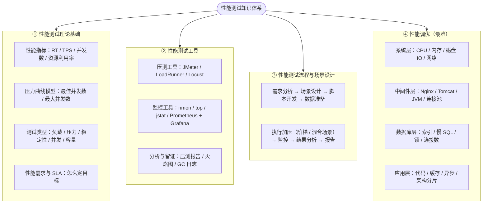
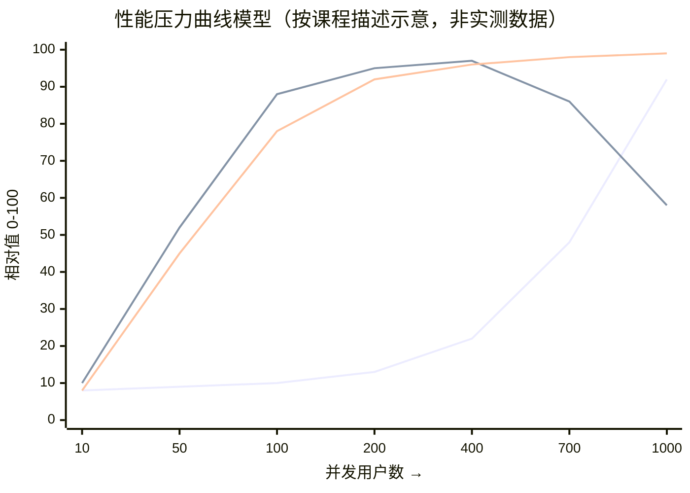

# Ch01 - 性能测试介绍与压力曲线模型

## 课程来源

- 学习日期：
- 课程模块：性能测试（第一节 · 总览）

---

## 一、什么是性能测试

### 知识点 1：性能测试的定义与五大关键指标

【课程原话/定义】
性能测试是一种测试方法，旨在评估系统、应用程序或组件在**现实场景**中的性能表现和可靠性。它通常用于衡量系统在**不同负载条件下**的响应时间、吞吐量、资源利用率、稳定性和可扩展性等关键指标。

【为什么？】
为什么性能测试必须强调"现实场景"和"不同负载条件"这两个限定词？因为性能本身不是一个固定值，而是一条曲线：同一个接口，1 个用户请求时 RT 可能是 50ms，500 个用户同时请求时可能是 5s。脱离开"负载"谈"性能"是没有意义的——所以性能测试的本质不是"测一次快不快"，而是**扫描负载从低到高的全过程，找出系统在什么负载下开始变慢、在什么负载下彻底崩掉**。功能测试回答"对不对"，性能测试回答"多少人来、来多久，它还对不对"。

【必须掌握】

| 关键指标           | 含义                           | 常用口径                       | 直白理解       |
| -------------- | ---------------------------- | -------------------------- | ---------- |
| 响应时间（RT）       | 从发出请求到收到完整响应的时间              | ms / s，常看平均值 + TP95 / TP99 | 用户要等多久     |
| 吞吐量（TPS / QPS） | 单位时间系统能成功处理的事务（请求）数          | 个/秒                        | 系统每秒能干多少活  |
| 资源利用率          | CPU / 内存 / 磁盘 IO / 网络带宽的占用情况 | %（CPU）、MB（内存）              | 服务器累不累     |
| 稳定性            | 长时间、持续负载下指标是否漂移（内存泄漏、连接泄漏）   | 小时 / 天                     | 跑 8 小时会不会崩 |
| 可扩展性           | 增加机器或资源后，性能能否接近线性提升          | 倍                          | 加机器管不管用    |

> 记法：**RT 是用户感受、TPS 是系统产能、资源利用率是成本、稳定性是时间维度、可扩展性是弹性维度**。面试时能把这三句话讲出来，就已经区别于"只会说响应时间"的候选人。

【企业场景】
你在公司拿到一个"订单查询接口"的压测需求，产品给你的是"大促期间 3000 QPS"。你交付的不是一句"能扛住"，而是一份数据：3000 QPS 时 RT 的 TP99 = 480ms（低于 SLA 的 800ms）、应用服务器 CPU 68%、TPS 曲线仍在上行未到拐点。如果 TP99 已经是 1.5s，你就要写"当前规格只支撑到约 1800 QPS"，而不是"测过了，没问题"。

【面试考察】
面试官："什么是性能测试？它和功能测试的区别是什么？"

参考回答框架：
1. 定义：在不同负载条件下评估系统的响应时间、吞吐量、资源利用率、稳定性和可扩展性
2. 关注点差异：功能测试关注"输入 → 输出是否正确"，性能测试关注"同样的输入在多少并发下仍然正确且及时"
3. 判定标准差异：功能测试是二元判定（通过 / 不通过），性能测试是"在什么负载下达到什么指标"的量化描述
4. 时机差异：功能测试贯穿全程，性能测试集中在版本稳定后、上线前（以及线上持续监控）

【易错点】

| 常见错误               | 正确理解                                                  |
| ------------------ | ----------------------------------------------------- |
| 性能测试就是压力测试         | 压力测试只是性能测试的一个子类型，性能测试还包括负载测试、稳定性测试、并发测试、容量测试          |
| 性能测试就是"把并发数调高看崩不崩" | 并发只是手段，真正的产出是 RT / TPS / 资源利用率 三条曲线以及拐点位置             |
| 性能 = 快             | 性能是"在可接受的资源成本下满足 SLA"，一味地快但要用 10 倍机器，在工程上是不合格的        |
| 用户量小就不用做性能测试       | 用户量小但接口有 N+1 查询、有全表扫描，上线后第一个高峰照样崩；性能风险取决于实现，不取决于当前用户数 |
| 只看平均值 RT           | 平均值会掩盖长尾，必须看 TP95 / TP99（1% 的慢请求往往对应真实用户的"卡死"体验）      |

【我的理解】
> （用自己的话回答：为什么说"抛开负载谈性能是没有意义的"？如果一个接口平均 RT 是 100ms，你能说它性能好吗？还需要补问哪些信息？）

---

### 知识点 2：为什么要进行性能测试（四个目的）

【课程原话/定义】
1. **发现性能瓶颈**：帮助发现系统在高负载或高并发情况下可能出现的问题，找到影响系统性能的原因，并针对性地进行优化和调整
2. **评估系统能力**：提供系统在不同负载条件下的性能数据（响应时间、吞吐量、资源利用率），帮助开发人员、运维人员和决策者评估系统能力、确定系统的性能边界，并制定相应的策略和决策
3. **优化系统性能**：发现系统存在的性能问题并优化——通过调整配置、优化代码和使用合适的技术方案，提高系统性能、提供更好的用户体验
4. **检验系统可靠性**：不仅可以评估性能，还可以测试系统在长时间运行、高负载和异常条件下的稳定性和可靠性；通过模拟实际使用场景，检验系统能否处理意外情况和异常情况，并找出潜在问题

【为什么？】
为什么"评估系统能力"这一条经常被忽视，但它其实是性能测试最不可替代的价值？因为瓶颈排查可以靠线上监控（慢了再查），优化可以靠经验，但"**系统的性能边界到底在哪**"这个问题，只有主动压测才能回答——它是容量规划、大促备战、资源采购的直接输入。没有这个数字，运维只能靠"买足够多的机器"来买安心，成本被直接浪费掉。

【必须掌握】

| 目的      | 产出物                                   | 主要使用者     |
| ------- | ------------------------------------- | --------- |
| 发现瓶颈    | 瓶颈定位报告（CPU / 内存 / IO / DB / 代码哪一层先饱和） | 开发、测开     |
| 评估系统能力  | 容量结论（当前规格支撑多少 QPS / 多少并发用户）           | 运维、决策者、业务 |
| 优化系统性能  | 调优前后对比数据（同负载下 RT / TPS 提升比例）          | 开发、DBA、运维 |
| 检验系统可靠性 | 长时间压测的指标漂移曲线（内存 / 连接是否泄漏）             | 运维、SRE    |

【企业场景】
你在一个电商团队负责大促备战。你要交付的不是"压测报告一份"，而是三个能被别的团队直接使用的结论：① 给运维——当前 8 台机器支撑 4000 QPS，大促预估 6000 QPS，需扩容到 12 台；② 给开发——瓶颈在商品详情接口的 N+1 查询，优化后可提升约 30%，能少扩 2 台；③ 给决策者——若预算不批，则需在大促期间对非核心接口降级限流。

【面试考察】
面试官："为什么要做性能测试？你们公司是怎么做的？"

参考回答框架：
1. 先讲四个目的（发现瓶颈 / 评估能力 / 优化性能 / 检验可靠性），不要只答"看系统能不能扛住"
2. 再落到业务驱动：大促、抢购、新功能上线、架构改造、服务器缩容，每种触发原因对应的压测目标和指标阈值都不同
3. 最后给一个闭环：压测发现问题 → 定位瓶颈 → 优化 → 回归压测对比 → 输出容量结论给运维和业务

【易错点】

| 常见错误                  | 正确理解                                                     |
| --------------------- | -------------------------------------------------------- |
| 性能测试的目的就是"证明系统能用"     | 目的是给出量化的能力边界和不达标点，只出"通过 / 不通过"的结论等于没做                    |
| 压测只做一次就结束             | 每次架构改造、依赖升级、大促备战都要重新压，性能是会回归的                            |
| 性能测试是测试团队一个人的事        | 需要开发（改代码）、DBA（改 SQL / 索引）、运维（调参数 / 扩容）共同参与，测试负责暴露问题并给出数据 |
| 稳定性测试（跑 8 / 24 小时）可以省 | 内存泄漏、连接泄漏、日志写满磁盘这类问题只在时间维度暴露，功能压测永远测不出来                  |

【我的理解】
> （用自己的话回答：如果线上监控已经能看到慢接口，为什么还要专门做性能测试？"发现瓶颈"和"评估系统能力"这两个目的，分别对应公司里哪些决策？）

---

## 二、性能测试的应用场景与价值

### 知识点 3：性能测试的应用场景

【课程原话/定义】
在开展性能测试之前，需要有一个明确的业务场景。比如如下场景：
- 双十一、618 即将到来，超过 x 千万的用户会同时下单
- 微博明星公开恋情
- 12306 抢票

以上场景的共同特点是：**在某个瞬间，来自用户的请求信息达到了远远超出平日正常使用的峰值。**

除以上场景，日常的性能测试也需要拉通业务、产品，确定产品的用户量，根据这些信息制定合理的用户数、并发数、响应时间等指标。如果是完全新上线的产品，第一次发布时会主要参考**竞品的数据指标**，制定性能测试计划。

【为什么？】
为什么性能测试的起点必须是"业务场景"而不是"技术指标"？因为并发数、TPS 这类数字本身没有意义——"5000 并发"对内部管理系统是灾难，对微博热搜是日常。只有先确定业务场景（什么时间、多少人、做什么操作、能接受多慢），才能反推出合理的并发模型与 SLA 阈值。跳过业务场景直接定指标，压出来的结论无法被业务方使用，也无法判断"达标"还是"不达标"。

【必须掌握】

| 场景类型 | 典型例子 | 特征 | 压测重点 |
|----------|----------|------|----------|
| 可预期的大促峰值 | 双十一、618、秒杀 | 有明确时间点，峰值可预估 | 容量规划 + 全链路压测 + 限流降级预案 |
| 不可预期的热点突发 | 微博明星公开恋情、突发事件 | 无预告，瞬时流量暴涨 | 系统弹性（扩容速度）+ 熔断保护，避免雪崩 |
| 资源抢占型 | 12306 抢票 | 高并发、强一致、请求集中在少数资源上 | 排队机制 + 库存一致性 + 防刷 |
| 日常容量规划 | 版本上线、架构改造、服务器缩容 | 流量平稳，但需要边界数据 | 摸清最佳 / 最大并发数，输出容量结论 |
| 全新产品首发 | 0 到 1 的新系统 | 无历史数据 | **参考竞品指标**制定第一版性能目标 |

【企业场景】
你在大促备战里做的事是一条链：业务方给出预估订单量（例如峰值 6000 单/分钟）→ 你结合"用户浏览 : 下单 = 20 : 1"的历史转化率折算成接口侧 QPS → 拆到核心接口（商品详情、下单、支付）→ 给每个接口定 SLA（如下单接口 TP99 ≤ 800ms）→ 设计压测场景（单接口基准 + 混合场景 + 阶梯加压 + 稳定性）。这份"预估量 → 并发模型 → SLA"的推导过程，本身就是面试里最能体现工程素养的材料。

【面试考察】
面试官："你怎么确定压测的并发数？"

参考回答框架：
1. 从业务侧拿到峰值业务量（订单数 / 日活 / 峰值时段占比）
2. 用转化率或漏斗比例折算成接口层请求量（QPS）
3. 按二八原则或峰值系数换算瞬时并发（并发数 ≈ QPS × 平均 RT）
4. 结合历史监控校准，新产品则参考竞品，并留出 20%~30% 冗余
5. 最终用"阶梯加压找拐点"验证，而不是只压一个拍脑袋的数字

【易错点】

| 常见错误                  | 正确理解                                     |
| --------------------- | ---------------------------------------- |
| 并发数拍脑袋定（"就按 1000 压吧"） | 并发必须从业务量推导，并说明推导过程，否则结论无法被采信             |
| 把在线用户数直接当并发用户数        | 在线用户 ≠ 同时发请求的用户；要用"活跃比例 + 请求集中度"折算       |
| 只按当前业务量定容量            | 要按"下一个峰值"定，例如大促倍数、新版本拉新预期                |
| 新产品没有数据就随便定           | 参考竞品指标 + 留冗余，并在上线后回采真实数据修正模型             |
| 一个场景压到底               | 大促要压混合场景（浏览 + 加购 + 下单 + 支付），单接口达标不代表链路达标 |

【我的理解】
> （用自己的话回答：为什么"微博明星公开恋情"和"12306 抢票"虽然都是高并发，但压测重点完全不同？如果让你给公司的一个新功能定压测目标，你会从哪几个问题问起？）

---

### 知识点 4：性能测试的价值——降本增效

【课程原话/定义】
性能测试的价值除了保证产品上线之后能正常使用之外，还有一个非常重要的因素，就是**降本增效**——因为服务器的价格是非常昂贵的，在能满足需求的情况下，能少买一台服务器，都是在替老板省钱。

性能省钱公式：**良好的容量规划能力 + 性能调优能力 = 为老板省钱**

【为什么？】
为什么"省钱"这件事要由测试来负责？因为在大多数公司里，**服务器 / 云资源是账单上最直观、最容易归因的一行成本**，而买多少台机器、买什么规格，靠的正是"系统能撑多少"这个数字。容量规划做得好 = 不多买；调优做得好 = 同样的机器多扛流量。两种能力的输入数据都来自性能测试。这是性能测试区别于其他测试类型的地方：功能测试的价值是"避免损失"，性能测试的价值可以被写成资产负债表上的"降低成本"。

【必须掌握】

| 能力 | 解决的问题 | 交付物 | 省钱路径 |
|------|------------|--------|----------|
| 容量规划 | 该买多少机器 / 什么规格 | 容量结论（当前规格支撑 X QPS，峰值需 Y 台） | 不超配：少买机器；不欠配：避免事故赔付 |
| 性能调优 | 同样硬件能扛多少 | 调优前后对比数据 + 具体改造项 | 同流量下少用机器（或延后扩容） |

> 一句话记忆：**容量规划 = 不浪费钱，性能调优 = 少花钱。**

【企业场景】
你在季度末被拉进一个"云成本优化"的会。运维说现在 20 台机器日常 CPU 只有 12%，问能不能缩容。能不能缩、缩到多少，靠的就是你之前压测出来的数据：8 台规格在峰值 3500 QPS 下 TP99 仍在 SLA 内 → 结论是可以先在非大促月份缩到 10 台，大促前弹性扩容。这个结论本身就是你在团队里"不可替代"的证据，也是简历上"通过容量规划为公司节省 X% 服务器成本"的来源。

【面试考察】
面试官："性能测试能给公司带来什么价值？"

参考回答框架：
1. 底线价值：避免线上崩溃和事故（大促、热点事件）——"不出事"
2. 成本价值：降本增效——良好的容量规划 + 性能调优 = 为老板省钱
3. 决策价值：为扩容、缩容、限流降级、架构改造提供量化依据
4. 体验价值：把"用户要等多久"变成可测量、可承诺的 SLA 指标

【易错点】

| 常见错误 | 正确理解 |
|----------|----------|
| 认为性能测试是"纯花钱的环节" | 性能测试是少数能直接产出"省钱结论"的工作，报告里要带成本影响 |
| 只报技术指标，不谈成本 | 同样一句"优化后 TPS 提升 40%"，翻译成"少扩 2 台机器、年省 XX 万"才有说服力 |
| 为了压测而压测（过度超配） | 压测目标是找到"够用的边界"，不是把系统压到无限大 |
| 把降本理解为"削减服务器" | 降本的前提是有容量数据支撑，没有数据的缩容就是拿事故换成本 |

【我的理解】
> （用自己的话回答：为什么说性能测试的价值可以被写进公司的成本账单？"容量规划"和"性能调优"分别是怎么省钱的？）

---

### 知识点 5：学习性能测试的价值——测开工程师的精华加分项

【课程原话/定义】
性能测试能力是测开工程师**精华加分项**。性能调优是整个性能测试过程中最难的一个环节——除了要掌握性能测试知识体系，还需要具备非常强的代码基础以及非常丰富的项目经验，所以基本上能做调优的测试，都是资深专家以上的级别。

【为什么？】
为什么"调优"比"测试"难一个量级？因为测试只需要**暴露问题**（用数据说明"这里不达标"），而调优必须**解决问题**，并且要跨栈定位：一条慢请求可能来自 SQL 没走索引、JVM 频繁 Full GC、连接池过小、锁竞争、N+1 查询、网络抖动……候选原因有几十个，每一次都要靠数据（监控 + 日志 + 火焰图）逐层排除，再验证改动是否真的有效。这种能力无法只靠学工具获得，必须靠代码功底和项目数量累积。

【必须掌握】
性能测试能力四级阶梯（用来判断自己在哪一级，也用来诚实回答面试）：

| 级别       | 能力                                    | 可检验的标志                 |
| -------- | ------------------------------------- | ---------------------- |
| L0 会用工具  | 会用 JMeter / LoadRunner 跑脚本            | 能按模板录制并跑出报告            |
| L1 会设计场景 | 能从业务量推导并发模型，设计基准 / 负载 / 压力 / 稳定性场景    | 能独立写压测方案并定 SLA         |
| L2 会定位瓶颈 | 能结合监控（CPU / 内存 / IO / JVM / DB）定位到具体层 | 能指着数据说"瓶颈在这个接口的这条 SQL" |
| L3 会调优   | 能改配置 / 改代码 / 改架构并量化收益                 | 优化前后有对比数据，能算省了多少钱      |

【企业场景】
你去面试测试开发岗，简历里有自动化框架已经很常见，真正让面试官眼睛一亮的是你能讲："我做过订单链路的压测，发现瓶颈在商品详情接口的 N+1 查询，优化后同机器规格下 TPS 从 1800 提到 2600。"这句话里同时包含工具使用、场景设计、瓶颈定位三项能力——它证明你不是只会跑脚本，而是能对系统性能负责。反过来，如果面试时连"最佳并发用户数"都说不清，面试官会认为你的自动化只停留在脚本层。

【面试考察】
面试官："性能测试和性能调优有什么区别？你做过调优吗？"

参考回答框架：
1. 定义区分：性能测试是"发现并量化问题"，性能调优是"解决问题并验证收益"
2. 门槛区分：测试重方法与工具，调优重代码基础 + 跨栈经验，通常需要资深级别的积累
3. 诚实分级：不要吹"我精通调优"，按四级阶梯讲清自己在哪一级（例如"我能独立设计场景并定位到数据库层，调优方案与开发 / DBA 一起落地"）
4. 加分项：把定位过程讲成故事——从监控看到什么、排除了什么、最后确认是什么

【易错点】

| 常见错误 | 正确理解 |
|----------|----------|
| 把"性能测试"和"性能调优"混为一谈 | 测试负责暴露问题与量化，调优负责解决与验证，职责和能力要求都不同 |
| 面试时吹自己会调优 | 调优问题一追问细节（火焰图、GC 日志、慢查询）立刻露馅，按阶梯诚实分级反而加分 |
| 认为性能测试是运维 / 开发的活 | 测开岗位的定位正是"用工程能力把性能风险变成可量化的数字"，所以是精华加分项 |
| 只学工具，不补代码和系统知识 | 工具只是入口，能把瓶颈定位到具体层才需要真功底（操作系统、JVM、数据库、网络） |

【我的理解】
> （用自己的话回答：为什么性能测试被称为测开工程师的"精华加分项"？对照四级阶梯，你现在处在哪一级，下一级缺的是什么？）

---

## 三、性能测试知识体系

### 知识点 6：性能测试知识体系四大模块

【课程原话/定义】
性能测试知识体系主要分为四大模块（课程以一张 uml diagram 呈现）：**性能测试理论基础、性能测试工具、性能测试流程与场景设计、性能调优**。课程同时强调：性能调优是整个性能测试过程中最难的一个环节——除了要掌握以上知识之外，还需要具备非常强的代码基础以及非常丰富的项目经验，所以基本上能做调优的测试，都是在资深专家以上的级别。

> 📷 【截图占位】性能测试知识体系四大模块（课程原图 uml diagram，未随文本发送）
>
> 下面的 Mermaid 图是按课程文字描述 + 通用性能测试体系重构的版本。请对照你的原图核对模块名称与分支，如有出入我按原图修正。

【为什么？】
为什么这四个模块是"越来越难"的顺序？因为这四块的能力性质不同：**理论基础**决定你能不能设计出有意义的压测（不会读曲线的人压出来的数字是废的）；**工具**决定执行力（能不能跑、能不能采数据）；**流程与场景设计**决定结果是否可信（场景错了，报告再漂亮也不可用）；**调优**才是真正需要跨栈功底和项目经验的环节——课程也明确说了，能做调优的基本是资深专家以上。所以学习路径一定是"先理论 → 再工具 → 再场景 → 最后才是调优"，跳过前面直接学调优，只会变成抄别人的参数。

【必须掌握】

| 模块        | 学什么                               | 依赖关系                | 面试权重             |
| --------- | --------------------------------- | ------------------- | ---------------- |
| ① 理论基础    | 指标口径、压力曲线模型、测试类型划分、SLA            | 最底层，不懂则后面全是玄学       | ★★★★★            |
| ② 工具      | JMeter（脚本 / 断言 / 参数化 / 分布式）、监控工具栈 | 依赖理论：得先知道要采哪些数据     | ★★★★☆            |
| ③ 流程与场景设计 | 需求 → 场景 → 执行 → 分析 → 报告全流程         | 依赖工具：场景要靠脚本落地       | ★★★★★            |
| ④ 性能调优    | OS / JVM / DB / 中间件 / 代码优化        | 依赖前三者 + 代码能力 + 项目经验 | ★★★☆☆（资深岗 ★★★★★） |

> 也可以把 ①②③ 理解为"性能测试工程师"的完整能力面，④ 是"性能测试专家 / 资深测开"的分水岭。

【企业场景】
你在公司做第一个压测任务，通常只会用到 ① 和 ②：用 JMeter 跑单接口基准，看 RT / TPS / CPU。当报告被人追问"这个 TPS 是拐点之前还是之后的？""为什么压到 800 并发时 TPS 反而降了？"——答案全部来自 ①（曲线模型）。而当问题需要"解决"时（例如"能不能不扩容？"），就进入 ④ 的领地，你能否参与，取决于代码基础和跨栈经验。这也是为什么同一个团队里，会跑脚本的人很多，能给出容量结论的人很少。

【面试考察】
面试官："性能测试要掌握哪些东西？你的学习路线是怎样的？"

参考回答框架：
1. 先给框架：理论（指标 + 曲线 + 场景设计）→ 工具（JMeter + 监控）→ 流程 → 调优，四层递进
2. 强调理论先行：指标口径和压力曲线决定了你是否能读懂自己压出来的数据
3. 说明调优的门槛：需要代码基础 + 跨栈经验，属于资深级别能力，不吹不装
4. 落到自己的下一步：例如"我现在在打通 JMeter + 监控，目标是能独立输出容量结论"

【易错点】

| 常见错误 | 正确理解 |
|----------|----------|
| 只学工具（JMeter 参数化、断言），不学曲线模型 | 工具会跑但结论不可用，等于没做性能测试 |
| 跳过监控直接学调优 | 没有数据支撑的调优是猜测，只会照抄别人的参数 |
| 认为压测报告就是"附上 JMeter 截图" | 报告的核心是"容量结论 + 瓶颈定位 + 优化建议"，截图只是证据 |
| 忽略测试数据准备 | 数据量、数据分布直接影响结果（空表和千万级表的 SQL 性能天差地别） |

【我的理解】
> （用自己的话回答：为什么四大模块里"性能调优"最难？如果让你给自己排一个 6 周的性能测试学习顺序，你会把监控工具放在哪一步，为什么？）

---

## 四、性能压力曲线模型（本章核心）

### 知识点 7：曲线图怎么读——横轴与三条曲线

【课程原话/定义】
这是一张非常经典的与测试相关的图，叫**性能压力曲线图**：
- 横轴：并发的用户数，从左到右表现了 Number of Concurrent Users（并发用户数）的不断增长
- 纵轴有三条曲线：
  - Utilization（资源的利用情况，包括硬件资源和软件资源）—— 绿色曲线
  - Throughput（吞吐量，这里指每秒事务数）—— 紫色曲线
  - Response Time（响应时间）—— 蓝色曲线

三条曲线都是压测过程中重点关注的信息：利用率曲线（并发用户数 - 资源利用情况）、吞吐量曲线（并发用户数 - 吞吐量）、平均响应时间曲线（并发用户数 - 响应时间）。

【为什么？】
为什么要三条曲线一起看，而不是只看吞吐量？因为单看 TPS 会在"弃忍区"给出致命误导：重压力区之后，TPS 会随并发继续增加而**下降**，而资源利用率仍顶在饱和状态——只盯 TPS 曲线，可能把"已经过载"读成"系统还行"；只有把 RT 曲线叠上去，才能看到 RT 正在急剧飙升、用户已经无法忍受。**三条曲线的组合才是完整的性能画像：产能（TPS）+ 成本（Utilization）+ 体验（RT）。**

【必须掌握】

| 曲线        | 颜色（课程原图） | 纵轴含义   | 读法要点                            |
| --------- | -------- | ------ | ------------------------------- |
| 平均响应时间 RT | 蓝色       | ms / s | 用户体验线，越往后越陡；关注 TP95 / TP99 而非均值 |
| 吞吐量 TPS   | 紫色       | 事务数/秒  | 系统产能线，先升后平、最后下滑，顶点在最优点附近        |
| 资源利用率     | 绿色       | %      | 成本线，先随并发上升，饱和后保持满值甚至过饱和         |

> 三线关系：**利用率逼近饱和之前，TPS 随并发近线性增长、RT 基本平稳；利用率饱和之后，TPS 停止增长、RT 开始上升；继续加压则 TPS 下降、RT 陡增。**

该知识点对应的课程原图：

> ![[Pasted image 20260923151847.png]]

【企业场景】
你在看压测报告或监控大盘时，第一件事不是看"最高 TPS 是多少"，而是找**三线的交叉关系**：CPU 到 80% 附近时 TPS 是否还在涨？如果 CPU 已 95% 而 TPS 开始走平，说明瓶颈已经出现，再往上压只会把 RT 顶上去——这时应该输出"当前规格的容量上限约为 X QPS"，而不是继续加压"看看能不能到 8000"。

【面试考察】
面试官："性能压力曲线图你会怎么解读？"

参考回答框架：
1. 先说清三要素：横轴是并发用户数，三条纵轴曲线分别是 RT / TPS / 资源利用率
2. 再说关系：利用率饱和前 TPS 线性上升、RT 平稳；饱和后 TPS 走平、RT 上升；继续加压 TPS 下降、RT 陡增
3. 强调"三线一起看"：单看 TPS 会把过载误读成正常
4. 落到动作：拐点之前是可用区，拐点数据就是容量结论的依据

【易错点】

| 常见错误             | 正确理解                                    |
| ---------------- | --------------------------------------- |
| 把最高 TPS 当作"系统能力" | 最高 TPS 往往出现在 RT 已经不达标的区间，可用容量要按 SLA 约束取 |
| 只看 TPS，不看 RT     | TPS 在重压力区之后会下降，只看 TPS 无法判断用户是否已经"无法忍受"  |
| 认为资源利用率越低越好      | 利用率过低意味着资源浪费（成本高）；目标是"利用率足够高但吞吐可控"      |
| 只看平均 RT          | 平均值掩盖长尾，必须看 TP95 / TP99，否则用户端的"卡死"看不见   |
| 把曲线当成固定不变的       | 同一系统不同场景（读 / 写、单接口 / 混合链路）、不同数据量的曲线完全不同 |

【我的理解】
> （用自己的话回答：如果只给你 TPS 一条曲线，你可能会得出什么错误结论？为什么必须把 RT 曲线叠在一起看，才能判断"系统能不能上线"？）

---

### 知识点 8：三个区域与两个拐点

【课程原话/定义】
曲线图主要分为 3 个区域：
- **Light Load（轻压力区）**
- **Heavy Load（重压力区）**
- **Buckle Zone（弃忍区）**

图中有两个拐点：
- **第一个拐点**：The Optimum Number of Concurrent Users（**最佳并发用户数**），位于 Light Load 与 Heavy Load 的交界处。代表最优并发用户数——既不会造成资源的浪费，也可以满足现有的需求
- **第二个拐点**：The Maximum Number of Concurrent Users（**最大并发用户数**），位于 Heavy Load 与 Buckle Zone 的交界处。代表系统能承载的最大的并发用户数，一旦超过这个并发，代表服务器需要进行扩容

三阶段过程分析：
- **阶段 1 轻压力区**：随着并发用户数增长，资源使用率和吞吐量（TPS）相应增长，但响应时间（RT）基本平稳，小幅递增
- **阶段 2 重压力区**：并发用户数增长到一定值后，资源利用趋于饱和，吞吐量（TPS）增长明显放缓甚至停止增长，而响应时间（RT）却进一步增大
- **阶段 3 弃忍区**：并发用户数继续增长，软硬件资源占用继续维持在饱和状态（过饱和），但吞吐量（TPS）开始下降，响应时间（RT）急剧递增

课程结论：
- 负载 = 最佳并发用户数时，系统整体效率最高，没有资源被浪费，用户也不需要等待
- 负载处于最佳并发数与最大并发数之间时，系统可以继续工作，但用户等待时间延长、满意度开始降低；如果负载一直持续，最终会导致有些用户无法忍受而放弃
- 负载 > 最大并发数时，将注定导致某些用户无法忍受超长的响应时间而放弃
- 所以性能测试的数据尽量保持在 **CPU 利用率足够高，整个系统的吞吐负载可控**

> 读图提示：约在并发 200（第一个拐点）之前是 Light Load；200~400 之间是 Heavy Load；超过约 400（第二个拐点）进入 Buckle Zone——TPS 从高位回落、RT 陡升、利用率仍顶在 98% 以上。原图三色对应：RT 蓝、TPS 紫、利用率绿（Mermaid 渲染色与课程原图不同，以曲线相对走势为准）。

【为什么？】
为什么会出现这两个拐点？底层原因是**资源守恒与排队效应**：
- 轻压力区：系统还有空闲资源（CPU 未饱和、线程池未满、连接未打满），请求几乎不需要排队，所以加并发 = 加产能，RT 基本不变
- 重压力区：瓶颈资源（CPU / 连接池 / 磁盘 / DB）已经打满，新来的请求只能排队等待，所以吞吐不再增长（被瓶颈资源限制），而 RT 因为排队而上升
- 弃忍区：排队继续变长，开始出现连锁恶化——请求超时触发重试、线程切换和 GC 抢占资源、连接被占满导致新请求被拒，系统把算力花在"管理拥堵"而不是"处理业务"上，于是 **TPS 反而下降、RT 急剧递增**。这也是"压崩"的本质：不是资源不够，而是资源被内耗掉了

【必须掌握】

| 区域              | 并发区间       | 资源利用率     | TPS      | RT        | 系统状态                | 业务含义               |
| --------------- | ---------- | --------- | -------- | --------- | ------------------- | ------------------ |
| Light Load 轻压力区 | 0 ~ 最佳并发数  | 随并发上升，未饱和 | 随并发近线性上升 | 基本平稳、小幅递增 | 资源有余量               | 效率高、体验好，但资源有浪费     |
| Heavy Load 重压力区 | 最佳 ~ 最大并发数 | 趋于饱和      | 增长放缓甚至停止 | 进一步增大     | 瓶颈已出现，请求在排队         | 还能工作，但用户等待变长、满意度下降 |
| Buckle Zone 弃忍区 | > 最大并发数    | 饱和甚至过饱和   | 开始下降     | 急剧递增      | 内耗（重试 / GC / 上下文切换） | 注定有用户无法忍受而放弃       |

| 拐点    | 位置                          | 名称               | 工程含义                            |
| ----- | --------------------------- | ---------------- | ------------------------------- |
| 第一个拐点 | Light Load / Heavy Load 交界  | 最佳并发用户数（Optimum） | 效率最高点：资源不浪费、用户不用等 → **系统的"甜点"** |
| 第二个拐点 | Heavy Load / Buckle Zone 交界 | 最大并发用户数（Maximum） | 容量红线：超过它必须扩容 → **容量的"天花板"**     |

【企业场景】
你做完一轮阶梯加压，拿到三个关键数字：最佳并发 200（此时 CPU 约 78%、RT 稳定）、最大并发 400（此时 RT 已到 SLA 上限）、400 之后 TPS 开始回落。你给运维的结论就不该是"系统能扛 400 并发"，而是三段式：
- 日常运行区间：并发 ≤ 200（效率最高、资源不浪费）
- 可容忍区间：200~400（可用但体验下降，需重点监控）
- 扩容红线：> 400 必须扩容或限流降级，否则进入弃忍区、事故风险高

【面试考察】
面试官："什么是最佳并发用户数和最大并发用户数？压测时应该压到哪个点？"

参考回答框架：
1. 先说清它们在图上的位置（两个拐点分别位于 轻 / 重压力区 与 重压力区 / 弃忍区 的交界）
2. 讲清两个定义：最佳并发 = 效率最高、无资源浪费、用户无等待；最大并发 = 系统能承载的上限，超过必须扩容
3. 再讲三个区域的指标走势：轻压力区（TPS 上升 / RT 平稳）→ 重压力区（TPS 走平 / RT 上升）→ 弃忍区（TPS 下降 / RT 陡增）
4. 落到动作：压测要么压到最大并发数（摸容量红线），要么压到 RT 达到 SLA 阈值（业务可用上限）；日常运行应控制在最佳并发数附近或略上
5. 加分：说明"为什么压崩不是目的"——超过最大并发后的数据没有业务意义，只能证明系统会雪崩

【易错点】

| 常见错误            | 正确理解                                 |
| --------------- | ------------------------------------ |
| 把"最大并发数"当成目标容量  | 最大并发数时 RT 往往已到用户容忍边缘，日常运营应贴近最佳并发数    |
| 认为必须把系统压崩才算压测完成 | 进入弃忍区后的数据无业务价值（TPS 反而下降），有价值的数据在拐点附近 |
| 忽略 RT，只看 TPS 拐点 | 有些系统 TPS 还在涨但 RT 已超出 SLA，此时容量已不可用    |
| 把并发用户数等同于在线用户数  | 并发用户数是"同一时刻在给系统施加压力的请求主体数"，需从业务量折算   |
| 认为资源利用率必须压满才算达标 | 目标是"足够高且可控"，长期过饱和就是弃忍区               |
| 一次压测结果长期复用      | 数据量增长、依赖变更、代码迭代都会让曲线左右平移，必须定期重压      |

【我的理解】
> （用自己的话回答：为什么过了第二个拐点之后 TPS 反而会下降？"资源明明都被占满了，为什么处理能力却变弱了"——试着从排队、重试、上下文切换的角度解释。）
> 
> 第二个拐点之后，TPS 下降并不是因为系统“没在工作”，而是因为系统太忙了，大量资源开始花在“等待和处理额外开销”上（排队 + 等待 + 重试 + 上下文切换 + 超时处理），而不是花在真正的业务处理上。
> 

---

### 知识点 9：拐点的工程意义——扩容判据与容量红线

【课程原话/定义】
综上所述：当系统负载等于最佳并发用户数时，系统整体效率最高，没有资源被浪费，用户也不需要等待；当负载处于最佳并发用户数和最大并发用户数之间时，系统可以继续工作，但是用户的等待时间延长，满意度开始降低，并且如果负载一直持续，将最终会导致有些用户无法忍受而放弃；当系统负载大于最大并发用户数时，将注定会导致某些用户无法忍受超长的响应时间而放弃。所以性能测试的数据尽量保持在 CPU 利用率足够高，整个系统的吞吐负载可控。

【为什么？】
为什么课程最后强调"CPU 利用率足够高 **且** 吞吐负载可控"这两个条件？因为这是两个方向相反的目标，它们的交集才是工程上的最优解：
- 只追求"利用率足够高" → 会压到饱和区，RT 失控、没有突发余量，一次流量抖动就进弃忍区
- 只追求"负载可控" → 机器买太多，CPU 常年 10%，成本被浪费（违背降本增效）
- 两个条件的交集 = **最佳并发数附近**：资源被充分使用，同时留有应对抖动的缓冲空间

这也解释了为什么容量评估不能只给一个数字（"能扛 400 并发"），而要给区间和红线：**最佳并发数用于日常规划，最大并发数用于大促备战与扩容触发。**

【必须掌握】

| 决策场景 | 依据 | 动作 |
|----------|------|------|
| 日常容量规划 | 最佳并发用户数 | 按最佳并发折算实例数，避免超配 |
| 大促 / 活动备战 | 最大并发用户数 | 峰值预估若超过最大并发数 → **扩容**（加机器）或**限流降级** |
| 无法扩容（预算 / 时间不够） | 最大并发数与峰值之差 | 提前做非核心接口降级、排队、缓存预热、静态化 |
| 性能劣化回归 | 拐点位置左移 | 拐点左移 = 容量缩水，说明代码 / 依赖 / 数据量变化带来性能退化，需排查 |
| 长时间运行 | 稳定性测试曲线 | 内存 / 连接等指标持续上升不回落 = 泄漏，需在容量计算中打折 |

【企业场景】
大促前一周，业务方说峰值预计 6000 QPS，而你压测得到最大并发对应的容量是 4500 QPS。你交付的应对方案应该是组合拳而不是一句"顶不住"：① 扩容——按线性折算缺 1/3 的机器，提前扩容；② 挑出可降级的非核心接口（推荐位、评价、足迹）做降级开关；③ 给核心接口设置限流阈值（略低于 4500）并预演一次限流；④ 大促当天拉一个实时看板盯 RT 与 CPU，把"拐点左移"作为报警条件而不是等报错。这套动作就是面试里最能体现"工程闭环能力"的部分。

【面试考察】
面试官："压测结果出来了，你怎么定容量、怎么给结论？"

参考回答框架：
1. 先明确约束：以 SLA（RT / TP99 或错误率）为第一约束，不达标的最大值不能算容量
2. 给区间而不是单点：最佳并发数（日常运行区间）+ 最大并发数（容量红线）
3. 给触发条件：什么情况下扩容（峰值预估 > 最大并发数）、什么情况下限流降级（无法及时扩容）
4. 给风险余量：留 20%~30% 冗余应对抖动，并说明数据量增长对容量的打折
5. 给闭环：优化后回归压测，拐点右移了多少 = 优化收益

【易错点】

| 常见错误 | 正确理解 |
|----------|----------|
| 容量结论只给一个数字 | 要给"日常区间 + 可用上限 + 扩容红线"三段式结论 |
| 不留冗余，按峰值刚好买机器 | 抖动、依赖抖动、数据增长都会吃掉容量，需要预留 20%~30% |
| 只考虑扩容，不考虑限流降级 | 扩容需要时间和预算，限流降级是应急必备的第二道闸 |
| 优化做完不复测 | 优化是否有效必须用压测数据验证（拐点是否右移、TPS 是否提升） |
| 稳定性和容量割裂评估 | 长时间运行会因泄漏导致容量衰减，容量结论必须结合稳定性测试数据 |

【我的理解】
> （用自己的话回答：为什么给业务方的结论应该是"区间 + 红线 + 触发条件"，而不是"系统能扛 400 并发"？如果大促预估量超过最大并发数，你会按什么顺序给出应对方案？）

---

## 今日课程总结

| 模块     | 核心内容                                                   | 面试权重  |
| ------ | ------------------------------------------------------ | ----- |
| 性能测试定义 | 在现实场景 / 不同负载下衡量 RT、TPS、资源利用率、稳定性、可扩展性                  | ★★★★★ |
| 为什么要做  | 发现瓶颈 / 评估系统能力 / 优化性能 / 检验可靠性                           | ★★★★☆ |
| 应用场景   | 大促峰值、热点突发、抢票、日常容量规划、新品参考竞品                             | ★★★★☆ |
| 价值     | 降本增效：容量规划能力 + 调优能力 = 为老板省钱                             | ★★★★★ |
| 学习价值   | 测开精华加分项；调优最难（需代码功底 + 项目经验，资深以上级别）                      | ★★★☆☆ |
| 知识体系   | 四大模块：理论 / 工具 / 流程与场景设计 / 调优                            | ★★★★☆ |
| 压力曲线模型 | 三条曲线（RT / TPS / 利用率）+ 三区域（轻 / 重 / 弃忍）+ 两拐点（最佳 / 最大并发数） | ★★★★★ |

---

## 今天没搞懂的问题
-
-
-

## 关联笔记
- [[Ch02-性能测试概念与指标体系]]（指标口径的精确化：并发 / RT / TPS / QPS、并发数 = QPS × 平均 RT、分位值）
- [[Ch03-经典技术架构解析]]（为什么分布式架构下必须建多机监控体系）
- [[Ch04-行业流行性能压测工具介绍]]（知识体系 ② 工具：压测工具选型）
- [[Ch05-行业流行性能监控工具介绍]]（知识体系 ② 工具：监控工具栈）
- [[Ch06-行业流行性能剖析工具介绍]]（知识体系 ④ 调优前置：剖析与链路追踪）
- [[Ch07-性能测试流程与方法]]（知识体系 ③ 流程：12 步流程 + 并发 / RPS 两种模式）
- [[Ch08-性能测试计划]]（知识体系 ③ 流程：计划的七个阶段与指标预期）
- [[Ch09-性能测试报告]]（知识体系 ③ 流程：最终交付物）
- [[Ch10-性能测试场景设计]]（知识体系 ①③ ：五类场景方法与三类用途）
- [[../../软件测试基础/Ch04-测试技术体系|软件测试基础 Ch04-测试技术体系]]（性能测试在测试分类里的定位：响应时间、吞吐量、资源使用）
- [[../../软件测试基础/Ch10-常用测试策略与测试手段|软件测试基础 Ch10-常用测试策略与测试手段]]（性能指标如何写进测试方案：页面加载 < 2 秒、并发 500）
- [[../../软件测试基础/Ch23-测试开发技术体系与能力全景|软件测试基础 Ch23-测试开发技术体系与能力全景]]（服务端性能测试在测开能力全景中的位置）
- [[../../接口测试/L1-接口协议与接口测试/Ch07-接口测试价值与体系|接口测试 Ch07-接口测试价值与体系]]（接口测试六类场景中的性能测试；区分"Postman 发一次"和"并发压测"）
- [[../../接口测试/L3-Mock工具使用/Ch17-弱网测试|接口测试 Ch17-弱网测试]]（另一类非功能测试：模拟网络条件而非模拟并发）
- [[../../../01-Learning-Path/投简历冲刺-复习优先级|投简历冲刺 · 复习优先级]]（性能测试在复习阶段④中的位置）
