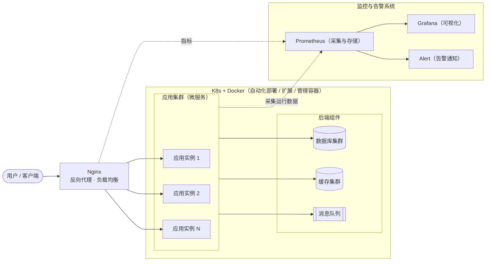

# Ch03 - 经典技术架构解析

## 课程来源

- 学习日期：
- 课程模块：性能测试体系 / L1（第三节）
- 课程站点：`performance.tutorial.hogwarts.ceshiren.com` → 性能测试体系 / L1 / tutorial / 经典技术架构解析
- 说明：本节课文未随消息发送，内容由站点原文补全（article 约 734 字）

---

## 一、为什么性能测试要先看架构

### 知识点 1：从单机到分布式集群——性能测试视角的变化

【课程原话/定义】
随着业务的增长，服务器部署由单一架构向分布式集群架构转变，性能测试过程中**指标监控也由单一服务器向集群服务器转变**。对于性能测试团队来说，需要建立起适用于测试的**多机监控系统**，以便后期顺利且高效地进行监控分析调优，从而保证整个测试过程的高可靠性。

【为什么？】
为什么"架构变了"会直接改变性能测试的做法？因为性能问题的**定位范围**变了：
- 单机架构：只有一台机器，CPU 满了就扩容，瓶颈一目了然，监控一个 `top` 就够
- 分布式集群：一次请求会经过 Nginx → 网关 → 多个应用实例 → 缓存 → 数据库 → 消息队列，**瓶颈可能在链路的任何一环**，而且某一环的抖动会被放大到整条链路

如果还用单机时代的做法（只盯应用机器的 CPU），你会频繁遇到"应用机器 CPU 只有 40%，但用户就是慢"的情况——因为瓶颈在数据库的慢查询、在 Redis 的热 key、在 MQ 的堆积、或者在 Nginx 的连接数上限。**不了解架构，就没有排查清单；没有排查清单，压测就只能压出"慢"，压不出"为什么慢"。**

【必须掌握】

| 架构阶段 | 部署方式 | 性能测试关注点 | 监控方式 |
|----------|----------|----------------|----------|
| 单机架构 | 一台服务器（Nginx + 应用 + DB 同机） | CPU / 内存 / 磁盘 / 单点 | 单机命令（top / vmstat） |
| 分布式集群架构 | Nginx + 应用集群 + 缓存集群 + DB 集群 + MQ | 全链路瓶颈、单点故障、横向扩展能力 | 多机监控系统（Prometheus + Grafana 等） |

【企业场景】
你压测一个电商下单链路，发现 QPS 卡在 1200 上不去、应用机器 CPU 只有 45%。如果你知道架构里"下单要先查缓存再写库"，你就会按清单逐层排查：先看 Nginx 连接数与错误率 → 再看应用实例数与线程池 → 再看缓存命中率与热 key → 最后看数据库的连接数与慢查询。最终结论可能是"数据库连接池只有 20，是它先饱和"，也可能是"缓存集群有热 key 导致单节点打满"。**压测的产出质量，取决于你对架构的熟悉程度。**

【面试考察】
面试官："分布式架构下做性能测试和单体架构有什么不一样？"

参考回答框架：
1. 定位范围：单体看单机资源，分布式要按链路逐层排查（Nginx / 应用 / 缓存 / DB / MQ）
2. 监控方式：从单机命令升级为多机监控系统（采集-存储-可视化）
3. 风险类型：新增单点故障、跨节点依赖抖动、扩容带来的不一致问题
4. 能力要求：要能画出架构图并标出每个节点的**可能瓶颈指标**，压测时按图巡检

【易错点】

| 常见错误 | 正确理解 |
|----------|----------|
| 只监控应用服务器 | 分布式架构要监控全链路所有节点（含中间件与依赖服务） |
| 用单机经验判断分布式瓶颈 | 全局瓶颈可能在一条 SQL、一个热 key、一个队列积压上 |
| 忽略架构中"单点"的存在 | 单点既是性能瓶颈也是故障风险，压测时要单独验证 |

【我的理解】
> （用自己的话回答：为什么说"分布式架构把性能问题的定位难度提高了不止一倍"？如果给你一张架构图，你会怎么标出每一层的"可能瓶颈指标"？）

---

## 二、典型互联网架构与监控体系

### 知识点 2：经典互联网技术架构解析

【课程原话/定义】
下图为一个典型的互联网架构图，对架构图的解析：
- 首先，可以看到**应用集群**与左侧的 **Nginx 服务**有着紧密的关联。Nginx 在这里扮演**反向代理或负载均衡**的角色，将来自外部的请求分发到应用集群中的各个实例上，从而确保系统的可用性和性能
- 同时，应用集群内部也包含了一系列的**微服务和组件**，它们通过内部网络进行通信和协作。这些组件包括**数据库集群、缓存集群、消息队列**等，它们共同支撑起应用集群的功能实现
- 此外，应用集群也与**监控和告警系统**相连。Prometheus 和 Grafana 等组件负责收集应用集群的运行数据，并进行实时分析和可视化展示。这样，系统管理员可以及时了解应用集群的运行状态，一旦发现异常情况，Alert 等告警系统能够及时发出通知，以便快速响应和处理
- 最后可以看到使用了 **K8s 与 Docker 自动化地部署、扩展和管理容器化的应用程序**。这有助于提升系统的**可扩展性、可维护性和资源利用率**

课程原图（未随消息发送）：

> 📷 【截图占位】经典互联网架构图（Nginx + 应用集群 + DB/缓存/MQ 集群 + K8s/Docker + Prometheus/Grafana/Alert）

> 下面的 Mermaid 图是按课程文字重构的版本，请对照原图核对连线与组件分层。

【为什么？】
为什么这张架构图对性能测试是"必需品"而不是"背景知识"？因为它给出了**压测的巡检清单**：
- **Nginx（入口）**：连接数、QPS、5xx 比例、upstream 响应时间 —— 入口先饱和，后面全白压
- **应用集群**：单实例 CPU/内存、线程池、JVM GC、实例数 —— 决定"能不能靠加实例扛住"
- **数据库集群**：连接数、慢查询、锁等待、主从延迟 —— 最常见的真瓶颈
- **缓存集群**：命中率、热 key、大 key、网络带宽 —— 突发流量下最容易雪崩的一环
- **消息队列**：堆积量、消费延迟 —— 表现为"接口很快但业务没完成"的隐蔽问题
- **监控与告警**：Prometheus 采集 → Grafana 展示 → Alert 通知 —— 压测期间"看得到才能分析得到"
- **K8s + Docker**：扩容/扩缩容能力 —— 决定弹性（分布式时代性能测试要顺便验证"扩容是否真的有效"）

换句话说：**架构图上的每个方框，在压测时都是一个要盯的指标集合；没有架构图，压测就等于蒙着眼睛调并发。**

【必须掌握】

| 架构组件 | 角色 | 压测时要盯的指标 |
|----------|------|------------------|
| Nginx | 反向代理 / 负载均衡 | 连接数、QPS、错误率、upstream RT |
| 应用集群 | 业务逻辑 | CPU / 内存 / 线程池 / GC / 实例数 |
| 数据库集群 | 数据持久化 | 连接数、慢 SQL、锁等待、主从延迟 |
| 缓存集群 | 加速读取 | 命中率、热 key、大 key、带宽 |
| 消息队列 | 异步解耦 | 堆积量、消费延迟 |
| K8s + Docker | 部署与弹性 | 扩容速度、资源利用率、容器重启 |
| Prometheus + Grafana + Alert | 监控与告警 | 采集覆盖率、看板、告警是否及时 |

【企业场景】
压测前你会做一次"环境与架构对齐"：把运维的架构图画在白板上，逐个方框写下你关心的指标和查看方式（哪个面板、哪条命令）。然后按被压环境的机器参数记录基线。压测中一旦 TPS 走平，你就能直接按图逐层看过去，5 分钟内定位到"是 Nginx 的连接数到了上限"还是"数据库连接池被打满"——**这正是架构知识在压测中的直接变现**。

【面试考察】
面试官："你们的系统架构是什么样的？压测时你关注哪些节点？"

参考回答框架：
1. 先讲分层：接入层（Nginx）→ 应用层（集群/微服务）→ 数据层（DB / 缓存 / MQ）→ 部署与监控（K8s / Prometheus / Grafana）
2. 讲每个节点关注的指标（按上表），体现"按图巡检"的方法论
3. 讲监控体系：Prometheus 采集 + Grafana 展示 + Alert 告警，压测期间必须全开
4. 加分：说明为什么要监控多机（分布式架构下标监控从单机升级为集群，是性能测试可靠性的前提）

【易错点】

| 常见错误 | 正确理解 |
|----------|----------|
| 认为"架构图是运维的事" | 压测的定位清单直接来自架构图，测试必须自己会读会画 |
| 只关注应用层指标 | 入口（Nginx）、数据层（DB/缓存/MQ）同样常见为瓶颈 |
| 忽略监控与告警链路本身 | 监控采集不到数据，等于压测期间没有证据 |
| 认为容器化天然性能更好 | K8s/Docker 提升的是可扩展性与资源利用率，性能仍取决于瓶颈节点 |

【我的理解】
> （用自己的话回答：为什么说"架构图上的每个方框，都是压测时要盯的一组指标"？对着上面的 Mermaid 图，你能为每一层各说出一个"最可能先饱和"的指标吗？）

---

### 知识点 3：监控体系的全景——只有完善的监控才能精准定位瓶颈

【课程原话/定义】
总结：服务资源监控包含**中间件监控、压测数据监控、DB 监控、日志监控、安全监控、API 监控、业务监控、客户监控、链路监控、服务资源监控**等。**只有不断完善监控体系，才能精准地找出系统性能存在的瓶颈与风险，用更少的资源提供更好的服务。**

【为什么？】
为什么"完善监控体系"被放在架构解析的结尾当作落脚点？因为性能测试的能力上限，等于监控能提供的信息上限：
- 没有链路监控 → 你只能说"这条链路慢"，说不出"慢在哪一跳"
- 没有 DB 监控 → 你只能猜是 SQL 问题，拿不出慢查询证据
- 没有业务监控 → 你只能看到接口返回 200，看不出"业务数据没写进去"
- 没有日志监控 → 压测期间的异常只能靠事后翻日志，错过现场

课程把监控分成十类，本质上是在说：**性能定位是"多维度交叉验证"的过程**——链路告诉你哪一跳慢，资源监控告诉你哪个节点饱和，业务/日志监控告诉你影响是什么。少了任何一类，结论就会从"证据"退化成"猜测"。

【必须掌握】

| 监控类别 | 监控对象 | 典型工具 / 数据源 |
|----------|----------|-------------------|
| 服务资源监控 | CPU / 内存 / 磁盘 / 网络 | top、vmstat、nmon、Prometheus |
| 中间件监控 | Nginx、Tomcat、JVM、Redis、Kafka | Nginx status、JConsole/VisualVM、Prometheus exporter |
| DB 监控 | 连接数、慢查询、锁、主从延迟 | 慢查询日志、数据库自带监控 |
| 压测数据监控 | TPS、RT、错误率 | JMeter 聚合报告、Grafana 看板 |
| 日志监控 | 错误日志、异常堆栈 | ELK / 日志平台 |
| API 监控 | 接口成功率、响应时间 | 网关 / APM |
| 业务监控 | 订单量、支付成功率等业务指标 | 业务埋点 / 数据看板 |
| 客户监控 | 用户端体验、崩溃率 | 端监控 / 埋点上报 |
| 链路监控 | 跨服务调用链路与耗时 | SkyWalking、Zipkin |
| 安全监控 | 异常流量、攻击行为 | WAF / 安全平台 |

【企业场景】
你做完一轮压测，报告里写"下单接口 TP99 从 300ms 涨到 2.1s"。如果只有压测数据监控，这个结论就到此为止；但如果你同时打开了链路监控 + DB 监控 + 资源监控，你就能给出完整结论："链路显示耗时集中在订单库写入这一跳 → DB 监控显示该实例连接数打满、出现锁等待 → 资源监控显示磁盘 IO 队列堆积"，并附上改进建议（加索引/调连接池/异步化）。**同一份压测，监控维度不同，交付物价值差一个量级。**

【面试考察】
面试官："压测时你怎么定位性能瓶颈？"

参考回答框架：
1. 先讲前提：多机监控体系必须提前搭好（Prometheus + Grafana + 告警），否则没有证据
2. 讲方法：按架构逐层巡检（入口 → 应用 → 缓存 → DB → MQ），从"第一个饱和的节点"入手
3. 讲交叉验证：链路监控定"哪一跳"，资源监控定"哪个节点"，业务/日志监控定"影响是什么"
4. 讲结论形式：给出瓶颈定位 + 证据（截图/数据）+ 优化建议，而不是只报一个慢字
5. 加分：指出监控覆盖率的完善是性能测试能力的上限

【易错点】

| 常见错误 | 正确理解 |
|----------|----------|
| 压测前不检查监控是否可用 | 监控没数据 = 压测白做，必须先验证采集链路 |
| 只看服务端资源，不看业务监控 | 接口 200 不代表业务成功（数据未写入、异步任务失败都可能是 200） |
| 依赖单一维度下结论 | 至少用两类以上监控交叉验证（链路 + 资源 或 DB + 日志） |
| 忽略压测机自身的监控 | 起压机瓶颈会伪装成"系统没问题" |

【我的理解】
> （用自己的话回答：为什么课程把"完善监控体系"当作性能测试的落脚点？如果只能保留两类监控，你会保留哪两类，为什么？）

---

## 今日课程总结

| 模块      | 核心内容                                     | 面试权重  |
| ------- | ---------------------------------------- | ----- |
| 架构演进的影响 | 单机 → 分布式集群，监控从单机命令升级为多机监控系统              | ★★★★☆ |
| 经典互联网架构 | Nginx（反向代理/负载均衡）→ 应用集群（微服务）→ DB/缓存/MQ 集群 | ★★★★★ |
| 部署与弹性   | K8s + Docker 自动化部署、扩展、管理容器，提升可扩展性与资源利用率  | ★★★☆☆ |
| 监控与告警   | Prometheus 采集 + Grafana 可视化 + Alert 告警   | ★★★★☆ |
| 监控体系全景  | 中间件/压测数据/DB/日志/安全/API/业务/客户/链路/服务资源 十类监控 | ★★★★☆ |
| 落脚点     | 只有不断完善监控体系，才能精准找出性能瓶颈与风险                 | ★★★★★ |

---

## 今天没搞懂的问题
-
-
-

## 关联笔记
- [[Ch01-性能测试介绍与压力曲线模型]]（知识体系四大模块：工具与监控在体系中的位置）
- [[Ch05-行业流行性能监控工具介绍]]（本篇提到的监控体系，具体工具怎么选、怎么搭）
- [[Ch06-行业流行性能剖析工具介绍]]（链路监控 SkyWalking / Zipkin 的深入使用）
- [[Ch07-性能测试流程与方法]]（流程中的"准备压力环境"与"监控"环节）
- [[../../软件测试基础/Ch23-测试开发技术体系与能力全景|软件测试基础 Ch23-测试开发技术体系与能力全景]]（服务端性能测试在测开能力全景中的位置）
- [[../../../01-Learning-Path/投简历冲刺-复习优先级|投简历冲刺 · 复习优先级]]
