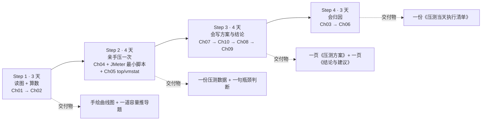

# 性能测试学习地图（初学者重点版）

> 一句话结论：**性能测试对初学者只有「1 个模型 + 1 个公式 + 1 条流程 + 1 次动手」是必须学透的，其余 20 多个工具名只是词典条目——知道有它、需要时查表即可。**
>
> 适用对象：Riley · 测试开发方向 · 性能测试为 🟡 加分项（不是当前主线，别让它挤掉 Pytest/接口自动化的时间）

---

## 0. 先解决"为什么懵"

初学者懵，不是因为难，而是因为**输入方式错了**：教程一站式地把 20+ 个工具名平铺给你——
AB / JMeter / nGrinder / Locust / LoadRunner / vmstat / top / nmon / Collectd / InfluxDB / Grafana / Prometheus / JConsole / VisualVM / jstack / FlameGraph / SkyWalking / Zipkin / eBPF / perf …

**但它们不是知识点，是词典条目。** 性能测试真正的骨架只有四件事：

| # | 骨架 | 一句话 | 对应章节 |
|---|------|--------|----------|
| 1 | 一张图 | 压力曲线：三条曲线 / 三个区域 / 两个拐点 | Ch01 |
| 2 | 一个公式 | 并发数 = QPS × 平均 RT（业务量 → 压力的翻译器） | Ch02 |
| 3 | 一条流程 | 取基线 → 定场景与标准 → 加压 → 采集 → 归因 → 出结论 | Ch07 / Ch08 |
| 4 | 一个动作 | 亲手压一次，盯着曲线说出"瓶颈在哪一层" | Ch04 + Ch05 |

把这四件事掌握，你已经超过大部分"我了解性能测试"的候选人。**工具名记不住，不影响面试；这张图和这个公式说不清，面试必挂。**

> 诊断你的"懵"属于哪一类：如果是"工具名太多记不住"——不用背，看第 1 节；如果是"不知道学了能干嘛"——看第 3 节的交付物；如果是"公式里的 QPS/并发/RT 分不清"——这是唯一需要今天就解决的，去做任务 6。

---

## 1. 必学（占 80% 价值的 20%）

| 优先级 | 学什么 | 章节 | **到什么程度（可检验的动作）** | 面试权重 | 别深挖什么 |
|--------|--------|------|-------------------------------|----------|-----------|
| ⭐️ 1 | **读图**：压力曲线模型 | Ch01 知识点 7-9 | 能在白板上 2 分钟画出三条曲线、标出两个拐点与三个区域；能解释"弃忍区 TPS 为什么反而下降"（排队→超时重试→上下文切换/GC 内耗） | ★★★★★ | 不用背 Light Load / Buckle Zone 的英文，理解走势与机制就够 |
| ⭐️ 2 | **算数**：指标口径 + 并发数公式 | Ch02 | 能把"日订单 10 万单 / 峰值时段占 30%"推成"下单接口 QPS 与并发数"，写出计算过程；能说清 TPS 与 QPS 的区别、为什么 SLA 看 TP99 不看均值 | ★★★★★ | 缩写表（HPS/CPS/IOPS…）能查就行，不硬背；多进程/多线程只记一句结论 |
| ⭐️ 3 | **动手**：JMeter 最小可用 + top/vmstat | Ch04（选型）+ Ch05（监控） | 能独立跑通一次单接口压测（线程组 + HTTP 请求 + 断言 + 聚合报告），同时用 top/vmstat 看服务器资源，并说出"瓶颈在 CPU 还是 IO 还是压测机" | ★★★★★ | 工具横向对比（nGrinder/LoadRunner/Locust）、分布式压测、自己搭 Grafana —— **全部先放** |
| ⭐️ 4 | **说话**：流程 + 场景 + 结论表达 | Ch07 / Ch10 / Ch08 / Ch09 | 能口述压测流程的重点 4 步（取基线、定场景、定验收标准、归因）；能把结果说成"日常区间 + 容量上限 + 扩容红线" | ★★★★★ | 报告的 14 个板块别背；报告先抓三件：结论、证据、建议 |

---

## 2. 了解即可（现在先放，别花整块时间）

| 内容 | 章节 | 现在学到什么程度 | 什么时候再回来 |
|------|------|------------------|----------------|
| 经典架构解析 | Ch03 | 能对着一张架构图说出"入口 / 应用 / 缓存 / DB / MQ 各盯什么指标" | 做真实项目压测、需要写巡检清单时 |
| 剖析工具全家桶 | Ch06 | 只记"哪个工具解决哪类问题"：CPU 热点 → 火焰图；线程/锁 → jstack；链路慢 → SkyWalking/Zipkin | 有 Java 项目或线上排障需求时 |
| 监控栈搭建 | Ch05 后半（Collectd / InfluxDB / Prometheus + Grafana） | 会用**现成看板**就够，别自己搭栈（搭栈会吃掉你一两周） | 团队要求你搭监控时 |
| 性能调优 | （站点 L4/L5） | **明确不学**。课程原话："能做调优的测试，基本都是资深专家以上的级别" | 工作 2~3 年后 |
| 多进程 / 多线程原理 | Ch02 知识点 4 | 只记一句：单机靠多线程、大规模靠多进程 + 多机分布式 | 需要做分布式压测时 |
| 各工具的参数细节（`-n`/`-c`/Groovy 脚本…） | Ch04 | 知道"AB 是快速基准"即可 | 真要用那个工具时 |

> 判断标准：**"不学它，我能不能完成一次压测并给出结论？"** 答"能"就往后放。

---

## 3. 学习顺序（2~3 周业余时间，每步都有交付物）

| 步骤 | 学什么 | 交付物（做完这个才算学会） |
|------|--------|----------------------------|
| Step 1（3 天） | Ch01 → Ch02 | 手绘一张压力曲线图（标两拐点三区域）+ 一道"日订单 10 万单 → 下单接口 QPS/并发"的推导题 |
| Step 2（4 天） | Ch04（只挑 JMeter）+ JMeter 最小脚本 + Ch05（top/vmstat 部分） | 一次真实压测的数据（聚合报告 + 资源截图）+ 一句瓶颈判断 |
| Step 3（4 天） | Ch07 → Ch10 → Ch08 → Ch09 | 一页《压测方案 + 验收标准》（含场景、请求比例、SLA）+ 一页《结论与建议》 |
| Step 4（3 天） | Ch03 → Ch06 | 一份《压测当天执行清单》（压前/压中/压后各做什么） |

> 这四步的动手题就是 `06-Daily-Summary/2026-09/2026-09-23.md` 里的任务 1~10，按 Step 分到 2~3 周即可。**不要一天刷完 10 章**——那是"看完"，不是"学会"。

---

## 4. 量化标准：到什么程度算"掌握到位"

| 能力 | ✅ 掌握到位（能做什么） | ⚠️ 没到位的样子 |
|------|------------------------|------------------|
| 读图 | 白板 2 分钟画出三曲线三区域；能说出"RT 一涨，并发需求成倍增加" → 弃忍区形成的机制 | 记得三个区域名字，说不出第二个拐点后 TPS 为什么降 |
| 算数 | 现场把"双十一每分钟 2 万订单"拆成各接口 QPS 与并发数，并说明假设与冗余 | 背下了公式，但不知道该乘哪个数、单位还搞混 |
| 动手 | 独立跑一次单接口压测，同时看资源并判断瓶颈层；知道起压机也可能是瓶颈 | 只会点"启动"，报告里的 RT/TPS 只会念数字 |
| 归因 | 能说出下钻路径：压测暴露 → 监控缩范围 → 剖析定代码/链路 | 只会说"系统有点慢" |
| 表达 | 结论是"日常区间 / 容量上限 / 扩容红线 + 触发条件"，每句话有数据 | 只会说"能扛 400 并发" |
| 面试 | 三个杀手锏问题能流利回答到机制层 | 只会复述定义 |

---

## 5. 这块的三个面试杀手锏（能答上来 = 达到可投简历水平）

| # | 问题 | 回答骨架 | 出处 |
|---|------|----------|------|
| Q1 | 你怎么确定压测的并发数？ | ①业务峰值量 → ②按转化率折算接口 QPS → ③并发数 = QPS × 平均 RT → ④用历史监控校准并留 20%~30% 冗余 → ⑤用阶梯加压找拐点验证（不是拍脑袋） | Ch02 / Ch10 |
| Q2 | 性能压力曲线怎么解读？ | ①三曲线（RT/TPS/资源利用率）+ ②三区域（轻/重/弃忍）+ ③两拐点（最佳/最大并发数）+ ④"三线一起看，单看 TPS 会把过载读成正常" + ⑤落到容量结论 | Ch01 知识点 7-9 |
| Q3 | 压测结果出来，你怎么定容量、怎么给结论？ | ①以 SLA（TP99/错误率）为第一约束 → ②给三段式结论（日常区间 / 容量上限 / 扩容红线）→ ③给触发条件（超容量则扩容，来不及则限流降级）→ ④优化后复压验证拐点右移 | Ch01 知识点 9 / Ch09 |

> 追问加分点（面试官一定会往下问）："弃忍区资源都满了，为什么处理能力反而下降？" → 回答机制：**排队变长 → 超时重试 + 线程上下文切换 + GC 抢占 → 资源被内耗在用"管理拥堵"而不是"处理业务"上**。

---

## 6. 你接下来两周做什么（照抄即可）

- [ ] **今天**：任务 1（Python + matplotlib 画三条曲线，标两拐点三区域）—— 做完这一步，这块约 50% 的"懵"会消失
- [ ] **今天**：任务 6（指标口径默写：并发 vs 在线、TPS vs QPS、并发数公式、P90/P95/P99）
- [ ] 本周：只挑 **JMeter 一个工具**装好，压一个公开接口（litemall / 宠物商店），拿到一份聚合报告 + 一张 top/vmstat 截图
- [ ] 下周：任务 10（设计一次完整场景方案）+ 任务 9（压测当天执行清单）
- [ ] 之后按需：任务 2 / 3 / 5 / 7 / 8
- [ ] **明确对自己说：nGrinder、LoadRunner、Locust、Zipkin、Collectd/InfluxDB 搭栈、性能调优 —— 这两周不看**

> 学习节奏建议：性能测试是 🟡 加分项，占你每周学习时间的 20%~25% 就够（主力仍是 Pytest / 接口自动化 / App 自动化）。**加分项的正确策略是"能用能讲"，不是"全面精通"。**

---

## 关联

- [[README|性能测试（课程 MOC）]]
- [[L1-性能测试体系/Ch01-性能测试介绍与压力曲线模型|Ch01-性能测试介绍与压力曲线模型]]（读图：压力曲线模型）
- [[L1-性能测试体系/Ch02-性能测试概念与指标体系|Ch02-性能测试概念与指标体系]]（算数：指标口径 + 并发数公式）
- [[L1-性能测试体系/Ch04-行业流行性能压测工具介绍|Ch04-行业流行性能压测工具介绍]]（动手：JMeter 选型理由）
- [[L1-性能测试体系/Ch05-行业流行性能监控工具介绍|Ch05-行业流行性能监控工具介绍]]（动手：top / vmstat）
- [[L1-性能测试体系/Ch07-性能测试流程与方法|Ch07-性能测试流程与方法]]（说话：流程 12 步 + 两种加压模式）
- [[L1-性能测试体系/Ch08-性能测试计划|Ch08-性能测试计划]]（说话：验收标准与实战命令）
- [[L1-性能测试体系/Ch09-性能测试报告|Ch09-性能测试报告]]（说话：结论与交付）
- [[L1-性能测试体系/Ch10-性能测试场景设计|Ch10-性能测试场景设计]]（说话：五类场景方法）
- [[../../06-Daily-Summary/2026-09/2026-09-23|每日总结 2026-09-23]]（任务 1~10 的原始清单）
