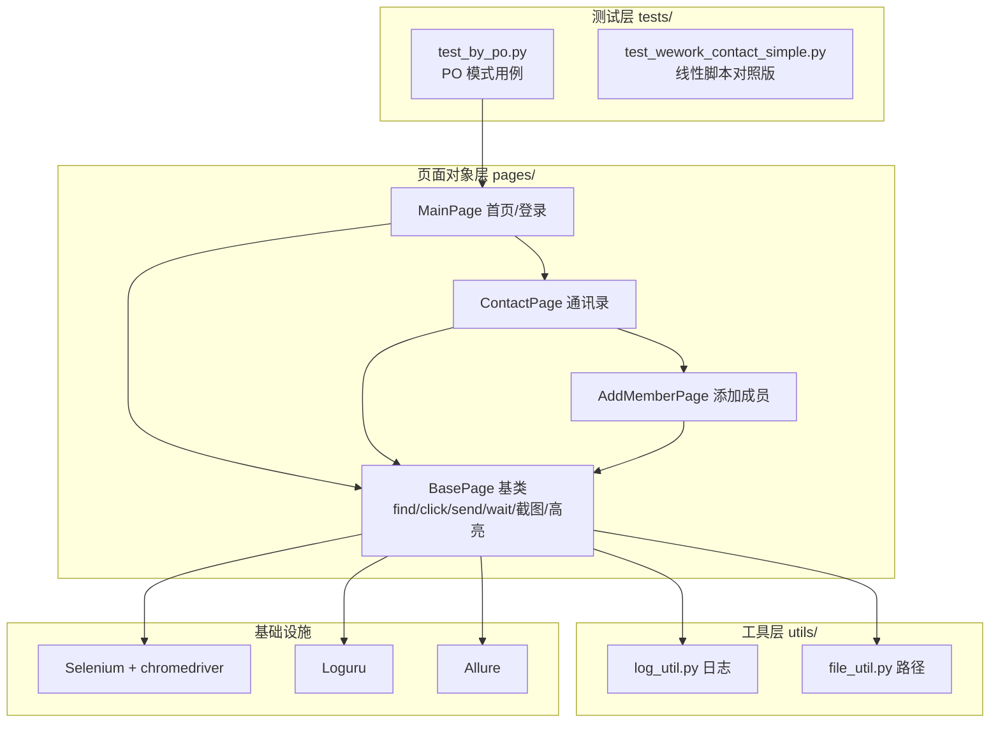

# 项目文档：企业微信 Web 自动化测试框架

> 本文件用于**简历 + 面试**：讲清"做了什么、怎么做的、为什么这么做、亮点在哪"。
> 配套代码：`03-Projects/05_web_auto_test-main/`（PO 模式完整框架）。

## 一、项目概述

- **一句话**：基于 Selenium + Pytest + Allure，用 Page Object 模式搭建的企业微信管理后台 Web UI 自动化测试框架，覆盖"添加成员"核心业务，具备 Cookie 复用登录、结构化日志、异常自动截图、元素高亮、测试报告等工程化能力。
- **我的角色**：测试开发工程师（独立完成环境搭建、脚本编写、PO 框架封装、框架优化与报告输出）。

**简历版（STAR）**
- **S（情境）**：企业微信后台的通讯录"添加成员"是核心高频操作，靠手工回归成本高、易漏测。
- **T（任务）**：搭建一套 Web UI 自动化框架，让"添加成员"能无人值守地回归，并输出可读的测试报告。
- **A（行动）**：从线性脚本起步，重构为 Page Object 三层架构，封装 BasePage 通用操作，引入 Cookie 复用登录、Faker 数据、Loguru 日志、异常截图 + PageSource、元素高亮、Allure 报告。
- **R（结果）**：核心用例从手工数分钟/次降为自动化秒级执行，失败时可凭日志 + 截图 + 页面源码快速定位，无需复现。

## 二、项目背景与目标

企业微信（WeCom）管理后台的通讯录管理是 OA 高频场景。手工回归"添加成员"需要多次点击、填写、校验，重复且易错。本项目的目标分三层：

1. 跑通"添加成员"主流程的自动化（先能跑）
2. 用 PO 模式封装成可维护的框架（再可维护）
3. 补齐日志、截图、报告等工程化能力（最后能交付）

【为什么？】 自动化项目的价值不在"能不能跑通一次"，而在"UI 变更时改起来便宜、挂了能快速定位、结果能让别人看懂"。所以目标是一层一层往上加的——缺了第 3 步就只能叫"脚本"，不叫"框架"。

## 三、技术栈清单

| 技术 | 版本 | 用途 | 选型原因 |
|------|------|------|----------|
| Python | 3.13 | 运行环境 | 测试开发通用语言 |
| Selenium | ≥4.48 | Web UI 自动化核心 | W3C 标准、生态成熟、自带 Selenium Manager |
| pytest | ≥9.1 | 测试框架 | 用例组织、fixture、断言 |
| Allure | allure-pytest≥2.16 | 测试报告 | 报告美观、支持 step/附件 |
| Loguru | ≥0.7 | 结构化日志 | 开箱即用、彩色输出、轮转 |
| Faker | ≥40 | 测试数据生成 | zh_CN 中文数据、账号唯一 |
| PyYAML | ≥6 | 配置解析 | 存 cookie |
| uv | — | 依赖管理 | 快、锁版本、可复现 |

## 四、整体架构



分层说明：
- **测试层**：只描述业务步骤（登录 → 进通讯录 → 添加成员 → 断言），不含任何元素定位。
- **页面对象层**：每页一个类，封装该页的元素定位与操作；BasePage 下沉所有页面共用的通用操作。
- **工具层**：日志、路径等横切关注点，页面层和测试层复用。

【为什么？】 三层的好处是"变更隔离"：元素定位只出现在页面层，UI 变了改一处；业务步骤只出现在测试层，需求变了改一处；通用操作只出现在 BasePage，写法统一改一处。**一行代码只出现在一个地方**，这就是可维护性。

## 五、核心功能与实现

### 5.1 Cookie 复用登录

```python
# BasePage.login_by_cookie()
data_dir = get_path("data")
with open(data_dir / "cookies.yaml", "r", encoding="utf-8") as f:
    cookies = yaml.safe_load(f)
for cookie in cookies:
    self.driver.add_cookie(cookie)
self.driver.refresh()
```

流程：第一次人工扫码 → `get_cookies()` 存成 `cookies.yaml` → 以后读文件 `add_cookie` 免扫码登录。

【为什么？】 UI 自动化的登录墙是最大拦路虎。Cookie 复用把"一次性人工登录"变成"可复用登录态"，让用例能在 CI/定时任务里无人值守跑。

【易错点】 `add_cookie` 之前必须先 `driver.get(同域页面)`，否则报 `invalid cookie domain`；cookie 会过期，过期后需重新扫码刷新 yaml。

### 5.2 BasePage 通用操作封装

BasePage 提供：`open / quit / find / finds / find_click / find_send / wait_located / wait_click / login_by_cookie / js_click / screen_image / save_page_source / highlight / unhighlight`。

关键设计点：

1. **可注入 driver**：`__init__(self, driver=None)`——driver 为 None 时自己 new 一个，否则复用传入的。这样 `ContactPage(self.driver)` 让多个页面共享同一个浏览器会话。
2. **find 失败降级为 None**：try/except 包住定位，失败不抛异常而是返回 None 并触发截图 + 存源码。
3. **等待分层**：`implicitly_wait` 兜底 + `wait_located/wait_click`（显式等待）为主力。

【为什么？】 把"定位、点击、输入、等待、截图、高亮"下沉到 BasePage，页面类只需一行 `self.find_click(*self.__ADD_MEMBER)`，测试用例彻底告别 `driver.find_element(By.XPATH, ...)` 的样板代码。

### 5.3 定位器私有化 + 名称改写

```python
class MainPage(BasePage):
    __CONTACT = By.XPATH, '//*[@id="nav"]//*[text()="通讯录"]'
```

定位器定义成类级私有常量（双下划线触发名称改写 `_MainPage__CONTACT`），页面方法里 `self.find_click(*self.__CONTACT)` 解包调用。

【为什么？】 定位器"集中定义、私有化"，外部无法直接改，UI 变化时只需改常量一处。

### 5.4 异常可观测性三件套：日志 + 截图 + PageSource

- **日志**（Loguru）：控制台彩色输出 + 文件输出（`rotation='1 MB'` 轮转、`retention=10` 保留 10 份）。
- **错误截图**（`screen_image`）：元素定位失败时自动截图，并用 `allure.attach.file` 挂进报告。
- **PageSource**（`save_page_source`）：失败时把 `driver.page_source` 存成 html，同样挂进报告。

【为什么？】 用例在 CI 半夜挂了，第二天看 Allure 报告能拿到"哪个元素定位失败 + 当时页面截图 + 页面源码"，不需要复现现场就能定位，这是框架能真正落地的关键。

【企业场景】 你在公司跑回归，领导问"昨晚那条用例为什么挂了"，你把 Allure 报告链接发过去，截图和页面源码都在报告里，一句"点开看附件"就说明白了——不用拉群、不用复现、不用解释半天。

### 5.5 元素高亮（调试可视化）

```python
def highlight(self, ele):
    self.driver.execute_script("arguments[0].style.border = '3px solid red';", ele)
```

通过 JS 给元素加红色边框，`find` 时高亮 → 截图（可选）→ 0.5 秒后取消。

【为什么？】 跑用例时肉眼看得到"它点的是哪个元素"，定位器写错了能立刻发现，是纯靠截图看不到的"过程可视化"。

### 5.6 Allure 报告

`@allure.feature("企业微信 Web 端")` / `@allure.story("添加成员")` / `@allure.title(...)` / `@allure.step(...)` 四级描述。页面方法上的 step 让报告自动生成"操作步骤树"，截图和 PageSource 作为附件挂进去。

【为什么？】 feature/story 是"测哪"的维度，step 是"怎么测"的过程，附件是"证据"。报告好不好看，直接决定框架在公司能不能推得动。

## 六、测试用例设计

| 用例标题 | 前置条件 | 用例步骤 | 预期结果 |
|---------|---------|---------|---------|
| 添加成员（冒烟用例） | Cookie 登录成功 | 通讯录→组织架构→添加成员→输入姓名/账号/手机号→保存 | 提示"保存成功"，新成员出现在成员列表 |
| 添加成员（重复账号） | Cookie 登录成功 | 同上，输入已存在的账号 | 提示"账号已被占用" |

代码里对应的两条断言：

```python
assert tips == "保存成功"
assert fname in mem_list
```

【易错点】 两条用例步骤几乎一样，差异只在"预期结果"——这正是 PO"同样的行为不同结果建模为不同方法"的体现，也是参数化 / 数据驱动可以接手的地方。

## 七、从测试工程师角度理解

| 环节 | 测试风险 | 框架对策 |
|------|---------|---------|
| 登录 | 扫码需人工、登录态过期 | Cookie 复用 + yaml 刷新 |
| 元素定位 | UI 变更导致定位器失效 | 定位器私有化集中管理 |
| 用例失败 | 无法定位失败原因 | 日志 + 截图 + PageSource |
| 报告沟通 | 别人看不懂结果 | Allure feature/story/step/附件 |
| 测试数据 | 账号重复导致二次跑失败 | Faker 随机数据 |

## 八、简历话术（可直接摘抄）

**版本 A（一句话）**：独立搭建企业微信管理后台 Web UI 自动化测试框架，采用 Page Object 模式分层设计，集成 Cookie 复用登录、Faker 数据构造、Loguru 日志、异常自动截图与 Allure 报告，实现"添加成员"核心用例的无人值守回归。

**版本 B（项目经历条目）**：
- 用 Selenium + Pytest + Allure 从 0 搭建 Web UI 自动化框架，覆盖企业微信"添加成员"核心业务。
- 重构线性脚本为 Page Object 三层架构（BasePage / 页面对象 / 用例），定位器与操作解耦，UI 变更只需改一处。
- 封装 BasePage 通用操作（查找/点击/输入/显式等待/JS 点击），消除用例中的样板代码。
- 引入 Cookie 复用登录 + Faker 随机数据，实现用例可重复、无人值守执行。
- 补齐可观测性：Loguru 结构化日志 + 异常自动截图 + PageSource 存档，失败无需复现即可定位。
- 输出 Allure 报告（feature/story/step + 截图附件），提升用例可读性与团队沟通效率。

**版本 C（一句话量化）**：将"添加成员"核心用例从手工数分钟/次降至自动化秒级执行，失败定位从"需复现"变为"看报告附件即可"。

## 九、面试考察

**Q1：PO 模式解决了什么问题？三个建模原则是什么？**
参考框架：线性脚本的三个痛点（不适应 UI 变化 / 表达不了业务场景 / 样板代码多）→ PO 用页面类封装元素和操作，用例只写业务步骤 → 原则：不暴露页面元素给外部 / 不用建模所有元素 / 方法返回 PageObject 或断言数据、不在方法内加断言。

**Q2：`add_cookie` 为什么要在同域打开页面后才能生效？**
参考框架：cookie 有 domain 属性，浏览器只会把 cookie 种到对应域下；空浏览器没有当前域，`add_cookie` 找不到归属域就报 `invalid cookie domain`，所以要先 get 目标域。

**Q3：隐式等待和显式等待有什么区别？为什么你两种都用？**
参考框架：隐式等待是全局、只在 find_element 找不到时轮询；显式等待是针对特定条件轮询、满足即返回。隐式值设小兜底，显式作为主力，因为"元素在 DOM ≠ 可交互"，隐式放行后 click 仍可能因遮罩/动画报 ElementClickInterceptedException。

**Q4：你的框架怎么定位一个偶发的失败用例？**
参考框架：看 Allure 报告 → 找到失败 step → 看错误截图（当时页面）→ 看 PageSource（页面源码）→ 结合 Loguru 日志（定位的元素 + 报错信息）三件套定位，不用复现。

**Q5：这套框架还缺什么？（考察工程化思维）**
参考框架：数据驱动（pytest parametrize 接管两条用例的差异）、失败重跑、多浏览器并发（pytest-xdist）、CI 集成（Jenkins/GitLab CI 定时跑 + 报告归档）、cookie 过期自动刷新、定位器配置化（data-test-id 契约）。

## 十、易错点对比表

| 易混点 | 正确 | 错误 |
|--------|------|------|
| 关闭浏览器 | `driver.quit()`（关所有窗口+结束会话） | `driver.close()`（只关当前窗口，可能残留进程） |
| 驱动方式 | 4.x `webdriver.Chrome()`（Selenium Manager 自动下） | 3.x 手动配 PATH / `executable_path` |
| 隐式等待值 | 3~5 秒兜底（本项目 15 偏大） | 15+ 秒拖慢失败用例 |
| add_cookie | 先 get 同域页面再 add | 空浏览器直接 add 报 invalid cookie domain |
| 断言位置 | 测试用例里 assert | PO 页面方法里 assert（违反原则） |
| 测试数据 | Faker 随机（可重复回归） | 写死账号（第二次跑就重复） |
| 元素高亮 | JS 改 border | Selenium 无此 API，别硬找 |

## 十一、关联笔记

- [[../../02-Course-Notes/Web自动化测试/Ch15-PageObject设计模式|Ch15-PageObject设计模式]]
- [[../../02-Course-Notes/Web自动化测试/Ch19-Cookie复用自动化登录|Ch19-Cookie复用自动化登录]]
- [[../../02-Course-Notes/Web自动化测试/Ch16-异常自动截图|Ch16-异常自动截图]]
- [[../../02-Course-Notes/Web自动化测试/Ch04-自动化测试用例结构分析|Ch04-自动化测试用例结构分析]]
- [[../../02-Course-Notes/Web自动化测试/实战项目-企业微信Web自动化-直播观看思路|实战项目-直播观看思路]]
