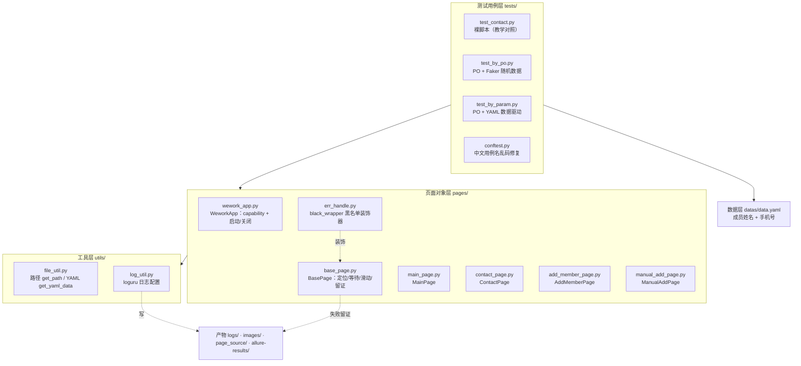
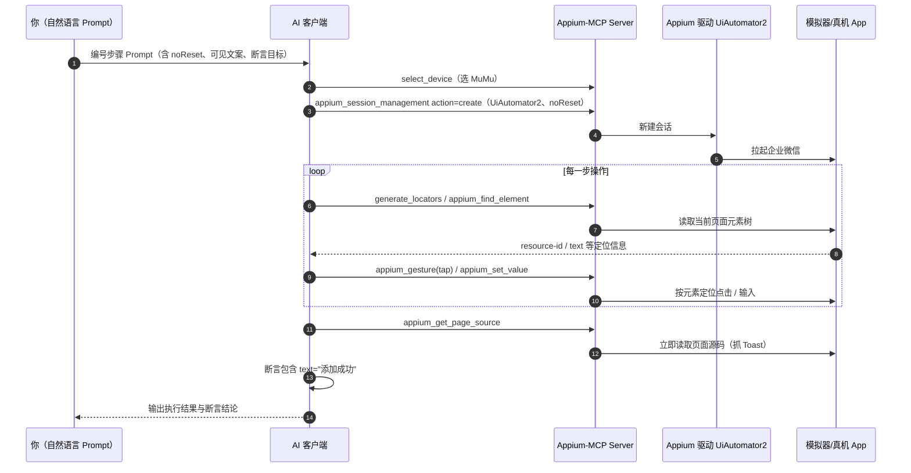

# 企业微信 App 自动化测试实战 — 完整技术文档

> 课程来源：霍格沃兹测试开发学社 L5 实战《企业微信用户端 App 自动化测试实战》（reveal.js 讲义，45 页）
> 对应项目：`03-Projects/06_app_auto_test-main`
> 配套笔记：[[../../02-Course-Notes/APP自动化测试/Ch28-企业微信App自动化测试实战与AI辅助测试|APP Ch28]]

---

## 一、课程目标

1. 熟悉 Appium 框架与常用操作（capability、元素定位、等待、滑动、Toast）
2. 掌握 App 自动化测试用例编写能力（可直接写、可数据驱动）
3. 掌握 App 自动化测试实战能力（用 PO 模式搭建完整框架：分层 + 数据驱动 + 异常处理 + 报告）
4. 了解 AI 辅助 App 自动化测试（Appium-MCP，让 AI 直接操作 App）

---

## 二、项目背景

**被测功能**：企业微信 Android 端「添加成员」。

企业微信是腾讯微信团队打造的企业通讯与办公工具，具有与微信一致的沟通体验、丰富的 OA 应用、和连接微信生态的能力。

**测试需求**：

| # | 需求 | 交付物 |
|---|------|--------|
| 1 | 企业微信 App 添加成员功能自动化测试 | 可执行的自动化用例 |
| 2 | 完成 App 自动化测试框架搭建 | PO 分层框架 |
| 3 | 在框架中编写自动化测试用例 | 直写版 / PO 版 / 数据驱动版 |
| 4 | 优化测试框架 | 日志、黑名单容错、数据驱动 |
| 5 | 输出测试报告 | Allure 报告 |

**前提条件**：

- 手机端已安装企业微信 App（本项目被测包：`com.tencent.wework`，启动页 `.launch.LaunchSplashActivity`）
- 企业微信注册用户，且设备上保持**已登录状态**（靠 `noReset=True` 保留，登录态失效时需人工重登一次）

---

## 三、环境与设备准备

| 组件 | 作用 | 关键点 |
|------|------|--------|
| JDK | 支撑 Android SDK 与 Appium Server | 需配 `JAVA_HOME` |
| Android SDK + 平台工具 | `adb` / uiautomator2 驱动依赖 | `adb devices` 能看到设备才算通 |
| Appium Server | 自动化驱动服务端 | 默认端口 **4723**，对应 `webdriver.Remote("http://127.0.0.1:4723")` |
| Appium Inspector | 可视化查看元素树、拿定位表达式 | 与 Server 端口不能冲突 |
| appium-python-client | Python 侧客户端 | `pip/uv add appium-python-client` |
| 模拟器 / 真机 | 被测设备 | 模拟器设备名即 `adb devices` 里的名字（如 `emulator-5554`） |

**环境自检三连**（跑脚本前先做，能省掉一半排错时间）：

```bash
adb devices                 # 设备在线
appium                      # Server 起来（默认 4723）
adb shell dumpsys activity top | grep ACTIVITY   # 拿到当前 App 的包名/Activity
```

---

## 四、测试用例设计

| 测试模块 | 用例标题 | 前置条件 | 用例步骤 | 预期结果 |
|----------|----------|----------|----------|----------|
| 成员模块 | 添加成员-成功 | 登录成功 | 1. 点击通讯录<br>2. 点击添加成员按钮<br>3. 点击手动输入添加按钮<br>4. 输入姓名、手机号，点击保存 | 1. 进入通讯录页面<br>2. 进入添加成员页面<br>3. 进入输入成员信息页面<br>4. 成功添加成员，给出【添加成功】提示 |
| 成员模块 | 添加成员-手机号重复，添加失败 | 登录成功 | 1. 点击通讯录<br>2. 点击添加成员按钮<br>3. 点击手动输入添加按钮<br>4. 输入**已存在的手机号**，点击保存 | 1. 进入通讯录页面<br>2. 进入添加成员页面<br>3. 进入输入成员信息页面<br>4. 提示【手机已存在于通讯录，无法添加】，添加失败 |

**为什么只做这 2 条**【为什么？】：一条走通主链路（正向冒烟），一条覆盖「服务端有确定返回」的典型异常。自动化用例的价值是**回归**而不是穷举——异常用例要挑「返回确定、文案确定」的场景才可稳定断言（网络异常/权限异常这类返回不确定的场景不做自动化）。

**用例的「预期结果」如何变成断言**：

| 预期结果 | 自动化里的实现 |
|----------|----------------|
| 进入通讯录页面 / 添加成员页面 / 输入成员信息页面 | 页面对象**链式跳转**（`goto_contact().goto_add_member().goto_manual_add()`） |
| 成功添加成员，提示【添加成功】 | Toast 文本断言（`get_tips() == "添加成功"`） |
| 提示【手机已存在于通讯录，无法添加】 | 同一条用例的参数化/分支断言（文案不同） |

---

## 五、分层架构设计

### 5.1 架构总览



**设计原则**：每层只依赖下层，不跨层、不反向依赖；页面对象层内部允许「跳转方法返回下一个页面对象」形成链。

### 5.2 各层职责（对应真实文件）

| 层次 | 文件 | 职责 | 关键实现 |
|------|------|------|----------|
| 工具层 | `utils/file_util.py` | 路径计算、YAML 读取 | `pathlib.Path` 定位项目根，`get_path()` / `get_yaml_data()` |
| 工具层 | `utils/log_util.py` | 日志配置 | **loguru**：`logger.remove()` 后加控制台（彩色）+ 文件（1MB 轮转、留存 10 份） |
| 页面对象层 | `pages/wework_app.py` | App 级操作 | `start()` 建会话返回 self、`goto_main()` 返回首页对象、`stop()` 关会话 |
| 页面对象层 | `pages/base_page.py` | 与业务无关的通用操作 | `find_ele`（**挂黑名单装饰器**）/ `find_eles` / `find_and_click` / `find_and_sendkeys` / `set_implicitly_wait` / `wait_ele_located` / `wait_ele_click` / `wait_for_text` / `swipe_window` / `swipe_find` / `screenshot` / `save_page_source` |
| 页面对象层 | `pages/err_handle.py` | 弹窗容错 | `black_list` + `black_wrapper` 装饰器 |
| 页面对象层 | `pages/main_page.py` | 首页 | `__CONTACT = (XPATH, "//*[@text='通讯录']")` + `goto_contact()` |
| 页面对象层 | `pages/contact_page.py` | 通讯录页 | 滑动找到「添加成员」→ `goto_add_member()` |
| 页面对象层 | `pages/add_member_page.py` | 添加成员页 | `goto_manual_add()` 返回手动录入页；`get_tips()` 取 Toast |
| 页面对象层 | `pages/manual_add_page.py` | 手动录入页 | `__NAME` / `__PHONE` / `__SAVE` 三个私有定位器 + `success_add_info()` |
| 数据层 | `datas/data.yaml` | 参数化数据 | `member_info: [[姓名, 手机号], ...]` |
| 用例层 | `tests/test_contact.py` | 裸脚本（教学起点） | capability + 定位 + 操作 + 断言全写在用例里 |
| 用例层 | `tests/test_by_po.py` | PO + Faker | `setup_class` 造随机数据，链式调用 |
| 用例层 | `tests/test_by_param.py` | PO + 数据驱动 | `@pytest.mark.parametrize("name, phonenum", get_member_datas())` |
| 用例层 | `tests/conftest.py` | 全局钩子 | `pytest_collection_modifyitems` 修中文乱码 |

### 5.3 目录结构（真实）

```
06_app_auto_test-main/
├── pyproject.toml            # uv 管理依赖
├── README.md
├── src/
│   ├── app_auto_test/
│   │   ├── __init__.py
│   │   ├── pages/
│   │   │   ├── base_page.py        # BasePage
│   │   │   ├── wework_app.py       # WeworkApp
│   │   │   ├── main_page.py        # MainPage
│   │   │   ├── contact_page.py     # ContactPage
│   │   │   ├── add_member_page.py  # AddMemberPage
│   │   │   ├── manual_add_page.py  # ManualAddPage
│   │   │   └── err_handle.py       # black_wrapper
│   │   └── utils/
│   │       ├── file_util.py        # get_path / get_yaml_data
│   │       └── log_util.py         # loguru 配置
│   ├── datas/data.yaml             # 测试数据
│   └── tests/
│       ├── conftest.py
│       ├── test_contact.py         # 裸脚本
│       ├── test_by_po.py           # PO + Faker
│       └── test_by_param.py        # PO + YAML 数据驱动
└── （运行时产物：logs/ · images/ · page_source/）
```

### 5.4 项目实际代码 vs 课程 PPT 示例的差异（**重要**）

课程 PPT 给的是**教学简化版**，实际项目跑的是另一套等价实现。对不上时以**项目代码**为准：

| 维度 | 课程 PPT | 项目实际代码 | 说明 |
|------|----------|--------------|------|
| 布局 | 根目录直接 `base/ page/ cases/ datas/ utils/` | `src/app_auto_test/pages|utils/` + `src/tests/` | uv 标准 src 布局，`pyproject.toml` 装机后可 import |
| 日志 | 标准库 `logging` + `RotatingFileHandler` | **loguru** | loguru 用 `rotation='1 MB'` / `retention=10` 一行搞定 |
| 路径 | `os.sep.join([root_path, ...])` + 全局 `root_path` | `pathlib.Path` + `get_path()` | 更安全，不依赖模块级全局变量 |
| 页面类父类 | `class MainPage(WeworkApp)` | `class MainPage(BasePage)` | 页面类继承 BasePage；`WeworkApp` 只负责会话生命周期 |
| 黑名单装饰器 | 挂在 `find_ele` + `find_eles` | **只挂 `find_ele`** | 见 8.3，这是个真实的遗漏点 |
| 项目路径注入 | conftest 里 `sys.path.append(root_path)` | 无（不需要） | 项目按包安装（uv），import 路径天然可用 |
| 类名/方法名 | `AddressListPage.goto_address_list_page()` | `ContactPage.goto_contact()` | 命名更短；文档里两套名字都出现过，认准项目代码 |

---

## 六、核心代码详解

### 6.1 WeworkApp — App 启动与 capability

**文件**：`src/app_auto_test/pages/wework_app.py`

```python
class WeworkApp:

    def start(self):
        caps = {}
        caps["platformName"] = "Android"                        # 平台
        caps["appium:automationName"] = "uiautomator2"          # 驱动（唯一必填）
        caps["appium:deviceName"] = "emulator-5554"             # adb devices 里的名字
        caps["appium:appPackage"] = "com.tencent.wework"        # 被测 App 包名
        caps["appium:appActivity"] = ".launch.LaunchSplashActivity"  # 启动页
        caps["appium:noReset"] = True                           # 不重置应用数据（保留登录态）
        caps["appium:forceAppLaunch"] = True                    # 会话建立时强制拉起 App
        options = AppiumOptions().load_capabilities(caps)
        self.driver = webdriver.Remote("http://127.0.0.1:4723", options=options)
        self.driver.implicitly_wait(10)                         # 全局隐式等待
        return self

    @allure.step("跳转到首页")
    def goto_main(self):
        return MainPage(self.driver)

    def stop(self):
        self.driver.quit()
```

【为什么？】

- **换被测 App 只改 2 行**：`appPackage` + `appActivity`（包名和启动页）。页面类、用例、工具层零改动——这就是「分层」最直接的收益，也是本章最该记住的一句话。
- **`start()` 返回 `self`**：让「启动 → 进首页」写成 `WeworkApp().start().goto_main()`，与 `goto_main()` 返回 `MainPage` 一起构成链式起点。
- **`stop()` 用 `quit()` 不是 `close()`**：`quit()` 关闭会话、释放设备；忘掉会导致下条用例报 session 冲突。
- **`appium:` 前缀**：Appium 2.x 里非 W3C 标准 capability 必须带前缀；只有 `platformName` / `browserName` / `browserVersion` 不带。

【易错点】

| 误区 | 纠正 |
|------|------|
| `noReset=True` 理解成「清缓存」 | 它表示**不重置应用数据/状态**（保留登录态）；「卸载重装式重置」是 `fullReset=True` |
| 把 `forceAppLaunch` 当成 `noReset` 的同义词 | `forceAppLaunch` 管**会话建立时拉起 App**；`noReset` 管**数据是否重置** |
| 漏 `appium:automationName` | 唯一必填项，漏了 Server 不知道用哪个驱动，直接报错 |
| `deviceName` 抄别人的 | 用自己 `adb devices` 的输出；企业里应改为从配置/环境变量读 |

---

### 6.2 BasePage — 通用方法封装

**文件**：`src/app_auto_test/pages/base_page.py`

| 方法 | 作用 | 备注 |
|------|------|------|
| `find_ele(by, value)` | 查找单个元素 | **只有它挂了 `@black_wrapper`** |
| `find_eles(by, value)` | 查找多个元素 | 未挂装饰器（见 8.3） |
| `find_and_click(by, value)` | 查找并点击 | 内部走 `find_ele`（继承容错） |
| `find_and_sendkeys(by, value, text)` | 查找并输入 | 同上 |
| `set_implicitly_wait(time=1)` | 设置隐式等待 | 默认 1s，供滑动查找提速 |
| `wait_ele_located(by, value, timeout=10)` | 显式等待 | ⚠ 实现用了 `invisibility_of_element_located`，见下 |
| `wait_ele_click(by, value, timeout=10)` | 显式等待可点击 | `element_to_be_clickable` |
| `wait_for_text(text, timeout=5)` | 等待文本出现 | 返回 True/False，不抛异常 |
| `swipe_window()` | 滑动一屏 | 按屏幕尺寸算坐标（x 居中，y 从 0.8h → 0.2h） |
| `swipe_find(text, max_num=5)` | 滑动查找 | 找到返回元素，滑 5 次仍无 → 抛 `NoSuchElementException` |
| `save_source_datas(source_type)` | 生成留证文件路径 | `images` → `.png`，`pagesource` → `_page_source.xml` |
| `screenshot()` | 截图 | `driver.save_screenshot(path)` |
| `save_page_source()` | 保存页面源码 XML | `encoding="u8"` |

```python
class BasePage:

    def __init__(self, driver):
        self.driver = driver

    @black_wrapper
    def find_ele(self, by, value):
        logger.info(f"查找单个元素的定位：{by},{value}")
        return self.driver.find_element(by, value)

    def find_and_click(self, by, value):
        logger.info(f"查找元素 {by},{value} 并点击")
        self.find_ele(by, value).click()          # ← 复用 find_ele，自动获得弹窗容错

    def swipe_find(self, text, max_num=5):
        self.driver.implicitly_wait(1)            # 提速：滑动查找会反复 find
        for num in range(max_num):
            try:
                ele = self.driver.find_element(AppiumBy.XPATH, f"//*[@text='{text}']")
                self.driver.implicitly_wait(15)   # 恢复
                return ele
            except Exception:
                self.swipe_window()               # 找不到就滑一屏再来
        self.driver.implicitly_wait(15)
        raise NoSuchElementException(f"滑动之后，未找到 {text} 元素")
```

【为什么？】

- **封装 `find_and_click` 的真正价值是「统一横切入口」**：所有点击/输入都收敛到 `find_ele`，所以日志、失败留证、弹窗容错只要在 `find_ele` 这一个点上做，整个框架自动受益。少写代码只是副产品。
- **`swipe_find` 找不到必须抛异常**：抛 `NoSuchElementException` 会把错误定位在「滑动查找失败」，信息明确；若返回 `None`，错误会推迟到调用处变成 `AttributeError: 'NoneType' object has no attribute 'click'`，排查成本翻倍。
- **`wait_for_text` 返回布尔值而不是抛异常**：它的语义是「文本是否出现」——本身就是结论，交给调用方决定是否失败；而 `wait_ele_click` 是「拿不到就没法继续」，所以抛异常。

【易错点】

| 误区 | 纠正 |
|------|------|
| `wait_ele_located` 用了 `invisibility_of_element_located` | 等的是「元素**不可见**」，与「等待元素可定位」语义相反，应为 `visibility_of_element_located`。这类错误**不报错**，只让等待神秘超时 → 写等待方法务必核对 `expected_conditions` 的语义 |
| 隐式等待时长前后不一致 | `WeworkApp.start()` 设 10s，`swipe_find` 恢复成 **15s**（第 3 个写法写死），滑动查找后全局等待被悄悄改掉 → 统一成同一个常量 |
| 滑动查找临时改隐式等待后忘记恢复 | 必须在每个出口（找到 / 滑满失败）都恢复 |
| 滑动写死坐标 | 用 `get_window_size()` 按比例算，换分辨率不崩 |

【扩展知识】

> 更规范的做法是用短超时显式等待替代「临时改 `implicitly_wait`」：`WebDriverWait(driver, 1).until(...)` 包一层轮询。改全局隐式等待属于「隐式状态副作用」，容易像本项目一样把恢复值写错（10 → 15）。

---

### 6.3 页面对象层 — 私有定位器 + 链式跳转

**文件**：`main_page.py` / `contact_page.py` / `add_member_page.py` / `manual_add_page.py`

```python
class MainPage(BasePage):
    __CONTACT = AppiumBy.XPATH, "//*[@text='通讯录']"

    @allure.step("点击通讯录按钮")
    def goto_contact(self):
        self.find_and_click(*self.__CONTACT)
        return ContactPage(self.driver)


class ContactPage(BasePage):
    __ADD_MEMBER = AppiumBy.XPATH, "//*[@text='添加成员']"

    @allure.step("点击添加成员按钮")
    def goto_add_member(self):
        self.swipe_find("添加成员").click()          # ⚠ 见下：与下一行重复点击
        self.find_and_click(*self.__ADD_MEMBER)
        return AddMemberPage(self.driver)


class AddMemberPage(BasePage):
    __MANUAL_ADD = AppiumBy.XPATH, "//*[@text='手动输入添加']"
    __TOAST = AppiumBy.XPATH, "//*[@class='android.widget.Toast']"

    @allure.step("点击手动输入添加按钮")
    def goto_manual_add(self):
        self.find_and_click(*self.__MANUAL_ADD)
        return ManualAddPage(self.driver)

    def get_tips(self):
        return self.find_ele(*self.__TOAST).text      # 返回「断言用的数据」，不含断言


class ManualAddPage(BasePage):
    __NAME = AppiumBy.XPATH, "//*[contains(@text, '姓名')]/../*[@text='必填']"
    __PHONE = AppiumBy.XPATH, "//*[@text='手机']/..//*[@text='选填']"
    __SAVE = AppiumBy.XPATH, "//*[@text='保存']"

    @allure.step("快捷输入成员信息")
    def success_add_info(self, name, phone):
        from app_auto_test.pages.add_member_page import AddMemberPage   # 延迟导入避免循环依赖
        self.find_and_sendkeys(*self.__NAME, name)
        self.find_and_sendkeys(*self.__PHONE, phone)
        self.swipe_find("保存")                        # 先滑到「保存」可见（不点击）
        self.find_and_click(*self.__SAVE)
        return AddMemberPage(self.driver)
```

【为什么？】

- **定位器做成类属性元组 + `*` 解包**：`__CONTACT = AppiumBy.XPATH, "..."` 把「定位方式 + 表达式」打包成一个值，`self.find_and_click(*self.__CONTACT)` 解包成两个参数，正好对上方法签名。定位器集中在类顶部 → 排错时「翻顶部常量」是统一动作。
- **双下划线 = 不暴露给外部**（PO 属性原则）：外部只看到 `goto_contact()` 这个方法，不知道里面怎么定位；文案变了只改类顶部一行。
- **`get_tips()` 只返回数据不断言**：断言属于用例层（PO 方法原则第 4 条），页面类既当运动员又当裁判就失去了分层的意义。
- **两个输入框为什么用 `..` 轴定位**：手动录入页的输入框**没有 resource-id**，但字段上方有说明文字（姓名-必填 / 手机-选填）。于是「先找说明文字，回父节点，再往下找同级输入框」：`//*[contains(@text,'姓名')]/../*[@text='必填']`、`//*[@text='手机']/..//*[@text='选填']`。这是 XPath 轴定位（Ch20）在真机上的典型用法。
- **延迟导入 `AddMemberPage`**：页面类互相引用会形成循环导入（AddMemberPage ↔ ManualAddPage 互相 return），把 import 放进方法体内即可打破。

【易错点】

| 误区 | 纠正 |
|------|------|
| `swipe_find("添加成员").click()` 之后又 `find_and_click(...)` | **本项目真实存在的重复点击**：`swipe_find` 已经返回元素、`.click()` 已点过，再加一次 `find_and_click` 等于点两下（点击类操作应二选一：要么 `swipe_find(...).click()`，要么 `swipe_find("添加成员")` 只用来滑动 + `find_and_click` 点击）。`test_contact.py` 里同样重复 |
| 元组忘了逗号 / 忘了 `*` | `__X = AppiumBy.XPATH, "..."` 是元组；必须 `*self.__X` 解包，否则传参错位 |
| 跳转方法忘记 `return` | 链式调用断在 `None`（紧接着 AssertionError/AttributeError） |
| 页面类里写 `assert` | 断言只在用例层；页面方法只做动作 / 返回数据 |
| 复制 `__NAME` 这种 XPATH 时不核对页面 | `..` 轴依赖「字段说明文字的文案」，文案变了定位就失效——这类定位要写注释说明依赖 |

---

### 6.4 err_handle.py — 黑名单装饰器

**文件**：`src/app_auto_test/pages/err_handle.py`

```python
black_list = [
    (AppiumBy.XPATH, "//*[@text='确定']"),
    (AppiumBy.XPATH, "//*[@text='取消']")
]

def black_wrapper(fun):
    def run(*args, **kwargs):
        basepage = args[0]                      # 实例方法的第一个位置参数就是 self
        try:
            logger.info(f"开始查找元素：{args[2]}")
            return fun(*args, **kwargs)
        except Exception as e:
            logger.warning("未找到元素，处理异常")
            # ① 留证：截图 + page_source 进 Allure
            image_path = basepage.screenshot()
            allure.attach.file(image_path, name="查找元素异常截图",
                               attachment_type=allure.attachment_type.PNG)
            pagesource_path = basepage.save_page_source()
            allure.attach.file(pagesource_path, name="page_source",
                               attachment_type=allure.attachment_type.TEXT)
            # ② 遍历黑名单：点掉弹窗 → 重试原始方法
            for b in black_list:
                basepage.set_implicitly_wait()          # 1s，查弹窗要快
                eles = basepage.driver.find_elements(*b)
                if len(eles) > 0:
                    basepage.driver.find_elements(*b)[0].click()
                    basepage.set_implicitly_wait(15)
                    return fun(*args, **kwargs)         # 重试
            logger.error(f"遍历黑名单，仍未找到元素，异常信息为 ====> {e}")
            raise e                                     # 抛原始异常，保留堆栈
    return run
```

【为什么？】

- **装饰器只挂一个点，全框架生效**：所有操作最终都经过 `find_ele`（`find_and_click` / `find_and_sendkeys` 内部都调它），所以在 `find_ele` 上挂装饰器 = 整个框架的查找都获得弹窗容错。
- **先留证再重试**：「元素找不到」只是表象，真因常在页面状态——截图给人看，`page_source` 给自己 grep（比如搜「确定」发现有个未预料的弹窗）。两件都作为附件进 Allure，失败现场永久保留。
- **`args[0]` 就是 `self`**：装饰器包的是实例方法，Python 会把实例作为第一个位置参数传入，所以能 `basepage.screenshot()`、`basepage.driver`。
- **点掉弹窗后重试一次，仍失败就 `raise e`**：抛**原始异常**而不是自定义异常，保留堆栈与错误信息，排查才有根因。

【易错点】

| 误区 | 纠正 |
|------|------|
| 弹窗文案写死在代码里 | 文案随版本变化，企业里应放配置（yaml/配置中心）；本项目写死属简化 |
| 重试后抛自定义异常 | `raise e` 保留原始异常与堆栈 |
| 黑名单挂到每个业务方法 | 挂在统一入口（`find_ele`） |
| 查弹窗不设短等待 | 没有弹窗时，每次 `find_elements` 都要白等一个隐式等待周期 → 先 `set_implicitly_wait()` |
| 循环结束后忘记抛异常 | 遍历完仍无弹窗就必须抛出，否则异常被吞、用例「假通过」 |

---

### 6.5 utils — 路径与日志（pathlib + loguru）

**`src/app_auto_test/utils/file_util.py`**

```python
from pathlib import Path
import yaml

def get_path(path_name):
    src = Path(__file__).resolve().parent.parent.parent    # 定位到 src/
    dir_path = src / path_name
    dir_path.mkdir(exist_ok=True)                          # 目录不存在就建
    return dir_path

def get_yaml_data(yaml_path):
    with open(yaml_path, encoding="utf-8") as f:
        return yaml.safe_load(f)
```

**`src/app_auto_test/utils/log_util.py`（loguru）**

```python
import sys
from loguru import logger
from app_auto_test.utils.file_util import get_path

logger.remove()                                    # 移除 loguru 默认 handler
logger.add(sink=sys.stderr, level='INFO', colorize=True,
           format='<green>{time:YYYY-MM-DD HH:mm:ss}</green> | <level>{level: <8}</level> | '
                  '<cyan>{file.name}</cyan>:<cyan>{line}</cyan> - <cyan>{function}</cyan> - <level>{message}</level>')
logger.add(sink=str(get_path("logs") / 'log.txt'), rotation='1 MB', retention=10, encoding='utf-8',
           level='INFO',
           format='[{time:YYYY-MM-DD HH:mm:ss}] [{level}] [{file.name}]/[line: {line}]/[{function}] {message}')
```

【为什么？】

- **路径用 `pathlib` 而不是拼字符串**：`Path(__file__).resolve().parent.parent.parent` 从当前文件反推项目根，`/` 运算符做拼接（跨平台）、`mkdir(exist_ok=True)` 幂等建目录。相比 `os.sep.join([...])` 少踩「硬编码 `/` 与 os.sep 冲突」的坑。
- **日志用 loguru 而不是标准库 logging**：`logger.remove()` + 两次 `logger.add()` 就完成「控制台彩色 + 文件轮转」；`rotation='1 MB'` / `retention=10` 一行等价于 `RotatingFileHandler(maxBytes=..., backupCount=...)`。业务代码直接 `from ...log_util import logger`，不用到处传 logger 对象。
- **必须轮转**：UI 自动化日志量极大（每次查找都打一条），不轮转会写满磁盘；`retention=10` 保证只留最近 10 个备份文件。
- **日志格式必带 `file.name` / `line` / `function`**：失败时能直接定位「哪个文件哪一行哪个方法」，配合截图/page_source 构成完整现场。

【易错点】

| 误区 | 纠正 |
|------|------|
| 用 `print` 代替日志 | 无级别、无落盘，CI 上拿不到 |
| 忘记 `logger.remove()` | loguru 默认 handler 会重复输出 |
| 忘记 `rotation`/`retention` | 磁盘被写满 |
| 忘记 `encoding='utf-8'` | Windows 下中文日志乱码/报错 |
| 用 `yaml.load` | 数据文件一律 `yaml.safe_load`（`load` 可执行任意 Python 对象） |

---

### 6.6 测试用例三种写法

**写法一：`test_contact.py` — 裸脚本（教学起点，对应 Ch28 知识点 3）**

用例类里直接写 capability、定位、操作、断言，自带 `swipe_window` / `swipe_find`。优点：上手快、能快速验证环境与元素定位；缺点：元素表达式散落在用例里，UI 一变全用例改。

**写法二：`test_by_po.py` — PO + Faker 随机数据**

```python
@allure.feature("企业微信联系人操作")
class TestWeworkContactByPO:

    def setup_class(self):
        faker = Faker("zh_CN")
        self.name = faker.name()
        self.phonenum = faker.phone_number()

    def setup_method(self):
        self.app = WeworkApp().start()

    def teardown_method(self):
        self.app.stop()

    @allure.story("添加成员")
    @allure.title("添加成员冒烟用例")
    def test_add_member(self):
        main = self.app.goto_main()
        tips = (main.goto_contact().goto_add_member().goto_manual_add()
                .success_add_info(self.name, self.phonenum).get_tips())
        assert tips == "添加成功"
```

**写法三：`test_by_param.py` — PO + YAML 数据驱动**

```python
def get_member_datas():
    yaml_datas = get_yaml_data(get_path("datas") / "data.yaml")
    datas = yaml_datas.get("member_info")
    logger.info(f"获取到的成员数据为 ===> {datas}")
    return datas

class TestContactByParams:

    def setup_method(self):
        self.app = WeworkApp()
        self.main = self.app.start().goto_main()

    def teardown_method(self):
        self.app.stop()

    @pytest.mark.parametrize("name, phonenum", get_member_datas())
    def test_add_member(self, name, phonenum):
        toast_tips = (self.main.goto_contact().goto_add_member()
                      .goto_manual_add().success_add_info(name, phonenum).get_tips())
        assert "添加成功" == toast_tips
```

**`src/datas/data.yaml`**

```yaml
member_info:
  - - 陈俊
    - "14691203895"
  - - 胡桂芳
    - "14590228232"
  - - 陈玉
    - "14984932909"
```

【为什么？】

- **`setup_class` 放 Faker、`setup_method` 放 driver**：随机数据整个类造一次（用例共享即可）；driver 每条用例一个干净会话（避免用例间状态污染，回报是「失败更容易复现」）。
- **数据驱动让「加 3 个成员」= 1 条用例逻辑 + 3 行 yaml**：加数据不改代码，是数据驱动的核心收益。
- **yaml 是「列表的列表」**：`parametrize("name, phonenum", datas)` 会把每个子列表解包成两个参数——**数据结构直接决定参数化写法**。

【易错点】

| 误区 | 纠正 |
|------|------|
| 相对路径读 yaml | 依赖运行时目录，换目录就找不到 → 用 `get_path()` 拼绝对路径 |
| 数据写成「字典的列表」却按位置元组解包 | 结构要与 `parametrize` 字段对应（字典列表要用 `ids`/取值函数） |
| 用 `setup_class` 建 driver | 类级只建一次，用例间共享同一会话 → 状态互相污染；用方法级 |
| 忘记 `teardown_method` 关会话 | 设备被占用，下条用例 session 冲突 |
| Faker 生成的手机号与企业微信规则冲突 | 手机号字段有格式校验，异常场景要**显式用固定手机号**（数据驱动里放已存在的号），不要随机 |

---

### 6.7 conftest.py — 中文用例名乱码修复

**文件**：`src/tests/conftest.py`

```python
def pytest_collection_modifyitems(session, config, items) -> None:
    for item in items:
        item.name = item.name.encode('utf-8').decode('unicode-escape')
        item._nodeid = item.nodeid.encode('utf-8').decode('unicode-escape')
```

【为什么？】pytest 收集用例后生成 `item.name` / `item.nodeid`，Windows 下中文会被转义成 `\u4e2d\u6587` 这样的字面量。这个钩子在「收集完成」这个时机统一做一次「utf-8 编码 → unicode-escape 解码」，把转义还原成中文。

【易错点】

| 误区 | 纠正 |
|------|------|
| 把钩子写在具体测试文件里 | 放 `conftest.py`（pytest 最早加载，全局生效） |
| 只改 `item.name` 不改 `item._nodeid` | 报告里的用例 ID 仍乱码，两个都要改 |

（课程 PPT 版本还在 conftest 里做 `sys.path.append(root_path)`；本项目按包安装，不需要这一步。）

---

## 七、运行方式

```bash
# 1. 恢复环境（uv 管理）
cd 03-Projects/06_app_auto_test-main
uv sync

# 2. 起 Appium Server（另开一个终端，默认 4723）
appium

# 3. 确认设备在线
adb devices

# 4. 跑用例
uv run pytest src/tests -v                          # 全部
uv run pytest src/tests/test_by_po.py -v            # 指定文件
uv run pytest src/tests/test_by_po.py::TestWeworkContactByPO::test_add_member -v   # 指定用例

# 5. Allure 报告
uv run pytest src/tests --alluredir=./allure-results --clean-alluredir
allure serve ./allure-results                       # 本地预览
allure generate --clean ./allure-results -o ./report/html   # 生成静态报告（归档/CI）
```

**Allure 三级描述**：`@allure.feature`（模块，如「企业微信联系人操作」）→ `@allure.story`（故事，如「添加成员」）→ `@allure.title`（用例标题），页面方法再加 `@allure.step`，报告里就展开成「点击通讯录按钮 → 点击添加成员按钮 → 点击手动输入添加按钮 → 快捷输入成员信息」的操作链。

---

## 八、常见问题与排查

### 8.1 启动类问题

| 现象 | 常见根因 | 处理 |
|------|----------|------|
| `Connection refused` 连不上 4723 | Appium Server 没起 / 端口被占 | 先起 `appium`；被占则换端口并同步改 `webdriver.Remote` |
| `No matching package` / 找不到 App | `appPackage` 写错 | `adb shell dumpsys activity top` 核对包名与 Activity |
| 设备列表为空 | adb 未连接 / 模拟器没启动 | `adb devices`，必要时 `adb kill-server && adb start-server` |
| 报 session already exists / 设备被占 | 上次会话没 `quit()` | 补 `teardown_method: self.app.stop()`；重启 Appium |
| 中文输入乱码/失败 | 未启用 Unicode 输入 | capability 加 `appium:unicodeKeyboard=True` + `resetKeyboard=True` |

### 8.2 元素定位类问题

| 现象 | 常见根因 | 处理 |
|------|----------|------|
| 找不到「添加成员」 | 按钮在列表底部、一屏看不到 | 必须**先滑动**（`swipe_find`），不是直接 `find_element` |
| 姓名/手机号输入框定位不到 | 输入框无 resource-id，靠邻接文字定位 | 核对 `//*[contains(@text,'姓名')]/../*[@text='必填']` 依赖的文案是否还在 |
| 元素找到了但点不动 | 元素在 DOM ≠ 可交互（属性未就绪或被遮挡） | 换 `wait_ele_click`（显式等待可点击）；不要只调大隐式等待 |
| Toast 断言失败（找不到 Toast） | Toast 约 2s 消失，取晚了 | 点击保存后**立即**取 Toast / `page_source`，中间不要插等待与截图 |
| 偶发用例集体失败 | 意外弹窗（权限/通知）遮挡 | 黑名单装饰器；并把弹窗文案做成可配置 |

### 8.3 本项目源码里值得改进的三处（面试时是加分谈资）

1. **重复点击**：`ContactPage.goto_add_member()` 里 `self.swipe_find("添加成员").click()` 之后又 `self.find_and_click(*self.__ADD_MEMBER)`，点两次（`test_contact.py` 同样）。改法：二选一——`swipe_find(...).click()`，或 `swipe_find(...)` 只负责滚动、`find_and_click` 负责点击。
2. **装饰器漏挂 `find_eles`**：`find_ele` 挂了 `@black_wrapper`，`find_eles` 没挂；而 `swipe_find` 内部直接调 `self.driver.find_element`，**完全绕过装饰器**——弹窗挡住列表时滑动查找不会触发容错。改法：`find_eles` 也挂装饰器，`swipe_find` 改为调用 `self.find_ele(...)`（多元素场景用 `find_eles` 判空）。
3. **隐式等待值不一致**：`start()` 设 10s，`swipe_find` 恢复成 15s。改法：定义常量 `IMPLICIT_WAIT = 10` 统一引用。

（这三处都属于「不报错但行为悄悄不对」的类型——复习时当找茬练习过一遍。）

---

## 九、AI 辅助 App 自动化（Appium-MCP）

### 9.1 是什么、和 Appium 什么关系

- **MCP = Model Context Protocol（模型上下文协议）**：把外部能力封装成 **tools** 暴露给 LLM 调用。
- **Appium-MCP**：基于 Appium 官方驱动（UiAutomator2 / XCUITest）的 MCP 服务端，把「建会话 / 找元素 / 点击 / 输入 / 滑动 / 取源码」封装成工具。
- **与脚本的关系：同源不同编排者**——底层都是 UiAutomator2/XCUITest；脚本是**人**写死步骤，MCP 是**模型**按自然语言即时编排。
- **稳定性来源**：按原生元素定位（resource-id / text）点击，**不依赖手写坐标**。

| 方式 | 描述 | 适用 |
|------|------|------|
| Appium | 人写代码执行 | 核心回归：步骤确定、可评审、可版本化、失败可复现 |
| Appium-MCP | AI 自动执行 | 探索测试：摸路径、一次性验证、拿定位表达式 |

### 9.2 安装与配置（Windows 上的三个坑）

**结论先说：不要用 npx。用 npm 装好包，客户端 `command` 写 `node` + 绝对路径。**

| # | 坑 | 现象 | 解法 |
|---|----|------|------|
| 1 | 国内镜像同步滞后 | `npm error code ETARGET / No matching version found for mcp-proxy@^6.7.13` | 显式指定官方源：`--registry=https://registry.npmjs.org/`（`-g` 安装**不读**项目级 `.npmrc`） |
| 2 | npm 11 的 npx 去重 bug | `TypeError: Invalid Version ... @npmcli/arborist ... Node.canDedupe` | 不用 `npx`/`npm exec`，改用本地安装 |
| 3 | Windows 无 shell spawn | `ENOENT`（opencode 直接 spawn，`npx`/`.cmd` 是批处理包装） | `command` 写成 `["node", "<绝对路径>/appium-mcp/dist/index.js"]` |

**方式一（推荐）：全局安装**

```bash
npm i -g appium-mcp@latest --registry=https://registry.npmjs.org/
npm root -g          # 查全局安装路径，用于客户端配置
```

```json
{
  "$schema": "https://opencode.ai/config.json",
  "mcp": {
    "appium-mcp": {
      "type": "local",
      "enabled": true,
      "command": ["node", "E:/node/node_global/node_modules/appium-mcp/dist/index.js"]
    }
  }
}
```

改完**退出并重启客户端**；验证标志 = 能执行 `appium_session_management(action=create)` 连上模拟器。

**方式二（备选，写进仓库/CI 用）：项目内固定版本**

```json
// .mcp/appium-mcp/package.json
{
  "name": "appium-mcp-pinned",
  "private": true,
  "dependencies": { "appium-mcp": "1.92.14" },
  "overrides":    { "mcp-proxy": "6.7.12" }
}
```

```bash
cd .mcp/appium-mcp && npm install
```

镜像下必须用 `overrides` 把 `mcp-proxy` 锁到镜像已同步的版本（6.7.12）；官方源则不需要。好处是**版本被钉在项目里**，同事 clone 下来就是同一个版本（跨语言同源：等价于 Python 的 lock 文件）。

### 9.3 执行流程



### 9.4 实战 Prompt 与操作要点

```
请完成以下测试步骤

1. 请带上 noReset 参数打开 mumu 模拟器中的企业微信 app
2. 点击通讯录按钮
3. 滑动到页面底部点击添加成员按钮
4. 点击手动输入添加成员按钮
5. 输入姓名和手机号，点击保存按钮
6. 验证弹出 toast
```

> ⚠ **源讲义笔误**：PPT 里写的是 `noRest`，正确参数名是 **`noReset`**。照抄会让参数被忽略或会话行为不符预期。

| 环节 | 工具 | 要点 |
|------|------|------|
| 建立会话 | `select_device` → `appium_session_management action=create` | UiAutomator2、`noReset` |
| 读取界面 | `generate_locators` / `appium_find_element` | 先读元素树再操作（取代人工开 Inspector） |
| 点击 / 输入 | `appium_gesture(tap)` / `appium_set_value` | 按元素定位，避免纯坐标 |
| 校验 Toast | `appium_get_page_source` | 点保存后**立即**取，断言含 `text="添加成功"` |

【为什么 Prompt 要写编号步骤 + 可见文案 + 参数】模型是逐步推理的：编号步骤 = 可验证的执行序列；可见文案 = 定位依据；`noReset` = 关键会话配置。**写 Prompt 和写用例一样，要求「步骤可验证」**——「滑动到页面底部」这句不能省，否则模型可能直接找元素、找不到就乱试。

### 9.5 分工与风险

**推荐分工**：核心流程 → Appium（稳定）；探索测试 → AI（高效）。

| AI 自动化的风险 | 对策 |
|-----------------|------|
| 误操作（误删数据） | 限制执行范围 |
| 权限问题 | 使用测试环境（测试组织 + 测试账号） |
| 不稳定 | 加操作白名单（**比黑名单安全：默认拒绝**） |
| 纯坐标点击偏差 | 优先元素定位（resource-id / text） |

**正确姿势**：AI 当探针（新版本验主流程、新页面摸定位表达式、复现线上路径），人工确认后再把结论**沉淀成 Appium 脚本**（脚本当护栏）。所谓「效率提升 10x」是探索环节的宣传口径，不能当成长期维护成本下降。

---

## 十、复习重点

1. **分层与可复用**：换被测 App 只改 `WeworkApp.start()` 里 `appPackage` / `appActivity` 两行；`BasePage` 零改动。
2. **统一入口的价值**：所有点击/输入都经过 `find_ele` → 日志、留证、黑名单容错都在这一个点生效。
3. **私有定位器**：`__XXX = AppiumBy.XX, "表达式"` + `*` 解包；满足 PO「不暴露页面内部元素」。
4. **链式跳转**：`WeworkApp().start().goto_main().goto_contact().goto_add_member().goto_manual_add().success_add_info(...).get_tips()`——跳转方法返回下一个页面对象，取值方法返回断言数据。
5. **黑名单装饰器**：异常 → 截图 + page_source 进 Allure → 点掉弹窗 → 重试 → 仍失败抛原始异常。
6. **数据驱动**：yaml + `parametrize`，加数据不改代码；数据在 `datas/`，路径靠 `get_path()`。
7. **留证三件套**：loguru 文件日志（1MB 轮转 / 留存 10）+ 截图 + page_source。
8. **Appium-MCP**：MCP 概念、执行流程、npx 三坑与两种安装、按元素定位、Toast 立即取源码。
9. **AI 与脚本的分工**：核心回归 Appium、探索测试 AI；风险三对策（限范围 / 测试环境 / 白名单）。

---

## 十一、面试高频题

**Q1：完整描述一下你的 APP 自动化框架？**
参考框架：PO 四层（用例层 / 页面对象层含 BasePage 与各页面类 / 工具层 / 数据层）+ 数据驱动（yaml + parametrize）+ 黑名单装饰器容错（挂 `find_ele` 统一入口，失败截图 + page_source 进 Allure 并重试）+ loguru 日志轮转 + Allure 报告（feature/story/title + step 链）。

**Q2：PO 模式的核心原则是什么？为什么方法内不加断言？**
参考框架：属性两条（不暴露内部元素、不建模所有元素）+ 方法四条（公共方法代表功能、返回 PageObject 或其他数据、不同结果建不同方法、不加断言）。断言放用例层，页面类只做动作/取数据，职责单一、UI 变更只改一处。

**Q3：换一个被测 App，你的框架要改哪些代码？**
参考框架：只改 `WeworkApp.start()` 的 `appPackage` / `appActivity`（必要时改 deviceName）；`BasePage`（通用操作）零改动，页面类按新 App 的业务页面重写，用例层改业务步骤。这一问考的是「你有没有真的分层」。

**Q4：元素找到了但点不了，怎么办？**
参考框架：元素在 DOM ≠ 可交互。隐式等待只保证「找得到」，不保证「可点击」（元素存在由 XML 决定、可交互由属性决定）；改用显式等待 `element_to_be_clickable`（本项目 `wait_ele_click`），调大隐式等待没用。

**Q5：Toast 怎么断言？**
参考框架：Toast 是 `android.widget.Toast`，约 2s 消失 → 点击保存后**立即**取 Toast 文本或 `page_source`，断言包含目标文案；中间不要插等待或截图。

**Q6：框架怎么处理意外弹窗？**
参考框架：装饰器 `black_wrapper` 挂在 `find_ele`（统一入口）：异常时截图 + 保存 page_source 附加到 Allure，遍历黑名单（确定/取消）点掉弹窗后重试，仍失败抛原始异常。弹窗文案企业里要可配置。

**Q7：pytest 的数据驱动怎么做？中文用例名乱码怎么解决？**
参考框架：数据放 yaml，`get_path()` 拼绝对路径 + `get_yaml_data()`（`safe_load`）读取，`@pytest.mark.parametrize("name, phonenum", datas)` 注入；中文乱码用 `conftest.py` 的 `pytest_collection_modifyitems` 对 `item.name` / `item._nodeid` 做 `encode('utf-8').decode('unicode-escape')`。

**Q8：你了解 MCP 吗？Appium-MCP 和 Appium 脚本的区别？**
参考框架：MCP 是模型上下文协议，把外部能力包成 tools 给 LLM；Appium-MCP 是基于 Appium 官方驱动的 MCP 服务端，让模型按元素定位直接操作 App。同源不同编排者：脚本步骤确定、适合稳定回归；MCP 由模型即时编排、适合探索验证。不是替代而是分工。

**Q9：Windows 上配 MCP 服务端踩过什么坑？**
参考框架：三个坑都在启动方式——国内镜像 ETARGET（解法：显式 `--registry`，`-g` 不读项目级 npmrc）、npm 11 npx 依赖解析 bug（解法：不用 npx）、无 shell spawn 导致 ENOENT（解法：`node` + 绝对路径）；共同原理是「启动路径要确定」。

**Q10：AI 能替代写自动化脚本吗？企业里怎么用？**
参考框架：不能替代。AI 做探索（摸路径、一次性验证、拿定位表达式），脚本守回归（确定、可评审、可复现）。风控三件套：只在测试环境/测试账号跑、限制执行范围、加操作白名单；优先元素定位而非坐标。

---

## 关联文档

- 课程笔记：[[../../02-Course-Notes/APP自动化测试/Ch28-企业微信App自动化测试实战与AI辅助测试|APP Ch28-企业微信App实战与AI辅助测试]]
- 项目总结（课程视角）：[[项目总结|企业微信 App UI 自动化测试框架 — 项目总结]]
- 直播观看思路：[[../../02-Course-Notes/APP自动化测试/实战项目-企业微信App自动化测试实战-直播观看思路|实战项目-直播观看思路]]
- 同类交付物（接口侧）：[[../07_interface_auto-main/接口自动化实战-完整技术文档|接口自动化测试实战 — 完整技术文档]]
